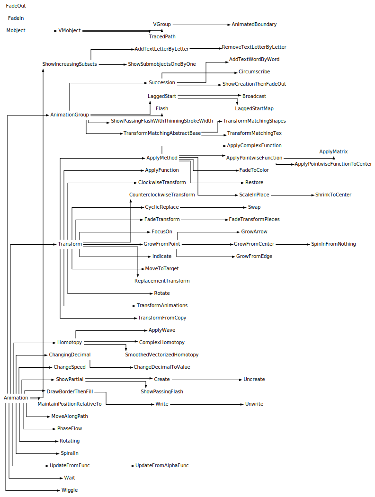
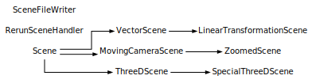

# 参考手册

本参考手册详细介绍了 Manim 中包含的模块、函数和变量，描述了它们的含义和用途。要了解如何使用 Manim，请参阅[教程](../tutorials_guides/tutorials/index.md)。有关自上次版本以来的更改列表，请参阅[更改日志](../changelog/0.18.1-changelog.md)。

> 警告:

> 链接到此处的页面目前正在开发中。

## 继承图

### 动画(Animations)

### 相机(Cameras)

### 对象(Mobjects)

### 场景(Scenes)

\.creation\.

## 模块索引

- [动画](./animation/index.md)
  - [动画](./animation/animations/index.md)
    - [动画](./animation/animations/Animation.md)
    - [等待](./animation/animations/Wait.md)
  - [改变](./animation/changing/index.md)
    - [动画边界](./animation/changing/AnimatedBoundary.md)
    - [追踪路径](./animation/changing/TracedPath.md)
  - [成分](./animation/composition/index.md)
    - [动画组](./animation/composition/AnimationGroup.md)
    - [滞后启动](./animation/composition/LaggedStart.md)
    - [滞后启动映射](./animation/composition/LaggedStartMap.md)
    - [继承](./animation/composition/Succession.md)
  - [创作](./animation/creation/index.md)
    - [逐个字母添加文本](./animation/creation/AddTextLetterByLetter.md)
    - [逐字添加文本](./animation/creation/AddTextWordByWord.md)
    - [创建](./animation/creation/Create.md)
    - [绘制边框然后填充](./animation/creation/DrawBorderThenFill.md)
    - [逐个字母删除文本](./animation/creation/RemoveTextLetterByLetter.md)
    - [显示增加的子集](./animation/creation/ShowIncreasingSubsets.md)
    - [部分显示](./animation/creation/ShowPartial.md)
    - [逐个显示子对象](./animation/creation/ShowSubmobjectOneByOne.md)
    - [螺旋](./animation/creation/SpiralIn.md)
    - [取消创建](./animation/creation/Uncreate.md)
    - [取消写入](./animation/creation/Unwrite.md)
    - [写](./animation/creation/Write.md)
  - [渐显渐隐](./animation/fading/index.md)
    - [淡入](./animation/fading/FadeIn.md)
    - [淡出](./animation/fading/FadeOut.md)
  - [扩大](./animation/growing/index.md)
    - [扩大箭头](./animation/growing/GrowArrow.md)
    - [从中心扩大](./animation/growing/GrowFromCenter.md)
    - [从边缘扩大](./animation/growing/GrowFromEdge.md)
    - [从点扩大](./animation/growing/GrowFromPoint.md)
    - [从无到有](./animation/growing/SpinInFromNothing.md)
  - [显示](./animation/indication/index.md)
    - [应用波](./animation/indication/ApplyWave.md)
    - [限制划界](./animation/indication/Circumscribe.md)
    - [闪现](./animation/indication/Flash.md)
    - [焦点](./animation/indication/FocusOn.md)
    - [显示](./animation/indication/Indicate.md)
    - [显示创建然后淡出](./animation/indication/ShowCreationThenFadeOut.md)
    - [一闪而过](./animation/indication/ShowPassingFlash.md)
    - [以细化笔画宽度显示经过的闪光](./animation/indication/ShowPassingFlashWithThinningStrokeWidth.md)
    - [摆动](./animation/indication/Wiggle.md)
  - [图形运动](./animation/movement/index.md)
    - [复同伦变换](./animation/movement/ComplexHomotopy.md)
    - [同伦变换](./animation/movement/Homotopy.md)
    - [沿路径移动](./animation/movement/MoveAlongPath.md)
    - [相位流动](./animation/movement/PhaseFlow.md)
    - [平滑向量化同伦变换](./animation/movement/SmoothedVectorizedHomotopy.md)
  - [数字](./animation/numbers/index.md)
    - [更改数字至数值](./animation/numbers/ChangeDecimalToValue.md)
    - [动态数字](./animation/numbers/ChangingDecimal.md)
  - [旋转](./animation/rotation/index.md)
    - [旋转](./animation/rotation/Rotate.md)
    - [正在旋转](./animation/rotation/Rotating.md)
  - [广播](./animation/specialized/index.md)
    - [广播](./animation/specialized/Broadcast.md)
  - [速度调节器](./animation/speedmodifier/index.md)
    - [改变速度](./animation/speedmodifier/ChangeSpeed.md)
  - [转换/变换](./animation/transform/index.md)
    - [应用复函数](./animation/transform/ApplyComplexFunction.md)
    - [应用函数](./animation/transform/ApplyFunction.md)
    - [应用矩阵](./animation/transform/ApplyMatrix.md)
    - [应用方法](./animation/transform/ApplyMethod.md)
    - [应用Pointwise函数](./animation/transform/ApplyPointwiseFunction.md)
    - [将Pointwise函数应用于中心](./animation/transform/ApplyPointwiseFunctionToCenter.md)
    - [顺时针变换](./animation/transform/ClockwiseTransform.md)
    - [逆时针变换](./animation/transform/CounterclockwiseTransform.md)
    - [循环替换](./animation/transform/CyclicReplace.md)
    - [淡入淡出颜色](./animation/transform/FadeToColor.md)
    - [淡入淡出变换](./animation/transform/FadeTransform.md)
    - [淡入淡出变换片段](./animation/transform/FadeTransformPieces.md)
    - [移动到目标](./animation/transform/MoveToTarget.md)
    - [替换变换](./animation/transform/ReplacementTransform.md)
    - [恢复](./animation/transform/Restore.md)
    - [就地扩展](./animation/transform/ScaleInPlace.md)
    - [收缩到中心](./animation/transform/ShrinkToCenter.md)
    - [交换](./animation/transform/Swap.md)
    - [转换](./animation/transform/Transform.md)
    - [变换动画](./animation/transform/TransformAnimation.md)
    - [从副本变换](./animation/transform/TransformFromCopy.md)
  - [变换匹配部分](./animation/transform_matching_parts/index.md)
    - [变换匹配抽象基类](./animation/transform_matching_parts/TransformMatchingAbstractBase.md)
    - [变换匹配形状](./animation/transform_matching_parts/TransformMatchingShapes.md)
    - [变换匹配Tex](./animation/transform_matching_parts/TransformMatchingTex.md)
  - [更新器](./animation/updaters/index.md)
    - [更新模块](./animation/updaters/update/index.md)
- [摄像机](./camera/index.md)
  - [摄像机](./camera/cameras/index.md)
    - [背景](./camera/cameras/BackgroundColoredVMobjectDisplayer.md)
    - [摄像机](./camera/cameras/Camera.md)
  - [映射摄像机](./camera/mapping_camera/index.md)
    - [映射摄像机](./camera/mapping_camera/MappingCamera.md)
    - [旧式多摄像机](./camera/mapping_camera/OldMultiCamera.md)
    - [分屏摄像机](./camera/mapping_camera/SplitScreenCamera.md)
  - [移动摄像机](./camera/moving_camera/index.md)
    - [移动摄像机](./camera/moving_camera/MovingCamera.md)
  - [多机位](./camera/multi_camera/index.md)
    - [多机位](./camera/multi_camera/MultiCamera.md)
  - [3D摄像机](./camera/three_d_camera/index.md)
    - [3D摄像机](./camera/three_d_camera/ThreeDCamera.md)
- [配置](./config/index.md)
  - [模块索引](./config/index.md)
    - [配置](./config/_config.md)
    - [实用工具](./config/utils/index.md)
    - [日志工具](./config/logger_utils/index.md)
- [对象(Mobjects)](./mobject/index.md)
  - [帧](./mobject/frame/index.md)
    - [全屏矩形](./mobject/frame/FullScreenRectangle.md)
    - [屏幕矩形](./mobject/frame/ScreenRectangle.md)
  - [几何](./mobject/geometry/index.md)
    - [几何模块](./mobject/geometry/index.md)
  - [图](./mobject/graph/index.md)
    - [有向图](./mobject/graph/DiGraph.md)
    - [通用图](./mobject/graph/GenericGraph.md)
    - [图](./mobject/graph/Graph.md)
  - [绘图](./mobject/graphing/index.md)
    - [绘图模块](./mobject/graphing/index.md)
  - [logo](./mobject/logo/index.md)
    - [ManimBanner](./mobject/logo/ManimBanner.md)
  - [矩阵](./mobject/matrix/index.md)
    - [小数矩阵](./mobject/matrix/DecimalMatrix.md)
    - [整数矩阵](./mobject/matrix/IntegerMatrix.md)
    - [矩阵](./mobject/matrix/Matrix.md)
    - [Mobject矩阵](./mobject/matrix/MobjectMatrix.md)
  - [对象(mobject)](./mobject/mobject/index.md)
    - [组](./mobject/mobject/Group.md)
    - [对象(Mobject)](./mobject/mobject/Mobject.md)
  - [svg](./mobject/svg/index.md)
    - [svg模块](./mobject/svg/index.md)
  - [表](./mobject/table/index.md)
    - [小数表](./mobject/table/DecimalTable.md)
    - [整数表](./mobject/table/IntegerTable.md)
    - [数学表](./mobject/table/MathTable.md)
    - [Mobject表](./mobject/table/MobjectTable.md)
    - [表](./mobject/table/Table.md)
  - [文本](./mobject/text/index.md)
    - [文本模块](./mobject/text/index.md)
  - [3D](./mobject/three_d/index.md)
    - [3D模块](./mobject/three_d/index.md)
  - [类型](./mobject/types/index.md)
    - [类型模块](./mobject/types/index.md)
  - [实用工具](./mobject/utils.md)
  - [值追踪器](./mobject/value_tracker/index.md)
    - [复杂值追踪器](./mobject/value_tracker/ComplexValueTracker.md)
    - [值追踪器](./mobject/value_tracker/ValueTracker.md)
  - [向量场](./mobject/vector_field/index.md)
    - [箭头向量场](./mobject/vector_field/ArrowVectorField.md)
    - [流线](./mobject/vector_field/StreamLines.md)
    - [向量场](./mobject/vector_field/VectorField.md)
- [场景](./scene/index.md)
  - [移动摄像机场景](./scene/moving_camera_scene/index.md)
    - [移动摄像机场景](./scene/moving_camera_scene/MovingCameraScene.md)
  - [部分](./scene/section/index.md)
    - [默认部分类型](./scene/section/DefaultSectionType.md)
    - [部分](./scene/section/Section.md)
  - [场景](./scene/scenes/index.md)
    - [重新运行场景处理程序](./scene/scenes/RerunSceneHandler.md)
    - [场景](./scene/scenes/Scene.md)
  - [场景文件写入器](./scene/scene_file_writer/index.md)
    - [场景文件写入器](./scene/scene_file_writer/SceneFileWriter.md)
  - [3D场景](./scene/three_d_scene/index.md)
    - [特殊3D场景](./scene/three_d_scene/SpecialThreeDScene.md)
    - [3D场景](./scene/three_d_scene/ThreeDScene.md)
  - [向量空间场景](./scene/vector_space_scene/index.md)
    - [线性变换场景](./scene/vector_space_scene/LinearTransformationScene.md)
    - [向量场景](./scene/vector_space_scene/VectorScene.md)
  - [缩放场景](./scene/zoomed_scene/index.md)
    - [缩放场景](./scene/zoomed_scene/ZoomedScene.md)
- [实用程序和其他模块](./utils/index.md)
  - [模块索引](./utils/index.md)
    - [常量](./utils/constants/index.md)
    - [贝塞尔](./utils/bezier.md)
    - [颜色](./utils/color/index.md)
    - [命令](./utils/commands.md)
    - [配置操作](./utils/config_ops/index.md)
    - [弃用](./utils/deprecation.md)
    - [Debug/调试](./utils/debug.md)
    - [文档构建](./utils/docbuild.md)
    - [哈希](./utils/hashing.md)
    - [ipython魔法](./utils/ipython_magic/index.md)
    - [图片](./utils/images.md)
    - [可迭代对象](./utils/iterables.md)
    - [路径](./utils/paths.md)
    - [速率函数](./utils/rate_functions.md)
    - [简单函数](./utils/simple_functions.md)
    - [声音](./utils/sounds.md)
    - [空间操作](./utils/space_ops.md)
    - [Tex](./utils/tex/index.md)
    - [tex模板](./utils/tex_templates/index.md)
    - [tex文件写入](./utils/tex_file_writing.md)

