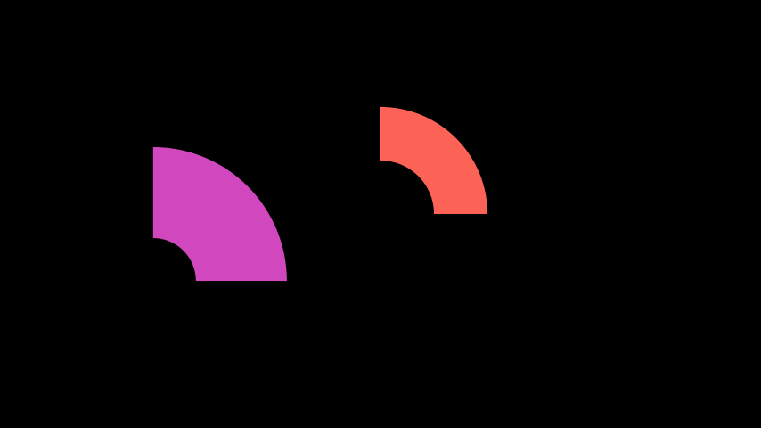

# 扇区

合格名称：`manim.mobject.geometry.arc.Sector`

```py
class Sector(outer_radius=1, inner_radius=0, **kwargs)
```

Bases: `AnnularSector`

例子

示例：ExampleSector



```py
from manim import *

class ExampleSector(Scene):
    def construct(self):
        sector = Sector(outer_radius=2, inner_radius=1)
        sector2 = Sector(outer_radius=2.5, inner_radius=0.8).move_to([-3, 0, 0])
        sector.set_color(RED)
        sector2.set_color(PINK)
        self.add(sector, sector2)
```

方法


属性

|||
|-|-|
`animate`|用于对 的任何方法的应用程序进行动画处理`self`。
`animation_overrides`|
`color`|
`depth`|对象的深度。
`fill_color`|如果有多种颜色（对于渐变），则返回第一个颜色
`height`|mobject 的高度。
`n_points_per_curve`|
`sheen_factor`|
`stroke_color`|
`width`|mobject 的宽度。
