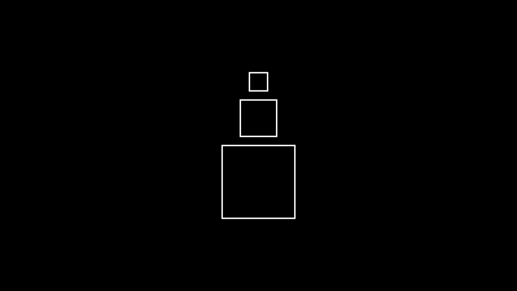

# 正方形

合格名称：`manim.mobject.geometry.polygram.Square`

```py
class Square(side_length=2.0, **kwargs)
```

Bases: `Rectangle`

边长相等的矩形。

参数

- **side_length** ( _float_ ) – 正方形边长。
- **kwargs** – 要传递给 的附加参数[`Rectangle`]()。

例子

示例：Square 示例




```py
from manim import *

class SquareExample(Scene):
    def construct(self):
        square_1 = Square(side_length=2.0).shift(DOWN)
        square_2 = Square(side_length=1.0).next_to(square_1, direction=UP)
        square_3 = Square(side_length=0.5).next_to(square_2, direction=UP)
        self.add(square_1, square_2, square_3)
```


方法


属性

|||
|-|-|
`animate`|用于对 的任何方法的应用程序进行动画处理`self`。
`animation_overrides`|
`color`|
`depth`|对象的深度。
`fill_color`|如果有多种颜色（对于渐变），则返回第一个颜色
`height`|mobject 的高度。
`n_points_per_curve`|
`sheen_factor`|
`stroke_color`|
`width`|mobject 的宽度。
