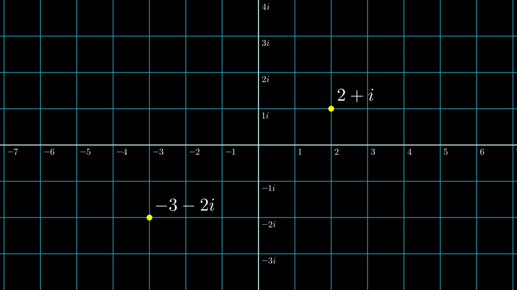

# 复杂平面

合格名称：`manim.mobject.graphing.coordinate\_systems.ComplexPlane`


```py
class ComplexPlane(**kwargs)
```

Bases: `NumberPlane`

专门[`NumberPlane`]()用于复数。

例子

示例：ComplexPlaneExample 



```py
from manim import *

class ComplexPlaneExample(Scene):
    def construct(self):
        plane = ComplexPlane().add_coordinates()
        self.add(plane)
        d1 = Dot(plane.n2p(2 + 1j), color=YELLOW)
        d2 = Dot(plane.n2p(-3 - 2j), color=YELLOW)
        label1 = MathTex("2+i").next_to(d1, UR, 0.1)
        label2 = MathTex("-3-2i").next_to(d2, UR, 0.1)
        self.add(
            d1,
            label1,
            d2,
            label2,
        )
```


参考：[`Dot`]() [`MathTex`]()

方法

|||
|-|-|
[`add_coordinates`]()|将生成的标签添加`get_coordinate_labels()`到平面上。
[`get_coordinate_labels`]()|生成[`DecimalNumber`]()平面坐标的 mobject。
[`n2p`]()|的缩写[`number_to_point()`]()。
[`number_to_point`]()|接受浮点/复数并返回平面上的等效点。
[`p2n`]()|[`point_to_number()`]()的缩写。
[`point_to_number`]()|接受一个点并返回与平面上该点等效的复数。


属性

|||
|-|-|
`animate`|用于对 的任何方法的应用程序进行动画处理`self`。
`animation_overrides`|
`color`|
`depth`|对象的深度。
`fill_color`|如果有多种颜色（对于渐变），则返回第一个颜色
`height`|mobject 的高度。
`n_points_per_curve`|
`sheen_factor`|
`stroke_color`|
`width`|mobject 的宽度。


`add_coordinates(*numbers, **kwargs)`

将生成的标签添加`get_coordinate_labels()`到平面上。

参数

- **numbers** ( _Iterable_ _\[_ _float_ _|_ _complex_ _\]_ ) – 浮点/复数的可迭代。浮点沿 x 轴定位，复数沿 y 轴定位。
- **kwargs** – 要传递给 的附加参数[`get_number_mobject()`]()，即[`DecimalNumber`]()。


`get_coordinate_labels(*numbers, **kwargs)`

生成[`DecimalNumber`]()平面坐标的 mobject。

参数

- **numbers** ( _Iterable_ _\[_ _float_ _|_ _complex_ _\]_ ) – 浮点/复数的可迭代。浮点沿 x 轴定位，复数沿 y 轴定位。
- **kwargs** – 要传递给 的附加参数[`get_number_mobject()`]()，即[`DecimalNumber`]()。

返回

[`VGroup`]()包含定位标签 mobjects 的 A。

返回类型

[`VGroup`]()


`n2p(number)`

[`number_to_point()`]()的缩写。

参数

**number**（*float | complex*）–

返回类型

np.ndarray


`number_to_point(number)`

接受浮点/复数并返回平面上的等效点。

参数

**number** ( _float_ _|_ _complex_ ) – 数字。可以是浮点数或复数。

返回

平面上的点。

返回类型

np.ndarray


`p2n(point)`

的缩写[`point_to_number()`]()。

参数

**point**(_Sequence[float]_ ) –

返回类型

complex


`point_to_number(point)`

接受一个点并返回与平面上该点等效的复数。

参数

**point** (_Sequence[float]_) – manim 坐标系中的点

返回

由实部和虚部组成的复数。

返回类型

complex
