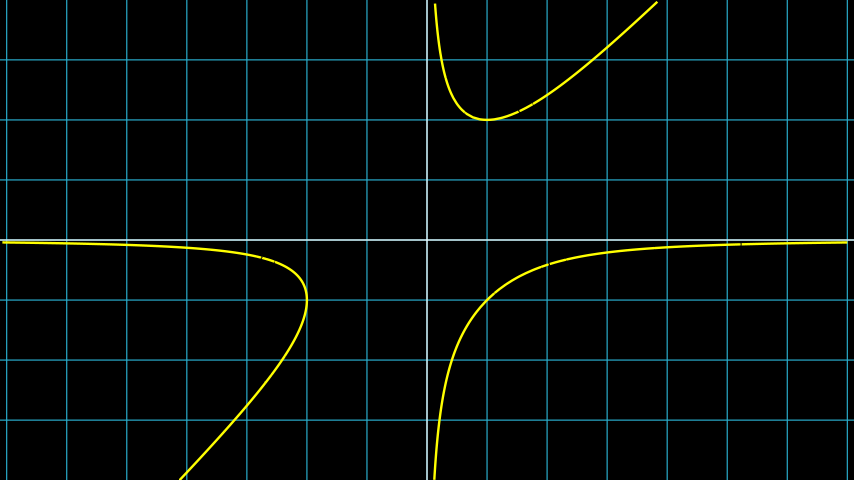

# 隐式函数

合格名称：`manim.mobject.graphing.functions.ImplicitFunction`


```py
class ImplicitFunction(func, x_range=None, y_range=None, min_depth=5, max_quads=1500, use_smoothing=True, **kwargs)
```

Bases: `VMobject`

隐式函数。

参数

- **func** ( _Callable_ _\[_ _\[_ _float_ _,_ _float_ _\]_ _,_ _float_ _\]_ ) – 形式的隐式函数。`f(x, y) = 0`
- **x_range** ( _Sequence_ _\[_ _float_ _\]_ _|_ _None_ ) – 函数的 x 最小值和最大值。
- **y_range** ( _Sequence_ _\[_ _float_ _\]_ _|_ _None_ ) – 函数的 y 最小值和最大值。
- **min_depth** ( _int_ ) – 要计算的函数的最小深度。
- **max_quads** ( _int_ ) – 要使用的最大四边形数量。
- **use_smoothing** ( _bool_ ) – 是否平滑曲线。
- **kwargs** – 要传递的附加参数`VMobject`


> 笔记

> 一个小的`min_depth` d 意味着一些小细节如果不跨越其中一个边缘，则可能会被忽略 4d 均匀的四边形。

> `max_quads`的值与曲线的质量密切相关，但四边形数量越多，渲染时间可能越长。


例子

示例：ImplicitFunctionExample 



```py
from manim import *

class ImplicitFunctionExample(Scene):
    def construct(self):
        graph = ImplicitFunction(
            lambda x, y: x * y ** 2 - x ** 2 * y - 2,
            color=YELLOW
        )
        self.add(NumberPlane(), graph)
```


方法

|||
|-|-|
[`generate_points`]()|初始化`points`并因此初始化形状。
[`init_points`]()|初始化`points`并因此初始化形状。


属性

|||
|-|-|
`animate`|用于对 的任何方法的应用程序进行动画处理`self`。
`animation_overrides`|
`color`|
`depth`|对象的深度。
`fill_color`|如果有多种颜色（对于渐变），则返回第一个颜色
`height`|mobject 的高度。
`n_points_per_curve`|
`sheen_factor`|
`stroke_color`|
`width`|mobject 的宽度。


`generate_points()`

初始化`points`并因此初始化形状。

被创造召唤。这是一个空方法，可以由子类实现。


`init_points()`

初始化`points`并因此初始化形状。

被创造召唤。这是一个空方法，可以由子类实现。
