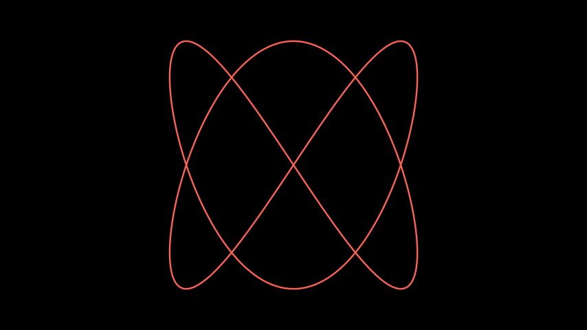
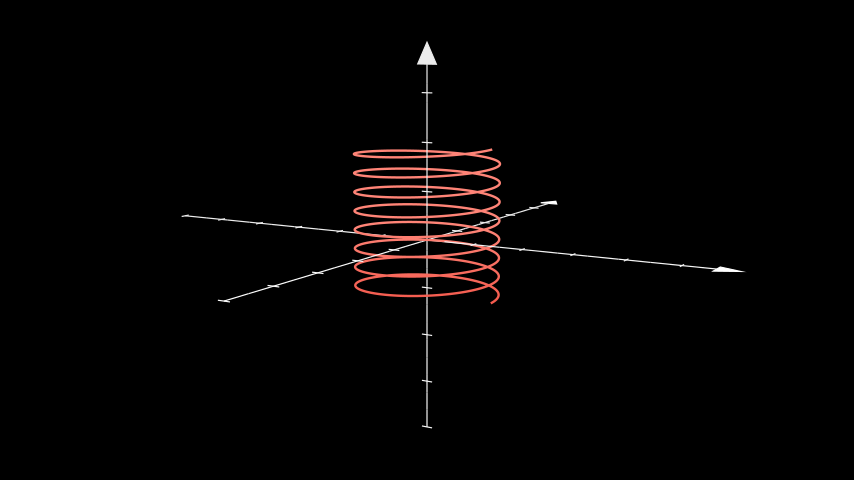
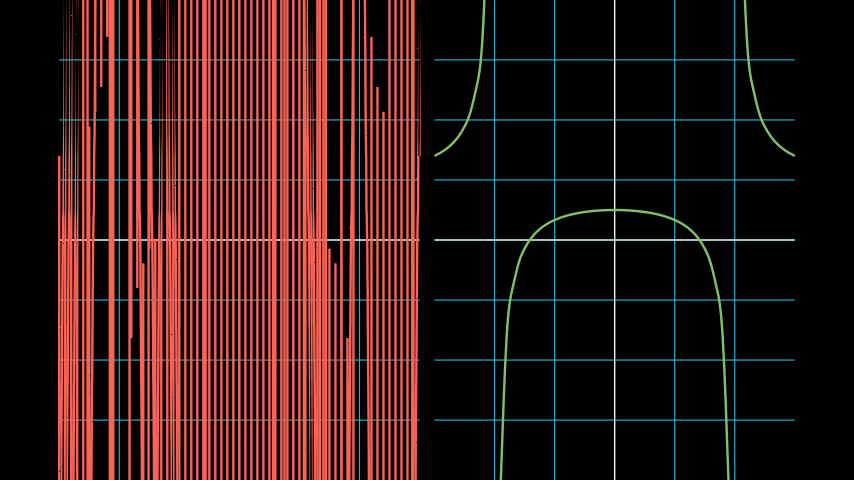

# 参数函数

合格名称：`manim.mobject.graphing.functions.ParametricFunction`


```py
class ParametricFunction(function, t_range=None, scaling=<manim.mobject.graphing.scale.LinearBase object>, dt=1e-08, discontinuities=None, use_smoothing=True, use_vectorized=False, **kwargs)
```

Bases: `VMobject`

参数曲线。

参数

- **function** ( _Callable_ _\[_ _\[_ _float_ _,_ _float_ _\]_ _,_ _float_ _\]_ ) – 以以下形式绘制的函数`(lambda x: x**2)`
- **t_range** ( _Sequence_ _\[_ _float_ _\]_ _|_ _None_ ) – 确定函数跨越的长度。默认情况下`[0, 1]`
- **scaling** ( \__ScaleBase_ ) – 应用于函数点的缩放类。默认为[`LinearBase`]().
- **use_smoothing** ( _bool_ ) – 创建函数后是否在函数点之间进行插值。（分数较低时会出现奇怪的行为）
- **use_vectorized** ( _bool_ ) – 是否将生成的 t 值数组传递给函数 as 。仅当您的函数支持时才使用它。输出应该是形状的 numpy 数组，但如果轴是二维的，也可以为 0` [t_0, t_1, ...]``[[x_0, x_1, ...], [y_0, y_1, ...], [z_0, z_1, ...]]``z `
- **discontinuities** ( _Iterable_ _\[_ _float_ _\]_ _|_ _None_ ) – 函数经历不连续性时的 t 值。
- **dt** ( _float_ ) – 不连续性的左右容差。

例子

示例：绘图参数函数



```py
from manim import *

class PlotParametricFunction(Scene):
    def func(self, t):
        return np.array((np.sin(2 * t), np.sin(3 * t), 0))

    def construct(self):
        func = ParametricFunction(self.func, t_range = np.array([0, TAU]), fill_opacity=0).set_color(RED)
        self.add(func.scale(3))
```

示例：ThreeDParametricSpring 



```py
from manim import *

class ThreeDParametricSpring(ThreeDScene):
    def construct(self):
        curve1 = ParametricFunction(
            lambda u: np.array([
                1.2 * np.cos(u),
                1.2 * np.sin(u),
                u * 0.05
            ]), color=RED, t_range = np.array([-3*TAU, 5*TAU, 0.01])
        ).set_shade_in_3d(True)
        axes = ThreeDAxes()
        self.add(axes, curve1)
        self.set_camera_orientation(phi=80 * DEGREES, theta=-60 * DEGREES)
        self.wait()
```


> 请注意

> 如果您的函数存在不连续性，则必须手动指定不连续性的位置。请参阅以下示例以获取指导。


示例：不连续示例



```py
from manim import *

class DiscontinuousExample(Scene):
    def construct(self):
        ax1 = NumberPlane((-3, 3), (-4, 4))
        ax2 = NumberPlane((-3, 3), (-4, 4))
        VGroup(ax1, ax2).arrange()
        discontinuous_function = lambda x: (x ** 2 - 2) / (x ** 2 - 4)
        incorrect = ax1.plot(discontinuous_function, color=RED)
        correct = ax2.plot(
            discontinuous_function,
            discontinuities=[-2, 2],  # discontinuous points
            dt=0.1,  # left and right tolerance of discontinuity
            color=GREEN,
        )
        self.add(ax1, ax2, incorrect, correct)
```

方法

|||
|-|-|
[`generate_points`]()|初始化`points`并因此初始化形状。
`get_function`|
`get_point_from_function`|
[`init_points`]()|初始化`points`并因此初始化形状。


属性

|||
|-|-|
`animate`|用于对 的任何方法的应用程序进行动画处理`self`。
`animation_overrides`|
`color`|
`depth`|对象的深度。
`fill_color`|如果有多种颜色（对于渐变），则返回第一个颜色
`height`|mobject 的高度。
`n_points_per_curve`|
`sheen_factor`|
`stroke_color`|
`width`|mobject 的宽度。


`generate_points()`

初始化`points`并因此初始化形状。

被创造召唤。这是一个空方法，可以由子类实现。


`init_points()`

初始化`points`并因此初始化形状。

被创造召唤。这是一个空方法，可以由子类实现。
