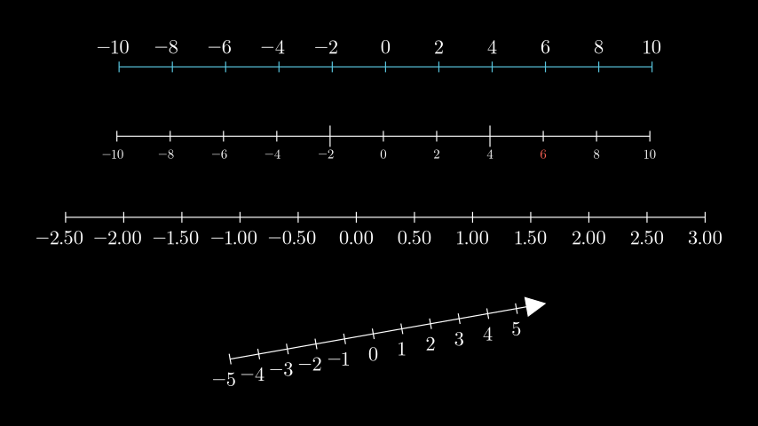

# 数轴

合格名称：`manim.mobject.graphing.number\_line.NumberLine`


```py
class NumberLine(x_range=None, length=None, unit_size=1, include_ticks=True, tick_size=0.1, numbers_with_elongated_ticks=None, longer_tick_multiple=2, exclude_origin_tick=False, rotation=0, stroke_width=2.0, include_tip=False, tip_width=0.35, tip_height=0.35, tip_shape=None, include_numbers=False, font_size=36, label_direction=array([ 0., -1., 0.]), label_constructor=<class 'manim.mobject.text.tex_mobject.MathTex'>, scaling=<manim.mobject.graphing.scale.LinearBase object>, line_to_number_buff=0.25, decimal_number_config=None, numbers_to_exclude=None, numbers_to_include=None, **kwargs)
```

Bases: `Line`

创建带有刻度线的数轴。

参数

- **x_range** ( _Sequence_ _\[_ _float_ _\]_ _|_ _None_ ) –用于创建线条的值。`[x_min, x_max, x_step]`
- **length** ( _float_ _|_ _None_ ) – 数轴的长度。
- **unit_size** ( _float_ ) – 线条的每个刻度之间的距离。如果指定，则被覆盖`length`。
- **include_ticks** ( _bool_ ) – 是否在数轴上包含刻度。
- **tick_size** ( _float_ ) – 每个刻度线的长度。
- **Numbers_with_elongated_ticks** ( _Iterable_ _\[_ _float_ _\]_ _|_ _None_ ) – 具有拉长刻度的特定值的可迭代。
- **long_tick_multiple** ( _int_ ) – 影响细长刻度比常规刻度大多少倍 (2 = 2x)。
- **rotation**( _float_ ) – 线旋转的角度（以弧度为单位）。
- **stroke_width** ( _float_ ) – 线条的粗细。
- **include_tip** ( _bool_ ) – 是否在行尾添加提示。
- **tip_width** ( _float_ ) – 尖端的宽度。
- **tip_height** ( _float_ ) – 尖端的高度。
- **tip_shape** ( _type_ _\[_ [_ArrowTip_]() _\]_ _|_ _None_ ) – 用于构造提示的 mobject 类，或者`None`（默认）用于默认箭头提示。传递的类必须继承自[`ArrowTip`]().
- **include_numbers** ( _bool_ ) – 是否向刻度线添加数字。小数位数由步长决定，可以通过 覆盖此默认值`decimal_number_config`。
- **scaling**( \__ScaleBase_`x_range` ) –值缩放的方式，即[`LogBase`]()对于对数数轴。默认为[`LinearBase`]().
- **font_size** ( _float_ ) – 标签 mobject 的大小。默认为 36。
- **label_direction** ( _Sequence_ _\[_ _float_ _\]_ ) – 在线上添加标签 mobject 的具体位置。
- **label_constructor** ( [_VMobject_]() ) – 确定将用于构造数轴标签的 mobject 类。
- **line_to_number_buff** ( _float_ ) – 线条和标签 mobject 之间的距离。
- **decimal_number_config** ( _dict_ _|_ _None_ ) – 可以传递[`DecimalNumber`]()以影响数字 mobject 的参数。
- **Numbers_to_exclude** ( _Iterable_ _\[_ _float_ _\]_ _|_ _None_ ) – 不添加到数轴的数字的显式迭代。
- **Numbers_to_include** ( _Iterable_ _\[_ _float_ _\]_ _|_ _None_ ) – 要添加到数轴的数字的显式迭代
- **kwargs** – 要传递给 的附加参数[`Line`]()。
- **except_origin_tick** (_bool_) –


> 提示：
> 包含负值和正值的数字范围将从 0 点生成，并且可能不包含最小/最大值处的刻度，因为刻度位置取决于步长。

例子

示例：NumberLine 示例



```py
from manim import *

class NumberLineExample(Scene):
    def construct(self):
        l0 = NumberLine(
            x_range=[-10, 10, 2],
            length=10,
            color=BLUE,
            include_numbers=True,
            label_direction=UP,
        )

        l1 = NumberLine(
            x_range=[-10, 10, 2],
            unit_size=0.5,
            numbers_with_elongated_ticks=[-2, 4],
            include_numbers=True,
            font_size=24,
        )
        num6 = l1.numbers[8]
        num6.set_color(RED)

        l2 = NumberLine(
            x_range=[-2.5, 2.5 + 0.5, 0.5],
            length=12,
            decimal_number_config={"num_decimal_places": 2},
            include_numbers=True,
        )

        l3 = NumberLine(
            x_range=[-5, 5 + 1, 1],
            length=6,
            include_tip=True,
            include_numbers=True,
            rotation=10 * DEGREES,
        )

        line_group = VGroup(l0, l1, l2, l3).arrange(DOWN, buff=1)
        self.add(line_group)
```

方法

|||
|-|-|
[`add_labels`]()|[`NumberLine`]()使用向 中添加专门定位的标签`dict`。
[`add_numbers`]()|添加[`DecimalNumber`]()代表其在数轴每个刻度处位置的 mobject。
[`add_ticks`]()|在数轴上添加刻度。
`get_labels`|
[`get_number_mobject`]()|生成[`DecimalNumber`]()根据 生成的定位 mobject `label_constructor`。
`get_number_mobjects`|
[`get_tick`]()|生成一个刻度并将其沿数轴定位。
`get_tick_marks`|
[`get_tick_range`]()|`x_range`根据数轴的属性生成在其上绘制标签的值范围。
`get_unit_size`|
`get_unit_vector`|
[`n2p`]()||[`number_to_point()`]()的缩写。
[`number_to_point`]()|接受沿数轴的值并返回相对于场景的点。
[`p2n`]()|[`point_to_number()`]()的缩写。
[`point_to_number`]()|接受相对于场景的点并返回沿数轴的浮点数。
`rotate_about_number`|
`rotate_about_zero`|


属性


`animate`|用于对 的任何方法的应用程序进行动画处理`self`。
`animation_overrides`|
`color`|
`depth`|对象的深度。
`fill_color`|如果有多种颜色（对于渐变），则返回第一个颜色
`height`|mobject 的高度。
`n_points_per_curve`|
`sheen_factor`|
`stroke_color`|
`width`|mobject 的宽度。


`_create_label_tex(label_tex, label_constructor=None, **kwargs)`

检查标签是否为 a ，否则，通过传递toVMobject创建标签。label_texlabel_constructor

参数：
- **label_tex** (str | float | manim.mobject.types.vectorized_mobject.VMobject) – 应为其创建 mobject 的标签。如果标签已经是一个 mobject，则不会创建新的 mobject。
- **label_constructor** (Optional[Callable]) – 可选。label_tex作为参数传递时返回 mobject 的类或函数。如果None传递（默认），则`label_constructor` 使用属性中的标签构造函数。

返回：
The label.

返回类型：
VMobject


```py
_original__init__(x_range=None, length=None, unit_size=1, include_ticks=True, tick_size=0.1, numbers_with_elongated_ticks=None, longer_tick_multiple=2, exclude_origin_tick=False, rotation=0, stroke_width=2.0, include_tip=False, tip_width=0.35, tip_height=0.35, tip_shape=None, include_numbers=False, font_size=36, label_direction=array([ 0., -1., 0.]), label_constructor=<class 'manim.mobject.text.tex_mobject.MathTex'>, scaling=<manim.mobject.graphing.scale.LinearBase object>, line_to_number_buff=0.25, decimal_number_config=None, numbers_to_exclude=None, numbers_to_include=None, **kwargs)
```

初始化自身。请参阅 help(type(self)) 以获取准确的签名。

参数：
**x_range** (Sequence[float] | None) –
**length** (float | None) –
**unit_size** (float) –
**include_ticks** (bool) –
**tick_size** (float) –
**numbers_with_elongated_ticks** (Iterable[float] | None) –
**longer_tick_multiple** (int) –
**exclude_origin_tick** (bool) –
**rotation** (float) –
**stroke_width** (float) –
**include_tip** (bool) –
**tip_width** (float) –
**tip_height** (float) –
**tip_shape** (type[ArrowTip] | None) –
**include_numbers** (bool) –
**font_size** (float) –
**label_direction** (Sequence[float]) –
**label_constructor** (VMobject) –
**scaling** (\_ScaleBase) –
**line_to_number_buff** (float) –
**decimal_number_config** (dict | None) –
**numbers_to_exclude** (Iterable[float] | None) –
**numbers_to_include** (Iterable[float] | None) –


```py
add_labels(dict_values, direction=None, buff=None, font_size=None, label_constructor=None)
```

[`NumberLine`]()使用向 中添加专门定位的标签`dict`。创建后可以通过 访问标签`self.labels`。

参数

- **dict_values** ( _dict_ _\[_ _float_ _,_ _str_ _|_ _float_ _|_ [_VMobject_]() _\]_ ) – 一个字典，由数轴上的位置和要添加的 mobject 组成： 。如果值不是 mobject (或)，则将用于构造标签。` {1: Tex("Monday"), 3: Tex("Tuesday")}``label_constructor``str``float `
- **Direction** ( _Sequence_ _\[_ _float_ _\]_ ) – 确定标签位于线条旁边的方向。
- **buff** ( _float_ _|_ _None_ ) – 标签与线条的距离。
- **font_size** ( _float_ _|_ _None_ ) – 要定位的 mobject 的字体大小。
- **label_constructor** ( [_VMobject_]() _|_ _None_ ) –[`VMobject`]()将用于构造标签的类。如果未指定，则默认`label_constructor`为数轴的属性。

额外
**AttributeError** – 如果标签没有属性`font_size`，`AttributeError`则会引发错误。


```py
add_numbers(x_values=None, excluding=None, font_size=None, label_constructor=None, **kwargs)
```

添加[`DecimalNumber`]()代表其在数轴每个刻度处位置的 mobject。创建后可以通过 访问这些号码`self.numbers`。

参数

- **x_values** ( _Iterable_ _\[_ _float_ _\]_ _|_ _None_ ) – 用于定位和创建标签的值的可迭代。默认为由产生的输出[`get_tick_range()`]()
- **excluding**( _Iterable_ _\[_ _float_ _\]_ _|_ _None_ ) – 要排除的值的列表`x_values`。
- **font_size** ( _float_ _|_ _None_ ) – 标签的字体大小。默认`font_size`为数轴的属性。
- **label_constructor** ( [_VMobject_]() _|_ _None_ ) –[`VMobject`]()将用于构造标签的类。如果未指定，则默认`label_constructor`为数轴的属性。


`add_ticks()`

在数轴上添加刻度。创建后可以通过 访问蜱虫`self.ticks`。


```py
get_number_mobject(x, direction=None, buff=None, font_size=None, label_constructor=None, **number_config)
```

生成[`DecimalNumber`]()根据 生成的定位 mobject `label_constructor`。

参数

- **x** ( _float_ ) – mobject 应定位的 x 值。
- **Direction** ( _Sequence_ _\[_ _float_ _\]_ _|_ _None_ ) – 确定标签位于线条旁边的方向。
- **buff** ( _float_ _|_ _None_ ) – 标签与线条的距离。
- **font_size** ( _float_ _|_ _None_ ) – 标签 mobject 的字体大小。
- **label_constructor** ( [_VMobject_]() _|_ _None_ ) –[`VMobject`]()将用于构造标签的类。如果未指定，则默认`label_constructor`为数轴的属性。

返回

定位的对象。

返回类型

[`DecimalNumber`]()


`get_tick(x, size=None)`

生成一个刻度并将其沿数轴定位。

参数

- **x** ( _float_ ) – 刻度线的位置。
- **size** ( _float_ _|_ _None_ ) – 刻度缩放的因子。

返回

定位的刻度线。

返回类型

[`Line`](")


`get_tick_range()`

`x_range`根据数轴的属性生成在其上绘制标签的值范围 。

返回

代表数轴上的值的 numpy 浮点数组。

返回类型

np.ndarray


`n2p(number)`

的缩写[`number_to_point()`]()。

参数

**number**( _float_ _|_ _np.ndarray_ ) –

返回类型

np.ndarray


`number_to_point(number)`

接受沿数轴的值并返回相对于场景的点。

参数

**number** ( _float_ _|_ _np.ndarray_ ) – 要转换为坐标的值。或者值列表。

返回

相对于场景坐标系的点。或者点列表。

返回类型

np.ndarray

例子

```py
from manim import NumberLine
number_line = NumberLine()
number_line.number_to_point(0)
array([0., 0., 0.])
number_line.number_to_point(1)
array([1., 0., 0.])
number_line.number_to_point([1,2,3])
array([[1., 0., 0.],
       [2., 0., 0.],
       [3., 0., 0.]])
```


`p2n(point)`

[`point_to_number()`]()的缩写。

参数

**point**(_Sequence[float]_) –

返回类型

float


`point_to_number(point)`

接受相对于场景的点并返回沿数轴的浮点数。

参数

**point** (_Sequence[float]_) – 由 组成的值序列。`(x_coord, y_coord, z_coord)`

返回

表示沿数轴的值的浮点数。

返回类型

float

例子

```py
from manim import NumberLine
number_line = NumberLine()
number_line.point_to_number((0,0,0))
0.0
number_line.point_to_number((1,0,0))
1.0
number_line.point_to_number([[0.5,0,0],[1,0,0],[1.5,0,0]])
array([0.5, 1. , 1.5])
```
