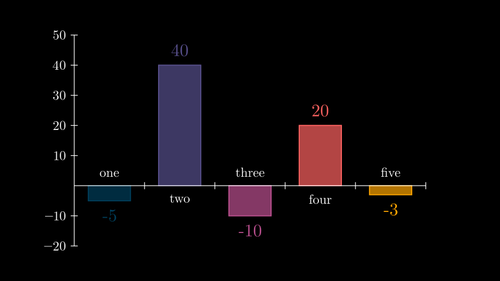
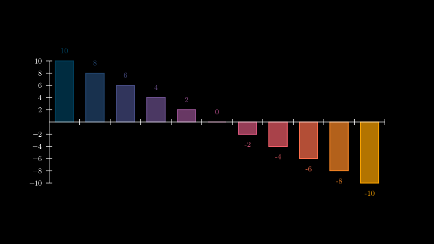
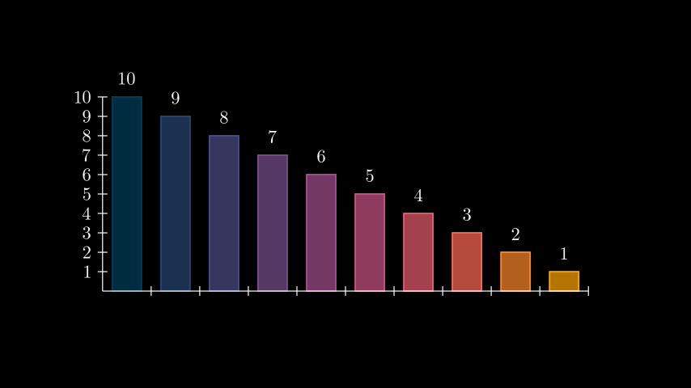

# 柱状图

合格名称：`manim.mobject.graphing.probability.BarChart`


```py
class BarChart(values, bar_names=None, y_range=None, x_length=None, y_length=None, bar_colors=['#003f5c', '#58508d', '#bc5090', '#ff6361', '#ffa600'], bar_width=0.6, bar_fill_opacity=0.7, bar_stroke_width=3, **kwargs)
```

Bases: `Axes`

创建柱状图。继承自[`Axes`]()，因此它共享其方法和属性。每个轴都继承自[`NumberLine`]()，因此传入`x_axis_config`/`y_axis_config` 来控制它们的属性。

参数

- **value** ( _MutableSequence_ _\[_ _float_ _\]_ ) – 确定每个条形高度的值序列。接受负值。
- **bar_names** ( _Sequence_ _\[_ _str_ _\]_ _|_ _None_ ) – 每个柱的名称序列。不必匹配 的长度`values`。
- **y_range** ( _Sequence_ _\[_ _float_ _\]_ _|_ _None_ ) – y 轴值范围。如果`None`，则将根据 的最小值/最大值计算范围`values`，并根据 计算步长`y_length`。
- **x_length** ( _float_ _|_ _None_ ) – x 轴的长度。如果`None`，则根据值的数量和屏幕的宽度自动计算。
- **y_length** ( _float_ _|_ _None_ ) – y 轴的长度。
- **bar_colors** ( _Iterable_ _\[_ _str_ _\]_ ) – 条形的颜色。接受一系列颜色（只能包含一个项目）。如果“bar_colors”的长度与 的长度不匹配`values`，则会自动确定中间颜色。
- **bar_width** ( _float_ ) – 条形的长度。必须介于 0 和 1 之间。
- **bar_fill_opacity** ( _float_ ) – 条形的填充不透明度。
- **bar_lines_width** ( _float_ ) – 条形的描边宽度。


例子

示例：柱状图示例



```py
from manim import *

class BarChartExample(Scene):
    def construct(self):
        chart = BarChart(
            values=[-5, 40, -10, 20, -3],
            bar_names=["one", "two", "three", "four", "five"],
            y_range=[-20, 50, 10],
            y_length=6,
            x_length=10,
            x_axis_config={"font_size": 36},
        )

        c_bar_lbls = chart.get_bar_labels(font_size=48)

        self.add(chart, c_bar_lbls)
```


方法

|||
|-|-|
[`change_bar_values`]()|更新图表条形的高度。
[`get_bar_labels`]()|用相应的值注释每个条。


属性

|||
|-|-|
`animate`|用于对 的任何方法的应用程序进行动画处理`self`。
`animation_overrides`|
`color`|
`depth`|对象的深度。
`fill_color`|如果有多种颜色（对于渐变），则返回第一个颜色
`height`|mobject 的高度。
`n_points_per_curve`|
`sheen_factor`|
`stroke_color`|
`width`|mobject 的宽度。


`change_bar_values(values, update_colors=True)`

更新图表条形的高度。

参数

- **value** ( _Iterable_ _\[_ _float_ _\]_ ) – 将用于更新条形高度的值。不必匹配条数。
- **update_colors** ( _bool_ ) – 是否根据 重新初始化条形的颜色`self.bar_colors`。


例子

示例：ChangeBarValuesExample 



```py
from manim import *

class ChangeBarValuesExample(Scene):
    def construct(self):
        values=[-10, -8, -6, -4, -2, 0, 2, 4, 6, 8, 10]

        chart = BarChart(
            values,
            y_range=[-10, 10, 2],
            y_axis_config={"font_size": 24},
        )
        self.add(chart)

        chart.change_bar_values(list(reversed(values)))
        self.add(chart.get_bar_labels(font_size=24))
```


```py
get_bar_labels(color=None, font_size=24, buff=0.25, label_constructor=<class 'manim.mobject.text.tex_mobject.Tex'>)
```

用相应的值注释每个条。用于`self.bar_labels`在创建后访问标签。

参数

- **color** ( _Color_ _|_ _None_ ) – 每个标签的颜色。默认情况下`None`，基于父级的条形颜色。
- **font_size** ( _float_ ) – 每个标签的字体大小。
- **buff** ( _float_ ) – 每个标签到其条形的距离。默认为 0.4。
- **label_constructor** ( _type_ _\[_ [_VMobject_]() _\]_ ) – 默认情况下，用于构造标签的 Mobject 类[`Tex`]()。


例子

示例：GetBarLabelsExample 



```py
from manim import *

class GetBarLabelsExample(Scene):
    def construct(self):
        chart = BarChart(values=[10, 9, 8, 7, 6, 5, 4, 3, 2, 1], y_range=[0, 10, 1])

        c_bar_lbls = chart.get_bar_labels(
            color=WHITE, label_constructor=MathTex, font_size=36
        )

        self.add(chart, c_bar_lbls)
```
