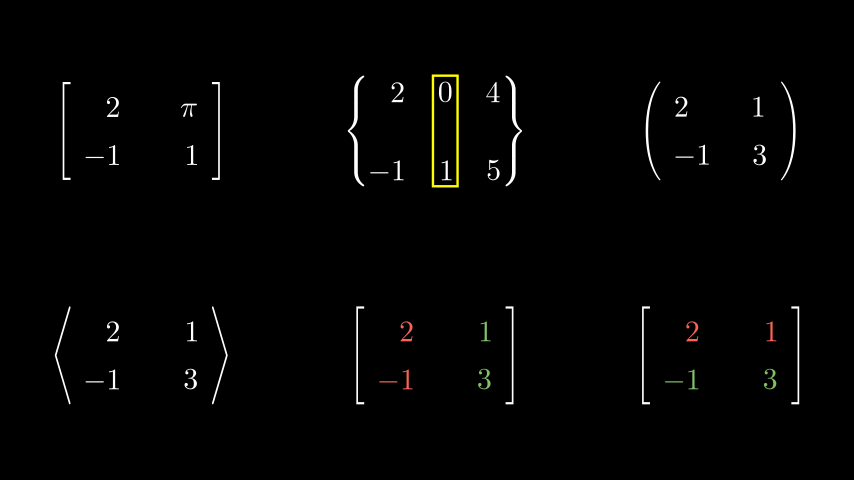
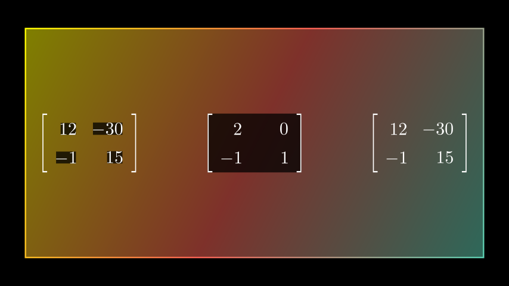
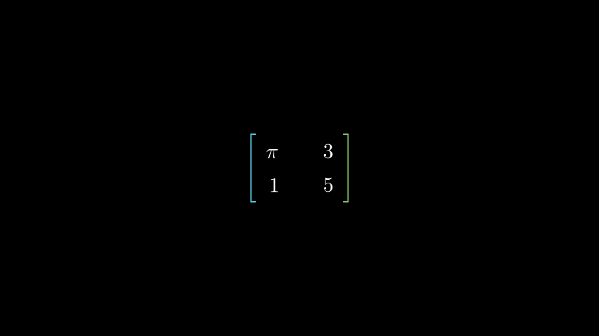
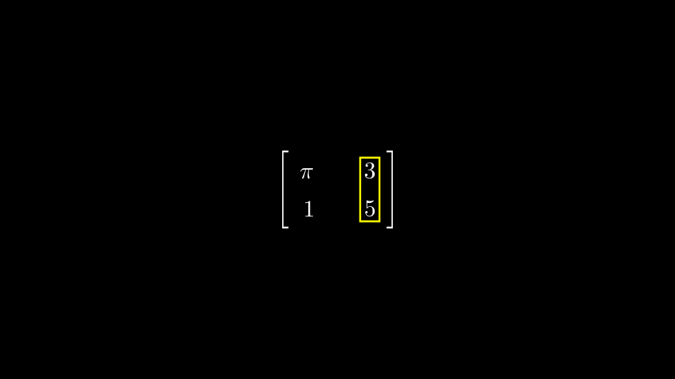
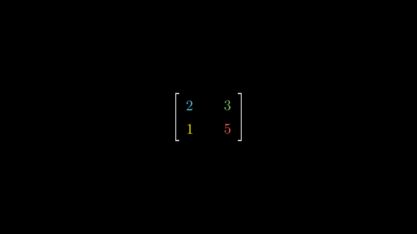
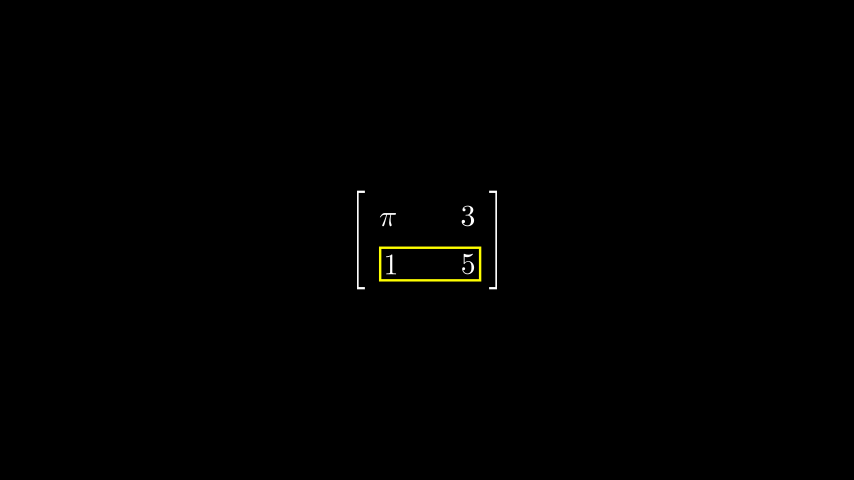
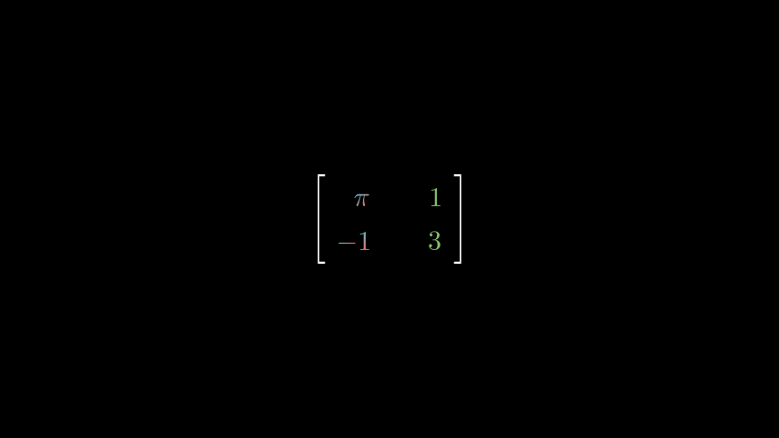
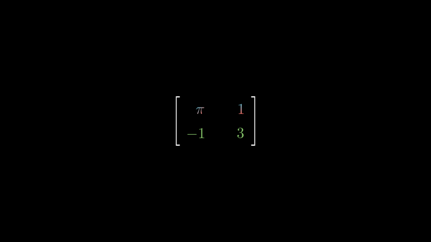

# 矩阵

合格名称：`manim.mobject.matrix.Matrix`


```py
class Matrix(matrix, v_buff=0.8, h_buff=1.3, bracket_h_buff=0.25, bracket_v_buff=0.25, add_background_rectangles_to_entries=False, include_background_rectangle=False, element_to_mobject=<class 'manim.mobject.text.tex_mobject.MathTex'>, element_to_mobject_config={}, element_alignment_corner=array([ 1., -1., 0.]), left_bracket='[', right_bracket=']', stretch_brackets=True, bracket_config={}, **kwargs)
```

Bases: `VMobject`


在屏幕上显示矩阵的 mobject。


例子

第一个示例显示了该模块的各种用途，而第二个示例则说明了选项 add_background_rectangles_to_entries 和 include_background_rectangle 的使用。

示例：矩阵示例



```py
from manim import *

class MatrixExamples(Scene):
    def construct(self):
        m0 = Matrix([[2, "\pi"], [-1, 1]])
        m1 = Matrix([[2, 0, 4], [-1, 1, 5]],
            v_buff=1.3,
            h_buff=0.8,
            bracket_h_buff=SMALL_BUFF,
            bracket_v_buff=SMALL_BUFF,
            left_bracket="\{",
            right_bracket="\}")
        m1.add(SurroundingRectangle(m1.get_columns()[1]))
        m2 = Matrix([[2, 1], [-1, 3]],
            element_alignment_corner=UL,
            left_bracket="(",
            right_bracket=")")
        m3 = Matrix([[2, 1], [-1, 3]],
            left_bracket="\\langle",
            right_bracket="\\rangle")
        m4 = Matrix([[2, 1], [-1, 3]],
        ).set_column_colors(RED, GREEN)
        m5 = Matrix([[2, 1], [-1, 3]],
        ).set_row_colors(RED, GREEN)
        g = Group(
            m0,m1,m2,m3,m4,m5
        ).arrange_in_grid(buff=2)
        self.add(g)
```


示例：背景矩形示例



```py
from manim import *

class BackgroundRectanglesExample(Scene):
    def construct(self):
        background= Rectangle().scale(3.2)
        background.set_fill(opacity=.5)
        background.set_color([TEAL, RED, YELLOW])
        self.add(background)
        m0 = Matrix([[12, -30], [-1, 15]],
            add_background_rectangles_to_entries=True)
        m1 = Matrix([[2, 0], [-1, 1]],
            include_background_rectangle=True)
        m2 = Matrix([[12, -30], [-1, 15]])
        g = Group(m0, m1, m2).arrange(buff=2)
        self.add(g)
```


参数

- **矩阵**( _Iterable_ ) – numpy 二维数组或列表列表。
- **v_buff** ( _float_ ) – 元素之间的垂直距离，默认为 0.8。
- **h_buff** ( _float_ ) – 元素之间的水平距离，默认为 1.3。
- **括号\_h_buff** ( _float_ ) – 默认情况下，括号与矩阵的距离`MED_SMALL_BUFF`。
- **括号\_v_buff** ( _float_ ) – 默认情况下括号的高度`MED_SMALL_BUFF`。
- **add_background_rectangles_to_entries** ( _bool_ ) –`True`默认情况下是否应将背景矩形添加到条目中`False`。
- **include_background_rectangle** ( _bool_ ) –`True`默认情况下是否应包含背景矩形`False`。
- **element_to_mobject** ( _type_ _\[_ [_MathTex_]() _\]_ ) – 默认情况下用于构造元素的 mobject 类[`MathTex`]()。
- **element_to_mobject_config** ( _dict_`element_to_mobject` ) –默认情况下要传递给构造函数的附加参数`{}`。
- **element_alignment_corner** ( _Sequence_ _\[_ _float_ _\]_ ) – 默认情况下元素对齐的角点`DR`。
- **left_bracket** ( _str_ ) – 默认情况下左括号类型`"["`。
- **right_bracket** ( _str_ ) – 默认情况下右括号类型`"]"`。
- **stretch_brackets** ( _bool_ ) –`True`默认情况下是否应该拉伸括号以适应矩阵内容的高度`True`。
- **括号\_config** ( _dict_[`MathTex`]() ) –构造括号时要传递的附加参数。


方法

|||
|-|-|
[`add_background_to_entries`]()|将黑色背景矩形添加到矩阵中，请参阅上面的示例。
[`get_brackets`]()|返回括号 mobject。
[`get_columns`]()|将矩阵的列返回为 VGroup。
[`get_entries`]()|返回矩阵的各个条目。
[`get_mob_matrix`]()|返回底层的生物矩阵 mobjects。
[`get_rows`]()|返回矩阵的行作为 VGroup。
[`set_column_colors`]()|为矩阵的每一列设置单独的颜色。
[`set_row_colors`]()|为矩阵的每一行设置单独的颜色。


属性

|||
|-|-|
`animate`|用于对 的任何方法的应用程序进行动画处理`self`。
`animation_overrides`|
`color`|
`depth`|对象的深度。
`fill_color`|如果有多种颜色（对于渐变），则返回第一个颜色
`height`|mobject 的高度。
`n_points_per_curve`|
`sheen_factor`|
`stroke_color`|
`width`|mobject 的宽度。


`add_background_to_entries()`

将黑色背景矩形添加到矩阵中，请参阅上面的示例。

返回

当前矩阵 object (self)。

返回类型

[`Matrix`]()


`get_brackets()`

返回括号 mobject。

返回

每个 VGroup 包含一个括号

返回类型

List\[ [`VGroup`]()\]


例子

示例：GetBracketsExample 



```py
from manim import *

class GetBracketsExample(Scene):
    def construct(self):
        m0 = Matrix([["\pi", 3], [1, 5]])
        bra = m0.get_brackets()
        colors = [BLUE, GREEN]
        for k in range(len(colors)):
            bra[k].set_color(colors[k])
        self.add(m0)
```


`get_columns()`

将矩阵的列返回为 VGroup。

返回

每个 VGroup 包含矩阵的一列。

返回类型

List\[ [`VGroup`]()\]


例子

示例：获取列示例



```py
from manim import *

class GetColumnsExample(Scene):
    def construct(self):
        m0 = Matrix([["\pi", 3], [1, 5]])
        m0.add(SurroundingRectangle(m0.get_columns()[1]))
        self.add(m0)
```


`get_entries()`

返回矩阵的各个条目。

返回

包含矩阵条目的 VGroup。

返回类型

[`VGroup`]()


例子

示例：GetEntriesExample 



```py
from manim import *

class GetEntriesExample(Scene):
    def construct(self):
        m0 = Matrix([[2, 3], [1, 5]])
        ent = m0.get_entries()
        colors = [BLUE, GREEN, YELLOW, RED]
        for k in range(len(colors)):
            ent[k].set_color(colors[k])
        self.add(m0)
```


`get_mob_matrix()`

返回底层的生物矩阵 mobjects。

返回

每个 VGroup 包含矩阵的一行。

返回类型

List\[ [`VGroup`]()\]


`get_rows()`

返回矩阵的行作为 VGroup。

返回

每个 VGroup 包含矩阵的一行。

返回类型

List\[ [`VGroup`]()\]


例子

示例：GetRowsExample 



```py
from manim import *

class GetRowsExample(Scene):
    def construct(self):
        m0 = Matrix([["\pi", 3], [1, 5]])
        m0.add(SurroundingRectangle(m0.get_rows()[1]))
        self.add(m0)
```


`set_column_colors(*colors)`

为矩阵的每一列设置单独的颜色。

参数

**colors**( _str_ ) – 颜色列表；指定的每种颜色对应于一列。

返回

当前矩阵 object (self)。

返回类型

[`Matrix`]()


例子

示例：SetColumnColorsExample 



```py
from manim import *

class SetColumnColorsExample(Scene):
    def construct(self):
        m0 = Matrix([["\pi", 1], [-1, 3]],
        ).set_column_colors([RED,BLUE], GREEN)
        self.add(m0)
```


`set_row_colors(*colors)`

为矩阵的每一行设置单独的颜色。

参数

**colors**( _str_ ) – 颜色列表；指定的每种颜色对应一行。

返回

当前矩阵 object (self)。

返回类型

[`Matrix`]()


例子

示例：SetRowColorsExample 



```py
from manim import *

class SetRowColorsExample(Scene):
    def construct(self):
        m0 = Matrix([["\pi", 1], [-1, 3]],
        ).set_row_colors([RED,BLUE], GREEN)
        self.add(m0)
```
