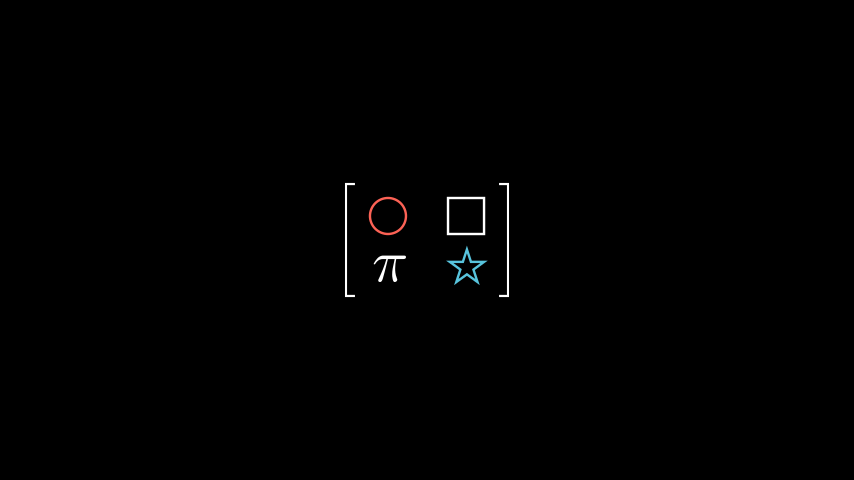

# Mobject矩阵

合格名称：`manim.mobject.matrix.MobjectMatrix`


```py
class MobjectMatrix(matrix, element_to_mobject=<function MobjectMatrix.<lambda>>, **kwargs)
```

Bases: `Matrix`

在屏幕上显示 mobject 条目矩阵的 mobject。

例子

示例：MobjectMatrixExample 



```py
from manim import *

class MobjectMatrixExample(Scene):
    def construct(self):
        a = Circle().scale(0.3)
        b = Square().scale(0.3)
        c = MathTex("\pi").scale(2)
        d = Star().scale(0.3)
        m0 = MobjectMatrix([[a, b], [c, d]])
        self.add(m0)
```


参数

- **matrix**– numpy 二维数组或列表列表。
- **v_buff** – 元素之间的垂直距离，默认为 0.8。
- **h_buff** – 元素之间的水平距离，默认为 1.3。
- **bracket_h_buff** – 默认情况下括号与矩阵的距离`MED_SMALL_BUFF`。
- **bracket_v_buff** – 默认情况下括号的高度`MED_SMALL_BUFF`。
- **add_background_rectangles_to_entries** –`True`默认情况下是否应将背景矩形添加到条目中`False`。
- **include_background_rectangle** –`True`默认情况下是否应包含背景矩形`False`。
- **element_to_mobject** – 默认情况下，用于构造元素的 mobject 类[`MathTex`]()。
- **element_to_mobject_config**`element_to_mobject` –默认情况下要传递给构造函数的附加参数`{}`。
- **element_alignment_corner** – 默认情况下元素对齐的角`DR`。
- **left_bracket** – 左括号类型，默认情况下`"["`。
- **right_bracket** – 默认情况下右括号类型`"]"`。
- **stretch_brackets** –`True`默认情况下是否应该拉伸括号以适应矩阵内容的高度`True`。
- **bracket_config**[`MathTex`]()–构造括号时要传递的附加参数。


方法


属性

|||
|-|-|
`animate`|用于对 的任何方法的应用程序进行动画处理`self`。
`animation_overrides`|
`color`|
`depth`|对象的深度。
`fill_color`|如果有多种颜色（对于渐变），则返回第一个颜色
`height`|mobject 的高度。
`n_points_per_curve`|
`sheen_factor`|
`stroke_color`|
`width`|mobject 的宽度。
