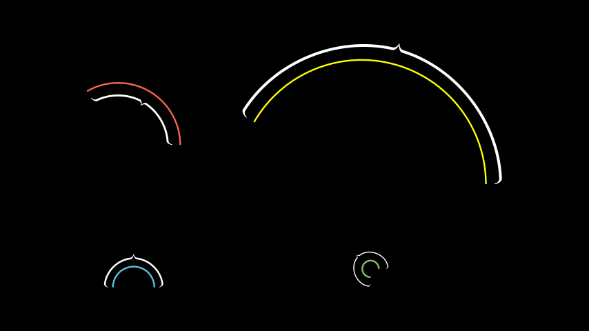

# 弧形大括号

合格名称：`manim.mobject.svg.brace.ArcBrace`


```py
class ArcBrace(arc=Arc, direction=array([1., 0., 0.]), **kwargs)
```

Bases: `Brace`

创建一个[`Brace`]()包围[`Arc`]().

方向参数允许从圆弧外部或内部应用支撑。

> 警告
> [`ArcBrace`]()对于半径较小的圆弧，该值较小。

> 提示
> 最初是由 的长度定义的[`ArcBrace`]()垂直线，但会按比例缩小以匹配起始角度和结束角度。然后根据圆弧半径移动指数函数。[`Brace`]()[`Arc`]()
> 缩放效果不适用于半径小于 1 的圆弧，以防止过度缩放。

参数

- **arc** ( [_Arc_]() ) –[`Arc`]()环绕[`Brace`]()mobject 的。
- **Direction** ( _Sequence_ _\[_ _float_ _\]_ ) – 支撑面向圆弧的方向。 `LEFT`为弧内，`RIGHT`为弧外。


例子

示例：ArcBrace 示例




```py
from manim import *

class ArcBraceExample(Scene):
    def construct(self):
        arc_1 = Arc(radius=1.5,start_angle=0,angle=2*PI/3).set_color(RED)
        brace_1 = ArcBrace(arc_1,LEFT)
        group_1 = VGroup(arc_1,brace_1)

        arc_2 = Arc(radius=3,start_angle=0,angle=5*PI/6).set_color(YELLOW)
        brace_2 = ArcBrace(arc_2)
        group_2 = VGroup(arc_2,brace_2)

        arc_3 = Arc(radius=0.5,start_angle=-0,angle=PI).set_color(BLUE)
        brace_3 = ArcBrace(arc_3)
        group_3 = VGroup(arc_3,brace_3)

        arc_4 = Arc(radius=0.2,start_angle=0,angle=3*PI/2).set_color(GREEN)
        brace_4 = ArcBrace(arc_4)
        group_4 = VGroup(arc_4,brace_4)

        arc_group = VGroup(group_1, group_2, group_3, group_4).arrange_in_grid(buff=1.5)
        self.add(arc_group.center())
```

参考：[`Arc`]()


方法


属性

|||
|-|-|
`animate`|用于对 的任何方法的应用程序进行动画处理`self`。
`animation_overrides`|
`color`|
`depth`|对象的深度。
`fill_color`|如果有多种颜色（对于渐变），则返回第一个颜色
`height`|mobject 的高度。
`n_points_per_curve`|
`sheen_factor`|
`stroke_color`|
`width`|mobject 的宽度。


`_original__init__(arc=None, direction=array([1., 0., 0.]), **kwargs)`

初始化自身。请参阅 help(type(self)) 以获取准确的签名。

参数:
- arc (manim.mobject.geometry.arc.Arc | None) –
- direction (Sequence[float]) –

