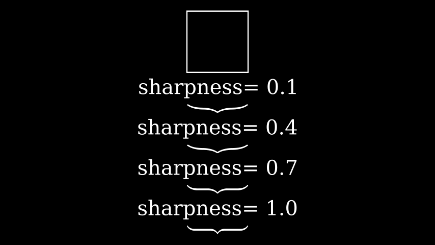

# 大括号

合格名称：`manim.mobject.svg.brace.Brace`


```py
class Brace(mobject, direction=array([0., - 1., 0.]), buff=0.2, sharpness=2, stroke_width=0, fill_opacity=1.0, background_stroke_width=0, background_stroke_color='#000000', **kwargs)
```

Bases: `VMobjectFromSVGPath`

获取一个 mobject 并在其旁边绘制一个大括号。

传递方向向量确定绘制支撑的方向。默认情况下，它是从下面绘制的。

参数

- **mobject** ( [_Mobject_]() ) – 与大括号相邻的 mobject。
- **Direction** ( _Sequence_ _\[_ _float_ _\]_ _|_ _None_ ) – 支撑面向 mobject 的方向。

> 也可以看看

> [`BraceBetweenPoints`]()


例子

示例：大括号示例



```py
from manim import *

class BraceExample(Scene):
    def construct(self):
        s = Square()
        self.add(s)
        for i in np.linspace(0.1,1.0,4):
            br = Brace(s, sharpness=i)
            t = Text(f"sharpness= {i}").next_to(br, RIGHT)
            self.add(t)
            self.add(br)
        VGroup(*self.mobjects).arrange(DOWN, buff=0.2)
```


方法

|||
|-|-|
[`get_direction`]()|用于[`shoelace_direction()`]()计算方向。
`get_tex`|
`get_text`|
`get_tip`|
`put_at_tip`|


属性

|||
|-|-|
`animate`|用于对 的任何方法的应用程序进行动画处理`self`。
`animation_overrides`|
`color`|
`depth`|对象的深度。
`fill_color`|如果有多种颜色（对于渐变），则返回第一个颜色
`height`|mobject 的高度。
`n_points_per_curve`|
`sheen_factor`|
`stroke_color`|
`width`|mobject 的宽度。


`get_direction()`

用于[`shoelace_direction()`]()计算方向。点的方向决定了绘制对象的方向，顺时针还是逆时针。

例子

a 的默认方向[`Circle`]()是逆时针：

```sh
>>> from manim import Circle
>>> Circle().get_direction()
'CCW'
```


返回

要么`"CW"`要么`"CCW"`.

返回类型

`str`
