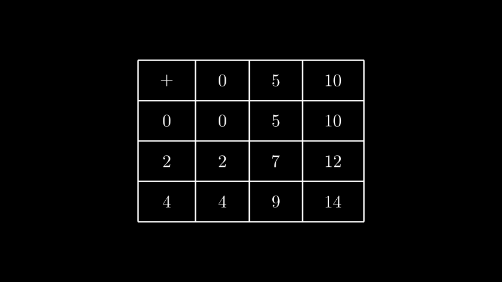

# 数学表

合格名称：`manim.mobject.table.MathTable`

```py
class MathTable(table, element_to_mobject=<class 'manim.mobject.text.tex_mobject.MathTex'>, **kwargs)
```

[`Table`]()与 LaTeX 一起使用的专用对象。

例子

示例：MathTable 示例



```py
from manim import *

class MathTableExample(Scene):
    def construct(self):
        t0 = MathTable(
            [["+", 0, 5, 10],
            [0, 0, 5, 10],
            [2, 2, 7, 12],
            [4, 4, 9, 14]],
            include_outer_lines=True)
        self.add(t0)
```


element_to_mobject 设置[`Table`]()为的特殊情况。表中的每个条目都是在 Latex 对齐环境中设置的。[`MathTex`]()

参数

- **table** ( _Iterable_ _\[_ _Iterable_ _\[_ _float_ _|_ _str_ _\]_ _\]_ ) – 二维数组或列表列表。表的内容必须是 的有效输入[`MathTex`]()。
- **element_to_mobject** ( _Callable_ _\[_ _\[_ _float_ _|_ _str_ _\]_ _,_ [_VMobject_]() _\]_ ) –[`Mobject`]()应用于表条目的类。设置为[`MathTex`]().
- **kwargs** – 要传递给 的附加参数[`Table`]()。


方法


属性

|||
|-|-|
`animate`|用于对 的任何方法的应用程序进行动画处理`self`。
`animation_overrides`|
`color`|
`depth`|对象的深度。
`fill_color`|如果有多种颜色（对于渐变），则返回第一个颜色
`height`|mobject 的高度。
`n_points_per_curve`|
`sheen_factor`|
`stroke_color`|
`width`|mobject 的宽度。
