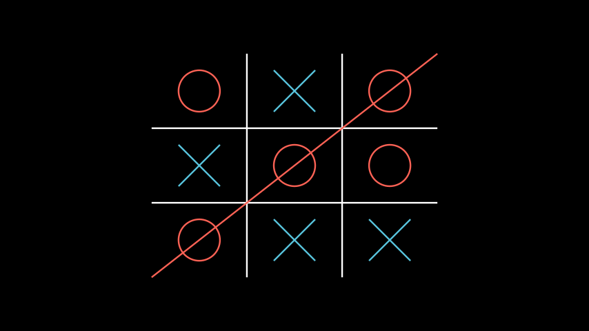

# Mobject表

合格名称：`manim.mobject.table.MobjectTable`


```py
class MobjectTable(table, element_to_mobject=<function MobjectTable.<lambda>>, **kwargs)
```

Bases: `Table`

[`Table`]()与 一起使用的专用对象[`Mobject`]()。

例子

示例：MobjectTableExample 



```py
from manim import *

class MobjectTableExample(Scene):
    def construct(self):
        cross = VGroup(
            Line(UP + LEFT, DOWN + RIGHT),
            Line(UP + RIGHT, DOWN + LEFT),
        )
        a = Circle().set_color(RED).scale(0.5)
        b = cross.set_color(BLUE).scale(0.5)
        t0 = MobjectTable(
            [[a.copy(),b.copy(),a.copy()],
            [b.copy(),a.copy(),a.copy()],
            [a.copy(),b.copy(),b.copy()]]
        )
        line = Line(
            t0.get_corner(DL), t0.get_corner(UR)
        ).set_color(RED)
        self.add(t0, line)
```


[`Table`]()with`element_to_mobject`设置为恒等函数的特殊情况。在这里， 中的每一项都`table`必须已经是类型[`Mobject`]()。

参数

- **table** ( _Iterable_ _\[_ _Iterable_ _\[_ [_VMobject_]() _\]_ _\]_ ) – 2D 数组或列表列表。表的内容必须是类型[`Mobject`]()。
- **element_to_mobject** ( _Callable_ _\[_ _\[_ [_VMobject_]() _\]_ _,_ [_VMobject_]() _\]_ ) –[`Mobject`]()应用于表条目的类。设置为返回自身。`lambda m : m`
- **kwargs** – 要传递给 的附加参数[`Table`]()。


方法


属性

|||
|-|-|
`animate`|用于对 的任何方法的应用程序进行动画处理`self`。
`animation_overrides`|
`color`|
`depth`|对象的深度。
`fill_color`|如果有多种颜色（对于渐变），则返回第一个颜色
`height`|mobject 的高度。
`n_points_per_curve`|
`sheen_factor`|
`stroke_color`|
`width`|mobject 的宽度。
