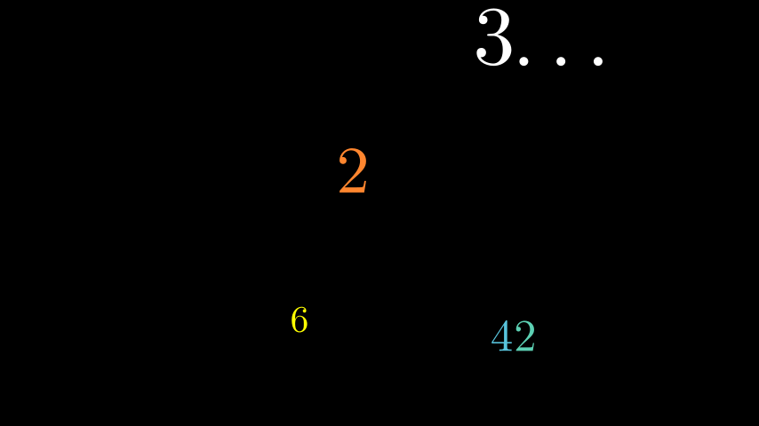

# 整数

合格名称：`manim.mobject.text.numbers.Integer`


```py
class Integer(number=0, num_decimal_places=0, **kwargs)
```

Bases: `DecimalNumber`

用于显示整数的类。


例子

示例：整数示例



```py
from manim import *

class IntegerExample(Scene):
    def construct(self):
        self.add(Integer(number=2.5).set_color(ORANGE).scale(2.5).set_x(-0.5).set_y(0.8))
        self.add(Integer(number=3.14159, show_ellipsis=True).set_x(3).set_y(3.3).scale(3.14159))
        self.add(Integer(number=42).set_x(2.5).set_y(-2.3).set_color_by_gradient(BLUE, TEAL).scale(1.7))
        self.add(Integer(number=6.28).set_x(-1.5).set_y(-2).set_color(YELLOW).scale(1.4))
```


方法

`get_value`


属性

|||
|-|-|
`animate`|用于对 的任何方法的应用程序进行动画处理`self`。
`animation_overrides`|
`color`|
`depth`|对象的深度。
`fill_color`|如果有多种颜色（对于渐变），则返回第一个颜色
`font_size`|tex mobject 的字体大小。
`height`|mobject 的高度。
`n_points_per_curve`|
`sheen_factor`|
`stroke_color`|
`width`|mobject 的宽度。
