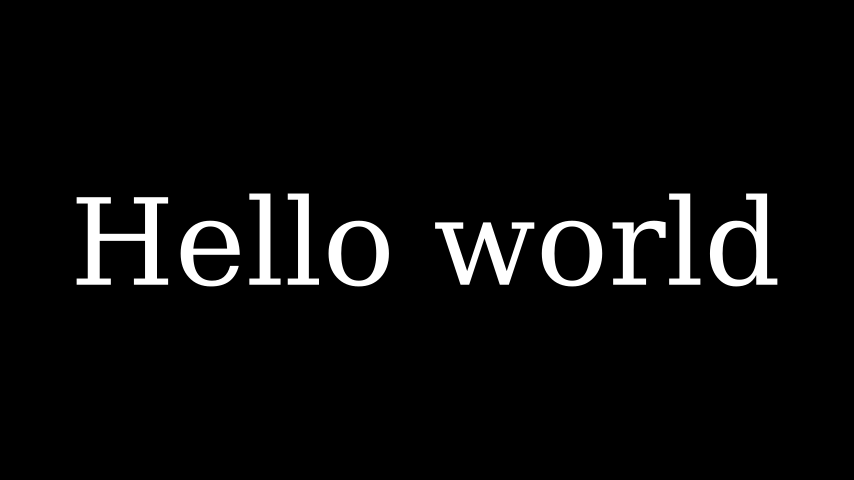
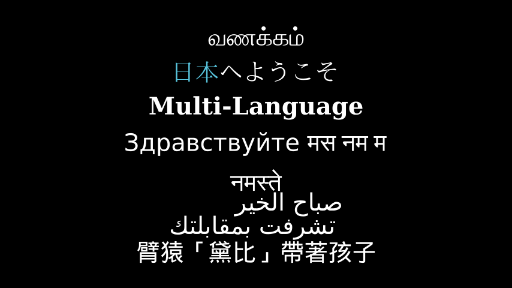

# Text文本

合格名称：`manim.mobject.text.text\_mobject.Text`


```py
class Text(text, fill_opacity=1.0, stroke_width=0, *, color='#FFFFFF', font_size=48, line_spacing=- 1, font='', slant='NORMAL', weight='NORMAL', t2c=None, t2f=None, t2g=None, t2s=None, t2w=None, gradient=None, tab_width=4, warn_missing_font=True, height=None, width=None, should_center=True, disable_ligatures=False, **kwargs)
```

Bases: `SVGMobject`

[显示使用 Pango](https://pango.gnome.org/)渲染的（非 LaTeX）文本。

文本对象的行为类似于[`VGroup`]()给定文本中所有字符的类似迭代。特别地，切片是可能的。

参数

- **text** ( _str_ ) – 需要创建为 mobject 的文本。
- **font** ( _str_ ) – 用于呈现文本的字体系列。这可以是系统字体，也可以是使用 register_font()加载的字体。请注意，不同操作系统的字体系列名称可能有所不同。
- **warn_missing_font** ( \_bool ) – 如果为 True （默认），如果从\_manimpango.list_fonts()返回的字体（区分大小写）列表中不存在该字体，Manim 将发出警告。
- **fill_opacity** (_float_) –
- **stroke_width**（_float_）-
- **color**(_Color\_\_|_ _str_ _|\_\_None_) –
- **font_size**（_float_）–
- **line_spacing** (_float_) –
- **slant**( _str_ ) –
- **weight**( _str_ ) –
- **t2c** (_dict_\_\[_ _str_ _,_ _str_ _\]_ ) –
- **t2f** (_dict_\_\[_ _str_ _,_ _str_ _\]_ ) –
- **t2g** (_dict_\_\[_ _str_ _,**tuple**\]_ ) –
- **t2s** (_dict_\_\[_ _str_ _,_ _str_ _\]_ ) –
- **t2w** (_dict_\_\[_ _str_ _,_ _str_ _\]_ ) –
- **gradient**（_tuple_）–
- **tab_width** ( _int_ ) –
- **height**（_float_）–
- **width**（_float_）–
- **should_center** (_bool_) –
- **disable_ligatures**( _bool_ ) –

返回

类似 mobject 的[`VGroup`]().

返回类型

[`Text`]()

例子

示例：Example1Text



```py
from manim import *

class Example1Text(Scene):
    def construct(self):
        text = Text('Hello world').scale(3)
        self.add(text)
```


示例：文本颜色示例


```py
from manim import *

class TextColorExample(Scene):
    def construct(self):
        text1 = Text('Hello world', color=BLUE).scale(3)
        text2 = Text('Hello world', gradient=(BLUE, GREEN)).scale(3).next_to(text1, DOWN)
        self.add(text1, text2)
```


示例：TextItalicAndBoldExample 


```py
from manim import *

class TextItalicAndBoldExample(Scene):
    def construct(self):
        text1 = Text("Hello world", slant=ITALIC)
        text2 = Text("Hello world", t2s={'world':ITALIC})
        text3 = Text("Hello world", weight=BOLD)
        text4 = Text("Hello world", t2w={'world':BOLD})
        text5 = Text("Hello world", t2c={'o':YELLOW}, disable_ligatures=True)
        text6 = Text(
            "Visit us at docs.manim.community",
            t2c={"docs.manim.community": YELLOW},
            disable_ligatures=True,
       )
        text6.scale(1.3).shift(DOWN)
        self.add(text1, text2, text3, text4, text5 , text6)
        Group(*self.mobjects).arrange(DOWN, buff=.8).set_height(config.frame_height-LARGE_BUFF)
```


示例：文本更多自定义


```py
from manim import *

class TextMoreCustomization(Scene):
    def construct(self):
        text1 = Text(
            'Google',
            t2c={'[:1]': '#3174f0', '[1:2]': '#e53125',
                 '[2:3]': '#fbb003', '[3:4]': '#3174f0',
                 '[4:5]': '#269a43', '[5:]': '#e53125'}, font_size=58).scale(3)
        self.add(text1)
```


由于[`Text`]()使用 Pango 渲染文本，渲染非英文字符是很容易的：

示例：多种字体



```py
from manim import *

class MultipleFonts(Scene):
    def construct(self):
        morning = Text("வணக்கம்", font="sans-serif")
        japanese = Text(
            "日本へようこそ", t2c={"日本": BLUE}
        )  # works same as ``Text``.
        mess = Text("Multi-Language", weight=BOLD)
        russ = Text("Здравствуйте मस नम म ", font="sans-serif")
        hin = Text("नमस्ते", font="sans-serif")
        arb = Text(
            "صباح الخير \n تشرفت بمقابلتك", font="sans-serif"
        )  # don't mix RTL and LTR languages nothing shows up then ;-)
        chinese = Text("臂猿「黛比」帶著孩子", font="sans-serif")
        self.add(morning, japanese, mess, russ, hin, arb, chinese)
        for i,mobj in enumerate(self.mobjects):
            mobj.shift(DOWN*(i-3))
```


示例：PangoRender 


```py
from manim import *

class PangoRender(Scene):
    def construct(self):
        morning = Text("வணக்கம்", font="sans-serif")
        self.play(Write(morning))
        self.wait(2)
```


测试

检查作品创作情况[`Text`]()：


```sh
>>> Text('The horse does not eat cucumber salad.')
Text('The horse does not eat cucumber salad.')
```


方法

|||
|-|-|
[`init_colors`]()|初始化颜色。


属性

|||
|-|-|
`animate`|用于对 的任何方法的应用程序进行动画处理`self`。
`animation_overrides`|
`color`|
`depth`|对象的深度。
`fill_color`|如果有多种颜色（对于渐变），则返回第一个颜色
`font_size`|
`hash_seed`|表示生成的对象点结果的唯一哈希值。
`height`|mobject 的高度。
`n_points_per_curve`|
`sheen_factor`|
`stroke_color`|
`width`|mobject 的宽度。


`init_colors(propagate_colors=True)`

初始化颜色。

被创造召唤。这是一个空方法，可以由子类实现。
