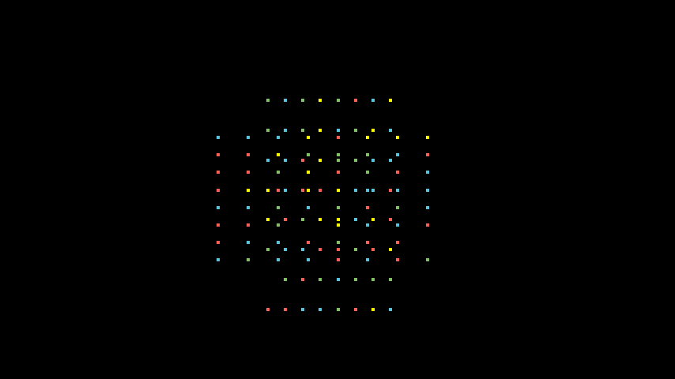

# 点

合格名称：`manim.mobject.types.point\_cloud\_mobject.Point`


```py
class Point(location=array([0., 0., 0.]), color='#000000', **kwargs)
```

Bases: `PMobject`

例子

示例：示例点



```py
from manim import *

class ExamplePoint(Scene):
    def construct(self):
        colorList = [RED, GREEN, BLUE, YELLOW]
        for i in range(200):
            point = Point(location=[0.63 * np.random.randint(-4, 4), 0.37 * np.random.randint(-4, 4), 0], color=np.random.choice(colorList))
            self.add(point)
        for i in range(200):
            point = Point(location=[0.37 * np.random.randint(-4, 4), 0.63 * np.random.randint(-4, 4), 0], color=np.random.choice(colorList))
            self.add(point)
        self.add(point)
```


方法

|||
|-|-|
[`generate_points`]()|初始化`points`并因此初始化形状。
`init_points`|


属性

|||
|-|-|
`animate`|用于对 的任何方法的应用程序进行动画处理`self`。
`animation_overrides`|
`depth`|对象的深度。
`height`|mobject 的高度。
`width`|mobject 的宽度。


`generate_points()`

初始化`points`并因此初始化形状。

被创造召唤。这是一个空方法，可以由子类实现。
