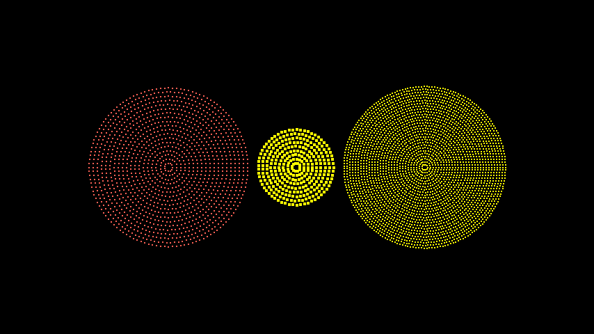

# 点云点

合格名称：`manim.mobject.types.point\_cloud\_mobject.PointCloudDot`


```py
class PointCloudDot(center=array([0., 0., 0.]), radius=2.0, stroke_width=2, density=10, color='#FFFF00', **kwargs)
```

Bases: `Mobject1D`


由点云组成的圆盘 .. 标题:: 示例


示例：PointCloudDotExample 



```py
from manim import *

class PointCloudDotExample(Scene):
    def construct(self):
        cloud_1 = PointCloudDot(color=RED)
        cloud_2 = PointCloudDot(stroke_width=4, radius=1)
        cloud_3 = PointCloudDot(density=15)

        group = Group(cloud_1, cloud_2, cloud_3).arrange()
        self.add(group)
```


示例：PointCloudDotExample2 

```py
from manim import *

class PointCloudDotExample2(Scene):
    def construct(self):
        plane = ComplexPlane()
        cloud = PointCloudDot(color=RED)
        self.add(
            plane, cloud
        )
        self.wait()
        self.play(
            cloud.animate.apply_complex_function(lambda z: np.exp(z))
        )
```


方法

|||
|-|-|
[`generate_points`]()|初始化`points`并因此初始化形状。
`init_points`|


属性

|||
|-|-|
`animate`|用于对 的任何方法的应用程序进行动画处理`self`。
`animation_overrides`|
`depth`|对象的深度。
`height`|mobject 的高度。
`width`|mobject 的宽度。


`generate_points()`

初始化`points`并因此初始化形状。

被创造召唤。这是一个空方法，可以由子类实现。
