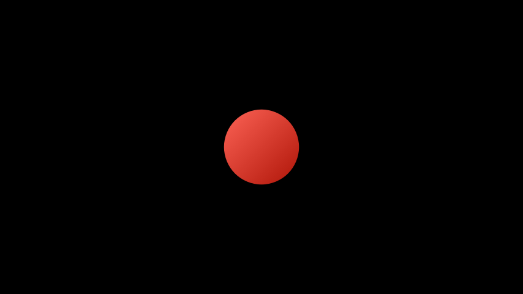

# VMobject

合格名称：`manim.mobject.types.vectorized\_mobject.VMobject`


```py
class VMobject(fill_color=None, fill_opacity=0.0, stroke_color=None, stroke_opacity=1.0, stroke_width=4, background_stroke_color='#000000', background_stroke_opacity=1.0, background_stroke_width=0, sheen_factor=0.0, joint_type=None, sheen_direction=array([- 1., 1., 0.]), close_new_points=False, pre_function_handle_to_anchor_scale_factor=0.01, make_smooth_after_applying_functions=False, background_image=None, shade_in_3d=False, tolerance_for_point_equality=1e-06, n_points_per_cubic_curve=4, **kwargs)
```

Bases: `Mobject`

矢量化对象。

参数

- **background_lines_color** – 背景描边的目的是使某些内容不会重叠填充，例如针对某些纹理背景的文本。
- **sheen_factor** – 当设置颜色 c 时，将通过使用 sheen_factor 将 c 插值到白色计算出第二种颜色，并且显示将在 sheen_direction 方向上渐变到该第二种颜色。
- **close_new_points** – 表示它不会显示，但它应该计入父对象的路径中
- **tolerance_for_point_equality** – 这是在一个像素内
- **joint_type** ( [_LineJointType_]() _|_ _None_ ) – 用于连接此矢量化 mobject 的曲线段的线接头类型。请参阅[`LineJointType`]() 参考资料 选项。


方法

|||
|-|-|
`add_cubic_bezier_curve`|
[`add_cubic_bezier_curve_to`]()|将三次贝塞尔曲线添加到路径中。
`add_cubic_bezier_curves`|
[`add_line_to`]()|添加一条从 VMobject 的最后一个点到给定点的直线。
`add_points_as_corners`|
[`add_quadratic_bezier_curve_to`]()|将二次贝塞尔曲线添加到路径中。
[`add_smooth_curve_to`]()|从给定点创建平滑曲线并将其添加到 VMobject。
`add_subpath`|
[`align_points`]()|向 self 和 vmobject 添加点，以便它们都具有相同数量的子路径，并且每个相应的子路径都包含相同数量的点。
`align_rgbas`|
`append_points`|
`append_vectorized_mobject`|
`apply_function`|
[`change_anchor_mode`]()|更改贝塞尔曲线的锚定模式。
`clear_points`|
`close_path`|
`color_using_background_image`|
`consider_points_equals`|
[`consider_points_equals_2d`]()|确定两个点是否足够接近以被视为相等。
`fade`|
[`force_direction`]()|确保点的方向是顺时针或逆时针。
[`gen_cubic_bezier_tuples_from_points`]()|从点数组返回贝塞尔曲线元组。
`gen_subpaths_from_points_2d`|
[`generate_rgbas_array`]()|第一个 arg 可以是颜色，也可以是颜色元组/列表。
[`get_anchors`]()|返回形成 VMobject 的曲线的锚点。
[`get_anchors_and_handles`]()|返回 anchors1、handles1、handles2、anchors2，其中 (anchors1\[i\]、handles1\[i\]、handles2\[i\]、anchors2\[i\]) 是为 range(0, len(锚 1))
[`get_arc_length`]()|返回整条曲线的近似长度。
`get_background_image`|
[`get_color`]()|返回的颜色[`Mobject`]()
`get_cubic_bezier_tuples`|
`get_cubic_bezier_tuples_from_points`|
[`get_curve_functions`]()|获取 mobject 曲线的函数。
[`get_curve_functions_with_lengths`]()|获取 mobject 的函数和曲线长度。
[`get_direction`]()|用于[`shoelace_direction()`]()计算方向。
[`get_end_anchors`]()|返回贝塞尔曲线的末端锚点。
[`get_fill_color`]()|如果有多种颜色（对于渐变），则返回第一个颜色
`get_fill_colors`|
`get_fill_opacities`|
[`get_fill_opacity`]()|如果有多个不透明度，则返回第一个
`get_fill_rgbas`|
`get_gradient_start_and_end_points`|
`get_group_class`|
`get_last_point`|
[`get_mobject_type_class`]()|返回此 mobject 类型的基类。
[`get_nth_curve_function`]()|返回第 n 条曲线的表达式。
[`get_nth_curve_function_with_length`]()|返回第 n 条曲线的表达式及其（近似）长度。
[`get_nth_curve_length`]()|返回第 n 条曲线的（近似）长度。
[`get_nth_curve_length_pieces`]()|返回用于长度近似的短线长度数组。
[`get_nth_curve_points`]()|返回定义 vmobject 第 n 条曲线的点。
[`get_num_curves`]()|返回 vmobject 的曲线数。
[`get_point_mobject`]()|最简单的[`Mobject`]()就是转化为自我或转化为自我。
`get_points_defining_boundary`|
`get_sheen_direction`|
`get_sheen_factor`|
[`get_start_anchors`]()|返回贝塞尔曲线的起始锚点。
`get_stroke_color`|
`get_stroke_colors`|
`get_stroke_opacities`|
`get_stroke_opacity`|
`get_stroke_rgbas`|
`get_stroke_width`|
`get_style`|
[`get_subcurve`]()|返回区间 \[a, b\] 之间 VMobject 的子曲线。
[`get_subpaths`]()|返回由 VMobject 的曲线形成的子路径。
`get_subpaths_from_points`|
`has_new_path_started`|
[`init_colors`]()|初始化颜色。
[`insert_n_curves`]()|将 n 条曲线插入到 vmobject 的贝塞尔曲线中。
[`insert_n_curves_to_point_list`]()|给定定义贝塞尔曲线（锚点和手柄）的 k 个点数组，返回精确定义 k + n 贝塞尔曲线的点。
`interpolate_color`|
`is_closed`|
`make_jagged`|
`make_smooth`|
`match_background_image`|
`match_style`|
[`point_from_proportion`]()|获取沿 路径的一定比例的点[`VMobject`]()。
[`pointwise_become_partial`]()|给定两个边界 a 和 b，将自身 vmobject 的点转换为相对于边界作为参数传递的 vmobject 的点。
[`proportion_from_point`]()|[`VMobject`]()返回沿特定给定点所在路径的比例。
[`resize_points`]()|调整锚点和手柄数组的大小以具有指定的大小。
[`reverse_direction`]()|通过反转点顺序来恢复点方向。
[`rotate`]()|[`Mobject`]()围绕某个点旋转。
[`rotate_sheen_direction`]()|旋转应用光泽的方向。
[`scale_handle_to_anchor_distances`]()|如果给定手柄点 H 与其关联的锚点 A 之间的距离为 d，则它将 H 更改为距 A 的距离因子 \*d，但从 A 到 H 的线不会改变。
[`set_anchors_and_handles`]()|给定两组锚点和句柄，对它们进行处理以将它们设置为 VMobject 的锚点和句柄。
`set_background_stroke`|
[`set_color`]()|条件是接受一个参数 (x, y, z) 的函数。
[`set_fill`]()|设置 的填充颜色和填充不透明度[`VMobject`]()。
`set_opacity`|
`set_points`|
[`set_points_as_corners`]()|给定一个点数组，将它们设置为 vmobject 的角点。
`set_points_smoothly`|
`set_shade_in_3d`|
[`set_sheen`]()|从某个方向应用颜色渐变。
[`set_sheen_direction`]()|设置应用光泽的方向。
`set_stroke`|
`set_style`|
`start_new_path`|
`update_rgbas_array`|


属性

|||
|-|-|
`animate`|用于对 的任何方法的应用程序进行动画处理`self`。
`animation_overrides`|
`color`|
`depth`|对象的深度。
[`fill_color`]()|如果有多种颜色（对于渐变），则返回第一个颜色
`height`|mobject 的高度。
`n_points_per_curve`|
`sheen_factor`|
`stroke_color`|
`width`|mobject 的宽度。


`add_cubic_bezier_curve_to(handle1, handle2, anchor)`

将三次贝塞尔曲线添加到路径中。

注意：第一个锚点不是参数，因为默认情况下是最后一个子路径的末尾！

参数

- **handle1** ( _ndarray_ ) – 第一个句柄
- **handle2** ( _ndarray_ ) – 第二个句柄
- **anchor**( _ndarray_ ) – 锚

返回

`self`

返回类型

[`VMobject`]()


`add_line_to(point)`

添加一条从 VMobject 的最后一个点到给定点的直线。

参数

**point** ( _ndarray_ ) – 直线的终点。

返回

`self`

返回类型

[`VMobject`]()


`add_quadratic_bezier_curve_to(handle, anchor)`

将二次贝塞尔曲线添加到路径中。

返回

`self`

返回类型

[`VMobject`]()

参数

- **handle**( _ndarray_ ) –
- **anchor**( _ndarray_ ) –


`add_smooth_curve_to(*points)`

从给定点创建平滑曲线并将其添加到 VMobject。如果传入两个点，第一个点将被解释为句柄，第二个点将被解释为锚点。

参数

**points**( _array_ ) – 用于添加平滑曲线的点（锚点和手柄，或只是锚点）

返回

`self`

返回类型

[`VMobject`]()

提高

**ValueError** – 如果给出 0 或超过 2 分。


`align_points(vmobject)`

向 self 和 vmobject 添加点，以便它们都具有相同数量的子路径，并且每个相应的子路径都包含相同数量的点。

通过沿着子路径均匀细分曲线或通过创建由重复的单个点组成的新子路径来添加点。

参数

**vmobject** ( [_VMobject_]() ) – 用来对齐点的对象。

返回

`self`

返回类型

[`VMobject`]()


`change_anchor_mode(mode)`

更改贝塞尔曲线的锚定模式。这将修改手柄。

只能有两种模式：“锯齿状”和“平滑”。

返回

`self`

返回类型

[`VMobject`]()

参数

**mode**( _str_ ) –


`consider_points_equals_2d(p0, p1)`

确定两个点是否足够接近以被视为相等。

这使用了 np.isclose() 中的算法，但在此处针对 2D 点情况进行了扩展。NumPy 对于这样一个小问题来说有点过分了。:param p0: 第一个点 :param p1: 第二个点

返回

两点是否接近。

返回类型

bool

参数

- **p0** ( _ndarray_ ) –
- **p1** ( _ndarray_ ) –

_属性_ fill_color

如果有多种颜色（对于渐变），则返回第一个颜色


`force_direction(target_direction)`

确保点的方向是顺时针或逆时针。

参数

**target_direction** ( _str_ ) –`"CW"`或`"CCW"`。


`gen_cubic_bezier_tuples_from_points(points)`

从点数组返回贝塞尔曲线元组。

self.points 是 mobject 贝塞尔曲线的锚点和句柄的列表（即 \[anchor1、handle1、handle2、anchor2、anchor3 ..\]）。该算法基本上通过每 n 取一个元素来检索它们，其中 n 是贝塞尔曲线的控制点数量。

参数

**points**( _ndarray_ ) – 将从中提取控制点的点。

返回

贝塞尔曲线控制点。

返回类型

_Tuple_


`generate_rgbas_array(color, opacity)`

第一个 arg 可以是颜色，也可以是颜色元组/列表。同样，不透明度可以是一个浮点数，也可以是浮点数的元组。如果 self.sheen_factor 不为零，并且只传入一种颜色，则会自动为渐变添加第二种稍浅的颜色


`get_anchors()`

返回形成 VMobject 的曲线的锚点。

返回

锚。

返回类型

np.ndarray


`get_anchors_and_handles()`

返回 anchors1、handles1、handles2、anchors2，其中 (anchors1\[i\]、handles1\[i\]、handles2\[i\]、anchors2\[i\]) 是为 range(0, len(anchors1))

返回

锚点和手柄的可迭代。

返回类型

_Iterable_\[np.ndarray\]


`get_arc_length(sample_points_per_curve=None)`

返回整条曲线的近似长度。

参数

**Sample_points_per_curve** ( _int_ _|_ _None_ ) – 用于近似长度的每条曲线的样本点数。更多的点会产生更好的近似值。

返回

[`VMobject`]()的长度。

返回类型

float


`get_color()`

返回的颜色[`Mobject`]()


`get_curve_functions()`

获取 mobject 曲线的函数。

返回

曲线的函数。

返回类型

_Iterable\[Callable\[\[float\], np.ndarray\]\]_


`get_curve_functions_with_lengths(**kwargs)`

获取 mobject 的函数和曲线长度。

参数

**\*\*kwargs** – 传递给的关键字参数[`get_nth_curve_function_with_length()`]()

返回

曲线的函数和长度。

返回类型

_Iterable\[Tuple[Callable\[\[float\], np.ndarray\], float\]\]_


`get_direction()`

用于[`shoelace_direction()`]()计算方向。点的方向决定了绘制对象的方向，顺时针还是逆时针。

例子

a 的默认方向[`Circle`]()是逆时针：

```py
>>> from manim import Circle
>>> Circle().get_direction()
'CCW'
```

返回

要么`"CW"`要么`"CCW"`.

返回类型

`str`


`get_end_anchors()`

返回贝塞尔曲线的末端锚点。

返回

启动锚点

返回类型

np.ndarray


`get_fill_color()`

如果有多种颜色（对于渐变），则返回第一个颜色


`get_fill_opacity()`

如果有多个不透明度，则返回第一个


`static get_mobject_type_class()`

返回此 mobject 类型的基类。


`get_nth_curve_function(n)`

返回第 n 条曲线的表达式。

参数

**n** ( _int_ ) – 所需曲线的索引。

返回

第 n 条贝塞尔曲线的表达式。

返回类型

_Callable_\[float\]


`get_nth_curve_function_with_length(n, sample_points=None)`

返回第 n 条曲线的表达式及其（近似）长度。

参数

- **n** ( _int_ ) – 所需曲线的索引。
- **Sample_points** ( _int_ _|_ _None_ ) – 采样以查找长度的点数。

返回

- **curve** ( _typing.Callable\[\[float\], np.ndarray\]_ ) – 第 n 条曲线的函数。
- **length** ( `float`) – 第 n 条曲线的长度。

返回类型

tuple\[_Callable_\[\[float\], np.ndarray\], float\]


`get_nth_curve_length(n, sample_points=None)`

返回第 n 条曲线的（近似）长度。

参数

- **n** ( _int_ ) – 所需曲线的索引。
- **Sample_points** ( _int_ _|_ _None_ ) – 采样以查找长度的点数。

返回

**length** – 第 n 条曲线的长度。

返回类型

`float`


`get_nth_curve_length_pieces(n, sample_points=None)`

返回用于长度近似的短线长度数组。

参数

- **n** ( _int_ ) – 所需曲线的索引。
- **Sample_points** ( _int_ _|_ _None_ ) – 采样以查找长度的点数。

返回

第 n 条曲线的短长度片段。

返回类型

np.ndarray


`get_nth_curve_points(n)`

返回定义 vmobject 第 n 条曲线的点。

参数

**n** ( _int_ ) – 所需贝塞尔曲线的索引。

返回

定义第 n 条贝塞尔曲线的点（锚点、手柄）

返回类型

np.ndarray


`get_num_curves()`

返回 vmobject 的曲线数。

返回

vmobject 的曲线数量。

返回类型

int


`get_point_mobject(center=None)`

最简单的[`Mobject`]()就是转化为自我或转化为自我。应由适当类型的点


`get_start_anchors()`

返回贝塞尔曲线的起始锚点。

返回

启动锚点

返回类型

np.ndarray


`get_subcurve(a, b)`

返回区间 \[a, b\] 之间 VMobject 的子曲线。曲线本身就是一个 VMobject。

参数

- **a** ( _float_ ) – 下限。
- **b** ( _float_ ) – 上限。

返回

\[a, b\] 之间的子曲线

返回类型

[VMobject]()


`get_subpaths()`

返回由 VMobject 的曲线形成的子路径。

子路径是曲线范围，每对连续曲线的终点/起点重合。

返回

子路径。

返回类型

_Tuple_


`init_colors(propagate_colors=True)`

初始化颜色。

被创造召唤。这是一个空方法，可以由子类实现。


`insert_n_curves(n)`

将 n 条曲线插入到 vmobject 的贝塞尔曲线中。

参数

**n** ( _int_ ) – 要插入的曲线数。

返回

`self`

返回类型

[`VMobject`]()


`insert_n_curves_to_point_list(n, points)`

给定定义贝塞尔曲线（锚点和手柄）的 k 个点数组，返回精确定义 k + n 贝塞尔曲线的点。

参数

- **n** ( _int_ ) – 所需曲线的数量。
- **points**( _ndarray_ ) – 起点。

返回

生成积分。

返回类型

np.ndarray


`point_from_proportion(alpha)`

获取沿 路径的一定比例的点[`VMobject`](")。

参数

**alpha** ( _float_ ) – 沿路径的比例[`VMobject`]()。

返回

上的点[`VMobject`]()。

返回类型

`numpy.ndarray`

提高

- **ValueError** – 如果`alpha`不在 0 和 1 之间。
- **Exception**\- 如果[`VMobject`]()没有分数。


`pointwise_become_partial(vmobject, a, b)`

给定两个边界 a 和 b，将自身 vmobject 的点转换为相对于边界作为参数传递的 vmobject 的点。这里的点代表贝塞尔曲线的控制点（锚点和手柄）

参数

- **vmobject** ( [_VMobject_]() ) – 将用作模型的 vmobject。
- **a** ( _float_ ) – 上限。
- **b** ( _float_ ) – 下限

返回

`self`

返回类型

[`VMobject`]()


`proportion_from_point(point)`

[`VMobject`]() 返回沿特定给定点所在路径的比例。

参数

**point** ( _Iterable_ _\[_ _float_ _|_ _int_ _\]_ ) – 点的笛卡尔坐标，该点可能位于也可能不位于[`VMobject`]()

返回

沿路径的比例[`VMobject`]()。

返回类型

float

提高

- **ValueError** – 如果`point`不在曲线上。
- **Exception**\- 如果[`VMobject`]()没有分数。


`resize_points(new_length, resize_func=<function resize_array>)`

调整锚点和手柄数组的大小以具有指定的大小。

参数

- **new_length** ( _int_ ) – 新的（总）点数。
- **resize_func** ( _Callable_ _\[_ _\[_ _ndarray_ _,_ _int_ _\]_ _,_ _ndarray_ _\]_ ) – 将 Numpy 数组（点）和整数（目标大小）映射到 Numpy 数组的函数。默认实现是基于 Numpy 的`resize`函数。


`reverse_direction()`

通过反转点顺序来恢复点方向。

返回

返回self。

返回类型

[`VMobject`]()


例子

示例：改变方向

```py
from manim import *

class ChangeOfDirection(Scene):
    def construct(self):
        ccw = RegularPolygon(5)
        ccw.shift(LEFT)
        cw = RegularPolygon(5)
        cw.shift(RIGHT).reverse_direction()

        self.play(Create(ccw), Create(cw),
        run_time=4)
```


`rotate(angle, axis=array([0., 0., 1.]), about_point=None, **kwargs)`

[`Mobject`]()围绕某个点旋转。

参数

- **angle**（_float_）–
- **axis**( _np.ndarray_ ) –
- **about_point** (_Sequence\[float\] | None_ ) –


`rotate_sheen_direction(angle, axis=array([0., 0., 1.]), family=True)`

旋转应用光泽的方向。

参数

- **angle** ( _float_ ) – 光泽方向旋转的角度。
- **axis** ( _ndarray_ ) – 旋转轴。


例子

正常使用：

```py
Circle().set_sheen_direction(UP).rotate_sheen_direction(PI)
```

> 也可以看看

> [`set_sheen_direction()`]()


`scale_handle_to_anchor_distances(factor)`

如果给定手柄点 H 与其关联的锚点 A 之间的距离为 d，则它将 H 更改为距 A 的距离因子 \*d，但从 A 到 H 的线不会改变。这在应用（可微）函数的上下文中最有用，以保留相切属性。人们会将所有手柄拉近其锚点，应用该功能，然后再次将它们推出。

参数

**Factor** ( _float_ ) – 用于缩放的因子。

返回

`self`

返回类型

[`VMobject`]()


`set_anchors_and_handles(anchors1, handles1, handles2, anchors2)`

给定两组锚点和句柄，对它们进行处理以将它们设置为 VMobject 的锚点和句柄。

anchors1\[i\]、handles1\[i\]、handles2\[i\] 和 anchors2\[i\] 定义 vmobject 的第 i 条贝塞尔曲线。有四个硬编码参数，这是一个问题，因为它使得每条三次曲线的点数不能从 4 个更改（两个锚点和两个手柄）。

返回

`self`

返回类型

[`VMobject`]()

参数

- **anchors1**（_Sequence\_\_\[_ _float_ _\]_）-
- **handles1**（_Sequence\_\_\[_ _float_ _\]_）-
- **handles2**（_Sequence\_\_\[_ _float_ _\]_）-
- **anchors2**（_Sequence\_\_\[_ _float_ _\]_）–


`set_color(color, family=True)`

条件是接受一个参数 (x, y, z) 的函数。这里它只是递归到子对象，但是在子类中，这应该基于颜色的内部工作原理进一步实现


`set_fill(color=None, opacity=None, family=True)`

设置 的填充颜色和填充不透明度[`VMobject`]()。

参数

- **color** ( _str_ _|_ _None_ ) – 的填充颜色[`VMobject`]()。
- **opacity** ( _float_ _|_ _None_ ) – 填充 的不透明度[`VMobject`]()。
- **family** ( _bool_ ) – 如果为`True`，则还设置所有子对象的填充颜色。

返回

`self`

返回类型

[`VMobject`]()

例子

示例：设置填充


```py
from manim import *

class SetFill(Scene):
    def construct(self):
        square = Square().scale(2).set_fill(WHITE,1)
        circle1 = Circle().set_fill(GREEN,0.8)
        circle2 = Circle().set_fill(YELLOW) # No fill_opacity
        circle3 = Circle().set_fill(color = '#FF2135', opacity = 0.2)
        group = Group(circle1,circle2,circle3).arrange()
        self.add(square)
        self.add(group)
```

> 也可以看看

> `set_style()`


`set_points_as_corners(points)`

给定一个点数组，将它们设置为 vmobject 的角点。

为了实现这一点，该算法将手柄设置为与锚点对齐，以便生成的贝塞尔曲线将成为两个锚点之间的线段。

参数

**points** ( _Sequence_ _\[_ _float_ _\]_ ) – 将被设置为角点的点数组。

返回

`self`

返回类型

[`VMobject`]()


`set_sheen(factor, direction=None, family=True)`

从某个方向应用颜色渐变。

参数

- **Factor** ( _float_ ) – 应用的光泽/渐变程度。如果为负，则渐变从黑色开始，如果为正，则渐变从白色开始并更改为当前颜色。
- **Direction** (_Optional\_\_\[_ _ndarray_ _\]_ ) – 应用渐变的方向。


例子

示例：SetSheen 



```py
from manim import *

class SetSheen(Scene):
    def construct(self):
        circle = Circle(fill_opacity=1).set_sheen(-0.3, DR)
        self.add(circle)
```


`set_sheen_direction(direction, family=True)`

设置应用光泽的方向。

参数

**Direction** ( _ndarray_ ) – 应用渐变的方向。


例子

正常使用：

```py
Circle().set_sheen_direction(UP)
```


> 也可以看看

> [`set_sheen()`](),[`rotate_sheen_direction()`]()
