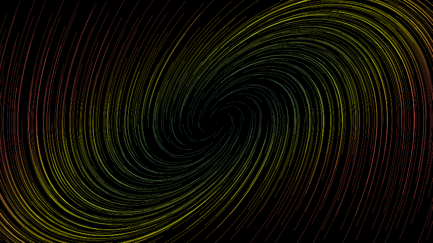
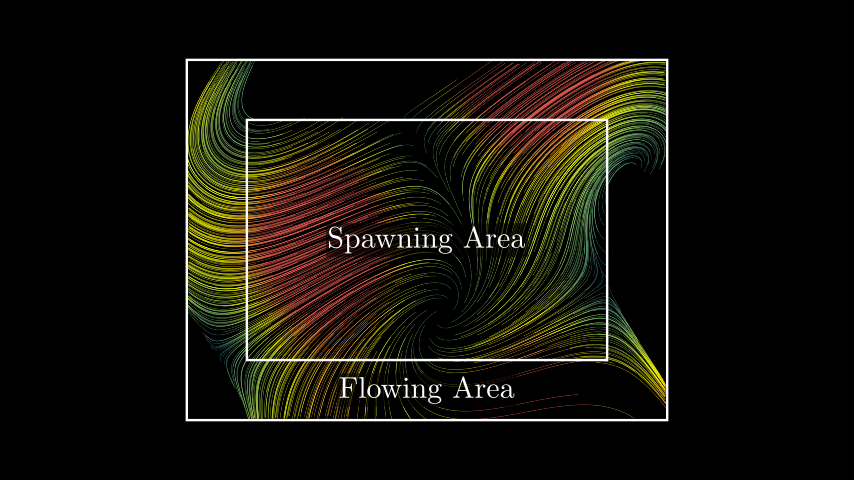

# 流线

合格名称：`manim.mobject.vector\_field.StreamLines`


```py
class StreamLines(func, color=None, color_scheme=None, min_color_scheme_value=0, max_color_scheme_value=2, colors=['#236B8E', '#83C167', '#FFFF00', '#FC6255'], x_range=None, y_range=None, z_range=None, three_dimensions=False, noise_factor=None, n_repeats=1, dt=0.05, virtual_time=3, max_anchors_per_line=100, padding=3, stroke_width=1, opacity=1, **kwargs)
```

Bases: `VectorField`

[`VectorField`]()流线表示使用移动主体的轨迹的流动。

矢量场始终基于定义每个位置矢量的函数。该函数的值是通过沿着矢量场移动许多代理并显示它们的轨迹来显示的。

参数

- **func** ( _Callable_ _\[_ _\[_ _np.ndarray_ _\]_ _,_ _np.ndarray_ _\]_ ) – 定义向量场每个位置的变化率的函数。
- **color** ( _Color_ _|_ _None_ ) – 矢量场的颜色。如果设置，则禁用特定于位置的着色。
- **color_scheme** ( _Callable_ _\[_ _\[_ _np.ndarray_ _\]_ _,_ _float_ _\]_ _|_ _None_ ) – 将向量映射到单个值的函数。该值给出使用 min_color_scheme_value、max_color_scheme_value 和 Colors 定义的颜色渐变中的位置。
- **min_color_scheme_value** ( *float ) – 要映射到*颜色中第一个颜色的 color_scheme 函数的值。较低的值也会导致渐变的第一种颜色。
- **max_color_scheme_value** ( *float ) – 要映射到*颜色中最后一个颜色的 color_scheme 函数的值。较高的值也会导致渐变的最后一种颜色。
- **colors**( _Sequence_ _\[_ _Color_ _\]_ ) – 定义矢量场颜色渐变的颜色。
- **x_range** ( _Sequence_ _\[_ _float_ _\]_ ) – x_min、x_max、delta_x 的序列
- **y_range** ( _Sequence_ _\[_ _float_ _\]_ ) – y_min、y_max、delta_y 的序列
- **z_range** ( _Sequence_ _\[_ _float_ _\]_ ) – z_min、z_max、delta_z 的序列
- **Three_dimensions** ( _bool_ ) – 启用 Three_dimensions。默认设置为 False，如果 z_range 不为 None，则自动变为 True。
- **noise_factor** ( _float_ _|_ _None_ ) – 每个智能体的起始位置沿每个轴改变的量。如果未定义则默认为。`delta_y / 2`
- **n_repeats** – 每个起点生成的代理数量。
- **dt** – 代理每步移动距离被拉伸的因子。值越低，矢量场中的轨迹就越接近。
- **virtual_time** – 代理在矢量场中移动的时间。因此，较高的值会导致较长的流线。然而，这整个时间都是在创建时模拟的。
- **max_anchors_per_line** – 每行的最大锚点数量。具有更多锚点的线条的复杂性会降低，但长度不会降低。
- **padding**– 距离代理可以在被终止之前移出生成区域。
- **Stroke_width** – 流线的笔划。
- **opacity**– 流线的不透明度。


例子

示例：基本用法



```py
from manim import *

class BasicUsage(Scene):
    def construct(self):
        func = lambda pos: ((pos[0] * UR + pos[1] * LEFT) - pos) / 3
        self.add(StreamLines(func))
```


示例：SpawningAndFlowingArea



```py
from manim import *

class SpawningAndFlowingArea(Scene):
    def construct(self):
        func = lambda pos: np.sin(pos[0]) * UR + np.cos(pos[1]) * LEFT + pos / 5
        stream_lines = StreamLines(
            func, x_range=[-3, 3, 0.2], y_range=[-2, 2, 0.2], padding=1
        )

        spawning_area = Rectangle(width=6, height=4)
        flowing_area = Rectangle(width=8, height=6)
        labels = [Tex("Spawning Area"), Tex("Flowing Area").shift(DOWN * 2.5)]
        for lbl in labels:
            lbl.add_background_rectangle(opacity=0.6, buff=0.05)

        self.add(stream_lines, spawning_area, flowing_area, *labels)
```


方法

|||
|-|-|
[`create`]()|流线的创建动画。
[`end_animation`]()|顺利结束流线动画。
[`start_animation`]()|使用更新程序对流线进行动画处理。


属性

|||
|-|-|
`animate`|用于对 的任何方法的应用程序进行动画处理`self`。
`animation_overrides`|
`color`|
`depth`|对象的深度。
`fill_color`|如果有多种颜色（对于渐变），则返回第一个颜色
`height`|mobject 的高度。
`n_points_per_curve`|
`sheen_factor`|
`stroke_color`|
`width`|mobject 的宽度。


`create(lag_ratio=None, run_time=None, **kwargs)`

流线的创建动画。

流线以随机顺序出现。

参数

- **lag_ratio** ( _float_ _|_ _None_ ) – 动画的滞后比率。如果未定义，则将选择它，以便总动画长度是每个流线创建的运行时间的 1.5 倍。
- **run_time** (_Callable\[\[float\], float\] | None_) – 每个流线创建的运行时间。由于 lag_ratio ，整个动画的运行时间可能会更长。如果未定义，则将流线的虚拟时间用作运行时间。

返回

流线的创建动画。

返回类型

[`AnimationGroup`]()


例子

示例：StreamLineCreation 

```py
from manim import *

class StreamLineCreation(Scene):
    def construct(self):
        func = lambda pos: (pos[0] * UR + pos[1] * LEFT) - pos
        stream_lines = StreamLines(
            func,
            color=YELLOW,
            x_range=[-7, 7, 1],
            y_range=[-4, 4, 1],
            stroke_width=3,
            virtual_time=1,  # use shorter lines
            max_anchors_per_line=5,  # better performance with fewer anchors
        )
        self.play(stream_lines.create())  # uses virtual_time as run_time
        self.wait()
```


`end_animation()`

顺利结束流线动画。

返回一个动画，导致完全显示流线而没有明显的剪切。

返回

动画淡出正在运行的流动画。

返回类型

[`AnimationGroup`]()

提高

**ValueError** – 如果没有流线动画正在运行


例子

示例：结束动画

```py
from manim import *

class EndAnimation(Scene):
    def construct(self):
        func = lambda pos: np.sin(pos[0] / 2) * UR + np.cos(pos[1] / 2) * LEFT
        stream_lines = StreamLines(
            func, stroke_width=3, max_anchors_per_line=5, virtual_time=1, color=BLUE
        )
        self.add(stream_lines)
        stream_lines.start_animation(warm_up=False, flow_speed=1.5, time_width=0.5)
        self.wait(1)
        self.play(stream_lines.end_animation())
```


```py
start_animation(warm_up=True, flow_speed=1, time_width=0.3, rate_func=<function linear>, line_animation_class=<class 'manim.animation.indication.ShowPassingFlash'>, **kwargs)
```

使用更新程序对流线进行动画处理。

流线将不断流动

参数

- **Warm_up** ( _bool_ ) – 如果为 True，动画将逐行初始化。否则，它将以显示的所有行开始。
- **flow_speed** ( _float_ ) – 当 flow_speed=1 时，流每秒移动的距离等于沿其路径的矢量场的大小。速度值缩放该流的速度。
- **time_width** ( _float_ ) – 动画时显示的流线比例
- **rate_func** ( _Callable_ _\[_ _\[_ _float_ _\]_ _,_ _float_ _\]_ ) – 每条流线闪烁的速率函数
- **line_animation_class** ( _type_ _\[_ [_ShowPassingFlash_]() _\]_ ) – 正在使用的动画类

返回类型

None


例子

示例：连续运动

```py
from manim import *

class ContinuousMotion(Scene):
    def construct(self):
        func = lambda pos: np.sin(pos[0] / 2) * UR + np.cos(pos[1] / 2) * LEFT
        stream_lines = StreamLines(func, stroke_width=3, max_anchors_per_line=30)
        self.add(stream_lines)
        stream_lines.start_animation(warm_up=False, flow_speed=1.5)
        self.wait(stream_lines.virtual_time / stream_lines.flow_speed)
```
