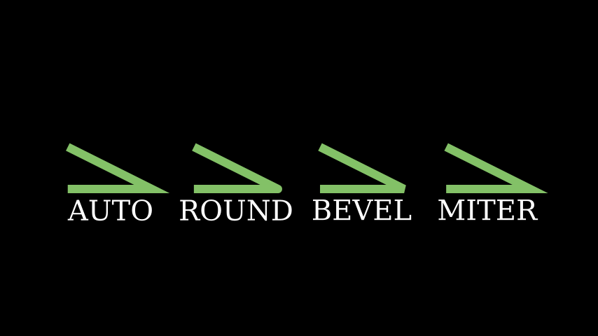

# 线连接类型

合格名称：`manim.constants.LineJointType`


```py
class LineJointType(value)
```

Bases: `Enum`

可用线接头类型的集合。

请参阅下面的示例，了解不同接头类型的直观说明。


例子

示例：LineJointVariants 



```py
from manim import *

class LineJointVariants(Scene):
    def construct(self):
        mob = VMobject(stroke_width=20, color=GREEN).set_points_as_corners([
            np.array([-2, 0, 0]),
            np.array([0, 0, 0]),
            np.array([-2, 1, 0]),
        ])
        lines = VGroup(*[mob.copy() for _ in range(len(LineJointType))])
        for line, joint_type in zip(lines, LineJointType):
            line.joint_type = joint_type

        lines.arrange(RIGHT, buff=1)
        self.add(lines)
        for line in lines:
            label = Text(line.joint_type.name).next_to(line, DOWN)
            self.add(label)
```


属性

`AUTO`

`ROUND`

`BEVEL`

`MITER`
