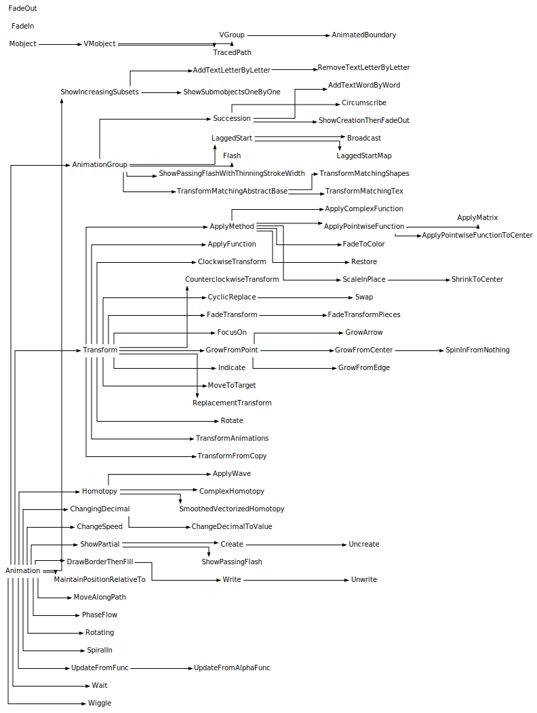
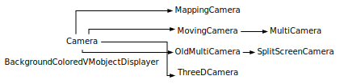
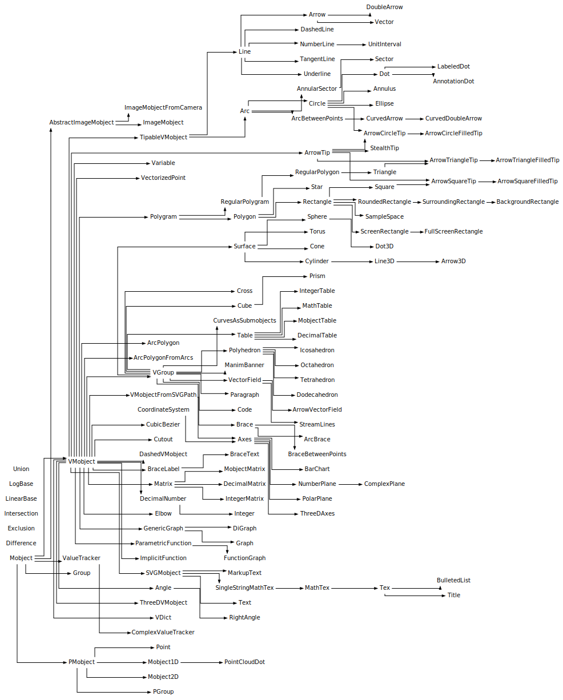
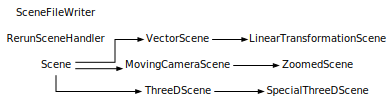

# 参考手册

本参考手册详细介绍了 Manim 中包含的模块、函数和变量，描述了它们的含义和用途。要了解如何使用 Manim，请参阅[教程]()。有关自上次版本以来的更改列表，请参阅[更改日志]()。

> 警告:

> 链接到此处的页面目前正在开发中。

## 继承图

### 动画(Animations)

### 相机(Cameras)

### 对象(Mobjects)

### 场景(Scenes)

## 模块索引

TODO: 以下链接待完善，当前为DEMO

- [动画](reference_index/animations.html)
  - [动画片](reference/manim.animation.animation.html)
    - [动画片](reference/manim.animation.animation.Animation.html)
    - [等待](reference/manim.animation.animation.Wait.html)
  - [改变](reference/manim.animation.changing.html)
    - [动画边界](reference/manim.animation.changing.AnimatedBoundary.html)
    - [追踪路径](reference/manim.animation.changing.TracedPath.html)
  - [作品](reference/manim.animation.composition.html)
    - [动画集团](reference/manim.animation.composition.AnimationGroup.html)
    - [滞后启动](reference/manim.animation.composition.LaggedStart.html)
    - [滞后起始图](reference/manim.animation.composition.LaggedStartMap.html)
    - [演替](reference/manim.animation.composition.Succession.html)
  - [创建](reference/manim.animation.creation.html)
    - [按字母添加文本](reference/manim.animation.creation.AddTextLetterByLetter.html)
    - [逐字添加文本](reference/manim.animation.creation.AddTextWordByWord.html)
    - [创造](reference/manim.animation.creation.Create.html)
    - [绘制边框然后填充](reference/manim.animation.creation.DrawBorderThenFill.html)
    - [逐个字母删除文本](reference/manim.animation.creation.RemoveTextLetterByLetter.html)
    - [显示增加的子集](reference/manim.animation.creation.ShowIncreasingSubsets.html)
    - [显示部分](reference/manim.animation.creation.ShowPartial.html)
    - [逐一显示子对象](reference/manim.animation.creation.ShowSubmobjectsOneByOne.html)
    - [螺旋式](reference/manim.animation.creation.SpiralIn.html)
    - [取消创建](reference/manim.animation.creation.Uncreate.html)
    - [取消写入](reference/manim.animation.creation.Unwrite.html)
    - [写](reference/manim.animation.creation.Write.html)
  - [衰退](reference/manim.animation.fading.html)
    - [淡入](reference/manim.animation.fading.FadeIn.html)
    - [消退](reference/manim.animation.fading.FadeOut.html)
  - [生长](reference/manim.animation.growing.html)
    - [成长箭](reference/manim.animation.growing.GrowArrow.html)
    - [从中心成长](reference/manim.animation.growing.GrowFromCenter.html)
    - [从边缘成长](reference/manim.animation.growing.GrowFromEdge.html)
    - [从点成长](reference/manim.animation.growing.GrowFromPoint.html)
    - [从无到有](reference/manim.animation.growing.SpinInFromNothing.html)
  - [指示](reference/manim.animation.indication.html)
    - [应用波](reference/manim.animation.indication.ApplyWave.html)
    - [外接](reference/manim.animation.indication.Circumscribe.html)
    - [闪光](reference/manim.animation.indication.Flash.html)
    - [专注于](reference/manim.animation.indication.FocusOn.html)
    - [表明](reference/manim.animation.indication.Indicate.html)
    - [显示创建然后淡出](reference/manim.animation.indication.ShowCreationThenFadeOut.html)
    - [显示传递闪光](reference/manim.animation.indication.ShowPassingFlash.html)
    - [ShowPassingFlashWithThinningStrokeWidth](reference/manim.animation.indication.ShowPassingFlashWithThinningStrokeWidth.html)
    - [摆动](reference/manim.animation.indication.Wiggle.html)
  - [移动](reference/manim.animation.movement.html)
    - [复同伦](reference/manim.animation.movement.ComplexHomotopy.html)
    - [同伦](reference/manim.animation.movement.Homotopy.html)
    - [沿着路径移动](reference/manim.animation.movement.MoveAlongPath.html)
    - [相流](reference/manim.animation.movement.PhaseFlow.html)
    - [平滑向量同伦](reference/manim.animation.movement.SmoothedVectorizedHomotopy.html)
  - [数字](reference/manim.animation.numbers.html)
    - [将小数更改为值](reference/manim.animation.numbers.ChangeDecimalToValue.html)
    - [改变小数](reference/manim.animation.numbers.ChangingDecimal.html)
  - [回转](reference/manim.animation.rotation.html)
    - [旋转](reference/manim.animation.rotation.Rotate.html)
    - [旋转](reference/manim.animation.rotation.Rotating.html)
  - [专门](reference/manim.animation.specialized.html)
    - [播送](reference/manim.animation.specialized.Broadcast.html)
  - [速度调节器](reference/manim.animation.speedmodifier.html)
    - [改变速度](reference/manim.animation.speedmodifier.ChangeSpeed.html)
  - [转换](reference/manim.animation.transform.html)
    - [应用复数函数](reference/manim.animation.transform.ApplyComplexFunction.html)
    - [应用函数](reference/manim.animation.transform.ApplyFunction.html)
    - [应用矩阵](reference/manim.animation.transform.ApplyMatrix.html)
    - [应用方法](reference/manim.animation.transform.ApplyMethod.html)
    - [应用逐点函数](reference/manim.animation.transform.ApplyPointwiseFunction.html)
    - [应用逐点函数到中心](reference/manim.animation.transform.ApplyPointwiseFunctionToCenter.html)
    - [顺时针变换](reference/manim.animation.transform.ClockwiseTransform.html)
    - [逆时针变换](reference/manim.animation.transform.CounterclockwiseTransform.html)
    - [循环替换](reference/manim.animation.transform.CyclicReplace.html)
    - [淡出颜色](reference/manim.animation.transform.FadeToColor.html)
    - [淡入淡出变换](reference/manim.animation.transform.FadeTransform.html)
    - [淡入淡出变换片段](reference/manim.animation.transform.FadeTransformPieces.html)
    - [移动到目标](reference/manim.animation.transform.MoveToTarget.html)
    - [替换变换](reference/manim.animation.transform.ReplacementTransform.html)
    - [恢复](reference/manim.animation.transform.Restore.html)
    - [就地扩展](reference/manim.animation.transform.ScaleInPlace.html)
    - [收缩到中心](reference/manim.animation.transform.ShrinkToCenter.html)
    - [交换](reference/manim.animation.transform.Swap.html)
    - [转换](reference/manim.animation.transform.Transform.html)
    - [变换动画](reference/manim.animation.transform.TransformAnimations.html)
    - [从复制转换](reference/manim.animation.transform.TransformFromCopy.html)
  - [变换匹配部分](reference/manim.animation.transform_matching_parts.html)
    - [变换匹配抽象库](reference/manim.animation.transform_matching_parts.TransformMatchingAbstractBase.html)
    - [变换匹配形状](reference/manim.animation.transform_matching_parts.TransformMatchingShapes.html)
    - [TransformMatchingTex](reference/manim.animation.transform_matching_parts.TransformMatchingTex.html)
  - [更新者](reference/manim.animation.updaters.html)
    - [模块](reference/manim.animation.updaters.html#modules)
- [相机](reference_index/cameras.html)
  - [相机](reference/manim.camera.camera.html)
    - [背景彩色 VM 对象显示器](reference/manim.camera.camera.BackgroundColoredVMobjectDisplayer.html)
    - [相机](reference/manim.camera.camera.Camera.html)
  - [映射\_相机](reference/manim.camera.mapping_camera.html)
    - [测绘相机](reference/manim.camera.mapping_camera.MappingCamera.html)
    - [旧多相机](reference/manim.camera.mapping_camera.OldMultiCamera.html)
    - [分屏摄像头](reference/manim.camera.mapping_camera.SplitScreenCamera.html)
  - [移动相机](reference/manim.camera.moving_camera.html)
    - [移动相机](reference/manim.camera.moving_camera.MovingCamera.html)
  - [多相机](reference/manim.camera.multi_camera.html)
    - [多机位](reference/manim.camera.multi_camera.MultiCamera.html)
  - [三维相机](reference/manim.camera.three_d_camera.html)
    - [三数码相机](reference/manim.camera.three_d_camera.ThreeDCamera.html)
- [配置](reference_index/configuration.html)
  - [模块索引](reference_index/configuration.html#module-index)
    - [\_config](reference/manim._config.html)
    - [实用程序](reference/manim._config.utils.html)
    - [logger_utils](reference/manim._config.logger_utils.html)
- [对象](reference_index/mobjects.html)
  - [框架](reference/manim.mobject.frame.html)
    - [全屏矩形](reference/manim.mobject.frame.FullScreenRectangle.html)
    - [屏幕矩形](reference/manim.mobject.frame.ScreenRectangle.html)
  - [几何学](reference/manim.mobject.geometry.html)
    - [模块](reference/manim.mobject.geometry.html#modules)
  - [图形](reference/manim.mobject.graph.html)
    - [有向图](reference/manim.mobject.graph.DiGraph.html)
    - [通用图](reference/manim.mobject.graph.GenericGraph.html)
    - [图形](reference/manim.mobject.graph.Graph.html)
  - [绘图](reference/manim.mobject.graphing.html)
    - [模块](reference/manim.mobject.graphing.html#modules)
  - [标识](reference/manim.mobject.logo.html)
    - [马尼姆旗帜](reference/manim.mobject.logo.ManimBanner.html)
  - [矩阵](reference/manim.mobject.matrix.html)
    - [十进制矩阵](reference/manim.mobject.matrix.DecimalMatrix.html)
    - [整数矩阵](reference/manim.mobject.matrix.IntegerMatrix.html)
    - [矩阵](reference/manim.mobject.matrix.Matrix.html)
    - [对象矩阵](reference/manim.mobject.matrix.MobjectMatrix.html)
  - [对象](reference/manim.mobject.mobject.html)
    - [团体](reference/manim.mobject.mobject.Group.html)
    - [对象](reference/manim.mobject.mobject.Mobject.html)
  - [svg](reference/manim.mobject.svg.html)
    - [模块](reference/manim.mobject.svg.html#modules)
  - [桌子](reference/manim.mobject.table.html)
    - [十进制表](reference/manim.mobject.table.DecimalTable.html)
    - [整数表](reference/manim.mobject.table.IntegerTable.html)
    - [数学表](reference/manim.mobject.table.MathTable.html)
    - [对象表](reference/manim.mobject.table.MobjectTable.html)
    - [桌子](reference/manim.mobject.table.Table.html)
  - [文本](reference/manim.mobject.text.html)
    - [模块](reference/manim.mobject.text.html#modules)
  - [三个\_d](reference/manim.mobject.three_d.html)
    - [模块](reference/manim.mobject.three_d.html#modules)
  - [类型](reference/manim.mobject.types.html)
    - [模块](reference/manim.mobject.types.html#modules)
  - [实用程序](reference/manim.mobject.utils.html)
  - [价值追踪器](reference/manim.mobject.value_tracker.html)
    - [复杂价值追踪器](reference/manim.mobject.value_tracker.ComplexValueTracker.html)
    - [价值追踪器](reference/manim.mobject.value_tracker.ValueTracker.html)
  - [矢量场](reference/manim.mobject.vector_field.html)
    - [箭头矢量场](reference/manim.mobject.vector_field.ArrowVectorField.html)
    - [流线型](reference/manim.mobject.vector_field.StreamLines.html)
    - [矢量场](reference/manim.mobject.vector_field.VectorField.html)
- [场景](reference_index/scenes.html)
  - [移动相机场景](reference/manim.scene.moving_camera_scene.html)
    - [移动相机场景](reference/manim.scene.moving_camera_scene.MovingCameraScene.html)
  - [部分](reference/manim.scene.section.html)
    - [默认节类型](reference/manim.scene.section.DefaultSectionType.html)
    - [部分](reference/manim.scene.section.Section.html)
  - [场景](reference/manim.scene.scene.html)
    - [重新运行场景处理程序](reference/manim.scene.scene.RerunSceneHandler.html)
    - [场景](reference/manim.scene.scene.Scene.html)
  - [场景文件编写器](reference/manim.scene.scene_file_writer.html)
    - [场景文件编写器](reference/manim.scene.scene_file_writer.SceneFileWriter.html)
  - [三维场景](reference/manim.scene.three_d_scene.html)
    - [特别三场景](reference/manim.scene.three_d_scene.SpecialThreeDScene.html)
    - [三场景](reference/manim.scene.three_d_scene.ThreeDScene.html)
  - [矢量空间场景](reference/manim.scene.vector_space_scene.html)
    - [线性变换场景](reference/manim.scene.vector_space_scene.LinearTransformationScene.html)
    - [矢量场景](reference/manim.scene.vector_space_scene.VectorScene.html)
  - [缩放场景](reference/manim.scene.zoomed_scene.html)
    - [缩放场景](reference/manim.scene.zoomed_scene.ZoomedScene.html)
- [实用程序和其他模块](reference_index/utilities_misc.html)
  - [模块索引](reference_index/utilities_misc.html#module-index)
    - [常量](reference/manim.constants.html)
    - [贝塞尔](reference/manim.utils.bezier.html)
    - [颜色](reference/manim.utils.color.html)
    - [命令](reference/manim.utils.commands.html)
    - [配置操作](reference/manim.utils.config_ops.html)
    - [弃用](reference/manim.utils.deprecation.html)
    - [调试](reference/manim.utils.debug.html)
    - [文档构建](reference/manim.utils.docbuild.html)
    - [散列](reference/manim.utils.hashing.html)
    - [ipython_magic](reference/manim.utils.ipython_magic.html)
    - [图片](reference/manim.utils.images.html)
    - [可迭代对象](reference/manim.utils.iterables.html)
    - [路径](reference/manim.utils.paths.html)
    - [速率函数](reference/manim.utils.rate_functions.html)
    - [简单函数](reference/manim.utils.simple_functions.html)
    - [声音](reference/manim.utils.sounds.html)
    - [空间操作](reference/manim.utils.space_ops.html)
    - [特克斯](reference/manim.utils.tex.html)
    - [tex_templates](reference/manim.utils.tex_templates.html)
    - [tex_file_writing](reference/manim.utils.tex_file_writing.html)

