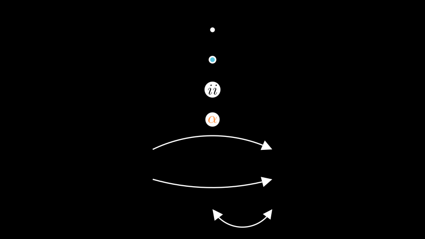

# 弧

弯曲的物体。

例子

示例：有用的注释



```py
from manim import *

class UsefulAnnotations(Scene):
    def construct(self):
        m0 = Dot()
        m1 = AnnotationDot()
        m2 = LabeledDot("ii")
        m3 = LabeledDot(MathTex(r"\alpha").set_color(ORANGE))
        m4 = CurvedArrow(2*LEFT, 2*RIGHT, radius= -5)
        m5 = CurvedArrow(2*LEFT, 2*RIGHT, radius= 8)
        m6 = CurvedDoubleArrow(ORIGIN, 2*RIGHT)

        self.add(m0, m1, m2, m3, m4, m5, m6)
        for i, mobj in enumerate(self.mobjects):
            mobj.shift(DOWN * (i-3))
```

Classes

|||
|-|-|
[`AnnotationDot`]()|具有较大半径和粗笔画的点来注释场景。
[`AnnularSector`]()|参数内半径;环形扇区的内半径。
[`Annulus`]()|两个同心圆之间的区域[`Circles`]()。
[`Arc`]()|一个圆弧。
[`ArcBetweenPoints`]()|继承自 Arc，并另外获取弧跨越的 2 个点。
[`ArcPolygon`]()|允许用弧连接点的广义多边形。
[`ArcPolygonFromArcs`]()|允许用弧连接点的广义多边形。
[`Circle`]()|一个圆圈。
[`CubicBezier`]()|例子
[`CurvedArrow`]()|
[`CurvedDoubleArrow`]()|
[`Dot`]()|一个半径很小的圆。
[`Ellipse`]()|圆形；椭圆形、圆形。
[`LabeledDot`]()|A[`Dot`]()的中心包含一个标签。
[`Sector`]()|例子
[`TipableVMobject`]()|用于圆弧和直线之间的共享功能。
