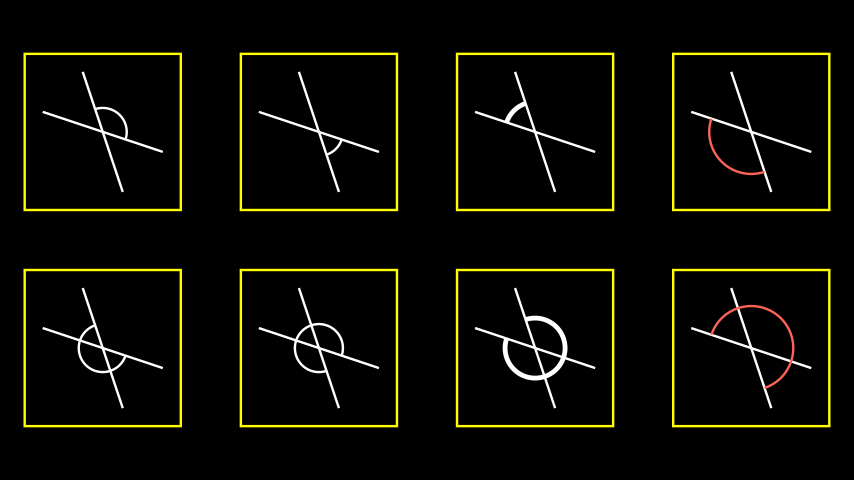
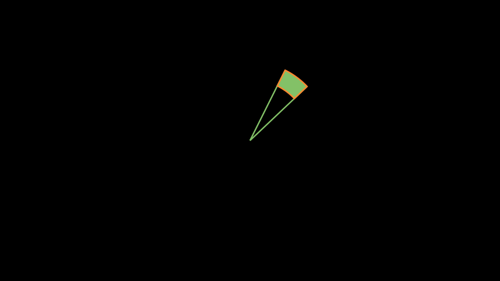
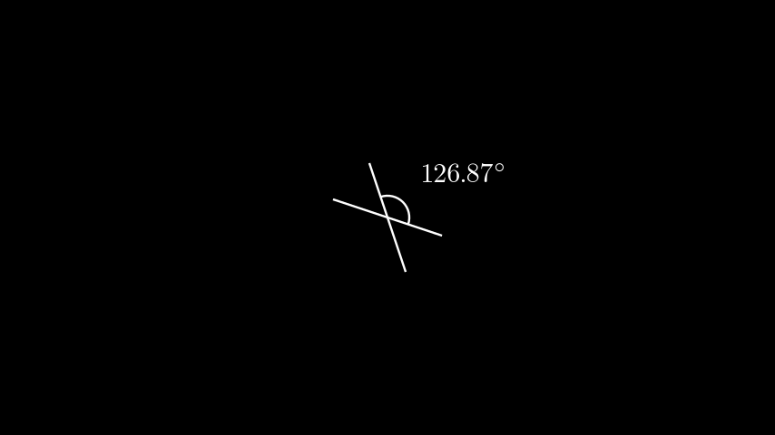

# 角度

合格名称：`manim.mobject.geometry.line.Angle`

```py
class Angle(line1, line2, radius=None, quadrant=(1, 1), other_angle=False, dot=False, dot_radius=None, dot_distance=0.55, dot_color='#FFFFFF', elbow=False, **kwargs)
```

Bases: `VMobject`

表示两条线的角度的圆弧或肘型对象。

参数

- **line1** ( [_Line_]() ) – 第一行。
- **line2** ( [_Line_]() ) – 第二行。
- **radius** ( _float_ ) – 的半径`Arc`。
- **Quadrant** ( _Sequence_ _\[_ _int_ _\]_ ) – 由两个数字组成的序列，`int`确定应使用 4 个象限中的哪一个。第一个值指示是否将弧锚定在第一条线上靠近终点 (1) 或起点 (-1) 的位置，第二个值的作用与第二条线上的终点 (1) 或起点 (-1) 类似。线。可能性：(1,1)、(-1,1)、(1,-1)、(-1,-1)。
- **other_angle** ( _bool_ ) – 在由两点和圆弧中心定义的两个可能的角度之间切换。如果设置为 False（默认），圆弧将始终从 line1 上的点逆时针移动，直到到达 line2 上的点。如果设置为 True，角度将从 line1 到 line2 顺时针旋转。
- **dot** ( _bool_ ) – 允许`Dot`弧内有 a。主要用作表示直角的约定。该点可以在接下来的三个参数中自定义。
- **dot_radius** ( _float_ _|_ _None_ ) – 的半径`Dot`。如果没有另外指定，该半径将为圆弧半径的 1/10。
- **dot_distance** ( _float_ ) – 从中心到弧的相对距离：0 将点置于中心，1 将点置于弧本身。
- **dot_color** ( [_Colors_]() ) – 的颜色`Dot`。
- **elbow**( _bool_ ) – 生成一个肘型 mobject 来指示直角，请参阅[`RightAngle`]()参考资料 来了解更多信息和简写。
- \***\*kwargs** – 传递给`Arc`or 的构造函数的更多关键字参数[`Elbow`]()。

例子

第一个示例显示了一些中间有一个点的直角，而第二个示例显示了由两条线定义的所有 8 个可能的角度。

示例：RightArcAngle 示例


```py
from manim import *

class RightArcAngleExample(Scene):
    def construct(self):
        line1 = Line( LEFT, RIGHT )
        line2 = Line( DOWN, UP )
        rightarcangles = [
            Angle(line1, line2, dot=True),
            Angle(line1, line2, radius=0.4, quadrant=(1,-1), dot=True, other_angle=True),
            Angle(line1, line2, radius=0.5, quadrant=(-1,1), stroke_width=8, dot=True, dot_color=YELLOW, dot_radius=0.04, other_angle=True),
            Angle(line1, line2, radius=0.7, quadrant=(-1,-1), color=RED, dot=True, dot_color=GREEN, dot_radius=0.08),
        ]
        plots = VGroup()
        for angle in rightarcangles:
            plot=VGroup(line1.copy(),line2.copy(), angle)
            plots.add(plot)
        plots.arrange(buff=1.5)
        self.add(plots)
```


示例：角度示例




```py
from manim import *

class AngleExample(Scene):
    def construct(self):
        line1 = Line( LEFT + (1/3) * UP, RIGHT + (1/3) * DOWN )
        line2 = Line( DOWN + (1/3) * RIGHT, UP + (1/3) * LEFT )
        angles = [
            Angle(line1, line2),
            Angle(line1, line2, radius=0.4, quadrant=(1,-1), other_angle=True),
            Angle(line1, line2, radius=0.5, quadrant=(-1,1), stroke_width=8, other_angle=True),
            Angle(line1, line2, radius=0.7, quadrant=(-1,-1), color=RED),
            Angle(line1, line2, other_angle=True),
            Angle(line1, line2, radius=0.4, quadrant=(1,-1)),
            Angle(line1, line2, radius=0.5, quadrant=(-1,1), stroke_width=8),
            Angle(line1, line2, radius=0.7, quadrant=(-1,-1), color=RED, other_angle=True),
        ]
        plots = VGroup()
        for angle in angles:
            plot=VGroup(line1.copy(),line2.copy(), angle)
            plots.add(VGroup(plot,SurroundingRectangle(plot, buff=0.3)))
        plots.arrange_in_grid(rows=2,buff=1)
        self.add(plots)
```


示例：填充角度




```py
from manim import *

class FilledAngle(Scene):
    def construct(self):
        l1 = Line(ORIGIN, 2 * UP + RIGHT).set_color(GREEN)
        l2 = (
            Line(ORIGIN, 2 * UP + RIGHT)
            .set_color(GREEN)
            .rotate(-20 * DEGREES, about_point=ORIGIN)
        )
        norm = l1.get_length()
        a1 = Angle(l1, l2, other_angle=True, radius=norm - 0.5).set_color(GREEN)
        a2 = Angle(l1, l2, other_angle=True, radius=norm).set_color(GREEN)
        q1 = a1.points #  save all coordinates of points of angle a1
        q2 = a2.reverse_direction().points  #  save all coordinates of points of angle a1 (in reversed direction)
        pnts = np.concatenate([q1, q2, q1[0].reshape(1, 3)])  # adds points and ensures that path starts and ends at same point
        mfill = VMobject().set_color(ORANGE)
        mfill.set_points_as_corners(pnts).set_fill(GREEN, opacity=1)
        self.add(l1, l2)
        self.add(mfill)
```


方法

|||
|-|-|
[`from_three_points`]()|线 AB 和 BC 之间的角度。
[`get_lines`]()|获取形成班级角度的线[`Angle`]()。
[`get_value`]()|获取类的角度值[`Angle`](")。


属性

|||
|-|-|
`animate`|用于对 的任何方法的应用程序进行动画处理`self`。
`animation_overrides`|
`color`|
`depth`|对象的深度。
`fill_color`|如果有多种颜色（对于渐变），则返回第一个颜色
`height`|mobject 的高度。
`n_points_per_curve`|
`sheen_factor`|
`stroke_color`|
`width`|mobject 的宽度。


`static from_three_points(A, B, C, **kwargs)`

线 AB 和 BC 之间的角度。

这构造了角度 ∠ABC。

参数

- **A** ( _ndarray_ ) – 第一个角腿的端点
- **B** ( _ndarray_ ) – 角度的顶点
- **C** ( _ndarray_ ) – 第二条角腿的端点
- \***\*kwargs** – 更多关键字参数被传递给[`Angle`]()

返回

角度（线 1，线 2，半径= 0.5，象限=（-1,1），描边宽度= 8），角度（线 1，线 2，半径= 0.7，象限=（-1，-1），颜色=红色，其他角度=真的），

返回类型

由三点计算出的角度

例子

示例：AngleFromThreePoints 示例


```py
from manim import *

class AngleFromThreePointsExample(Scene):
    def construct(self):
        sample_angle = Angle.from_three_points(UP, ORIGIN, LEFT)
        red_angle = Angle.from_three_points(LEFT + UP, ORIGIN, RIGHT, radius=.8, quadrant=(-1,-1), color=RED, stroke_width=8, other_angle=True)
        self.add(red_angle, sample_angle)
```


`get_lines()`

获取形成班级角度的线[`Angle`]()。

返回

包含[`VGroup`]()形成类角度的线[`Angle`]()。

返回类型

[`VGroup`]()

例子


```py
line_1, line_2 = Line(ORIGIN, RIGHT), Line(ORIGIN, UR)
angle = Angle(line_1, line_2)
angle.get_lines()
VGroup(Line, Line)
```


`get_value(degrees=False)`

获取类的角度值[`Angle`]()。

参数

**Degrees** ( _bool_ ) – 一个布尔值，用于决定返回角度值的单位 (deg/rad)。

返回

类角度的度/弧度值[`Angle`]()。

返回类型

`float`

例子

示例：获取值示例



```py
from manim import *

class GetValueExample(Scene):
    def construct(self):
        line1 = Line(LEFT+(1/3)*UP, RIGHT+(1/3)*DOWN)
        line2 = Line(DOWN+(1/3)*RIGHT, UP+(1/3)*LEFT)

        angle = Angle(line1, line2, radius=0.4)

        value = DecimalNumber(angle.get_value(degrees=True), unit="^{\circ}")
        value.next_to(angle, UR)

        self.add(line1, line2, angle, value)
```

