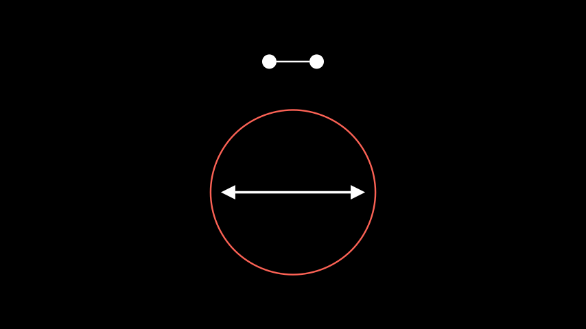
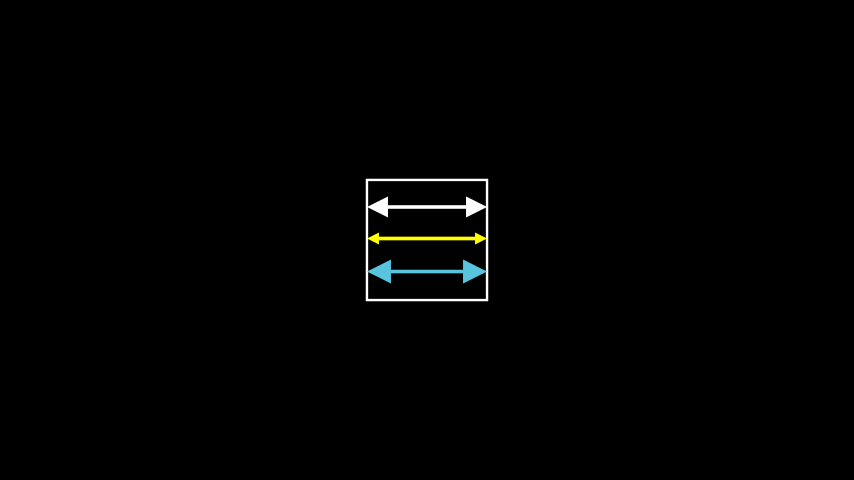

# 双箭头

合格名称：`manim.mobject.geometry.line.DoubleArrow`

```py
class DoubleArrow(*args, **kwargs)
```

Bases: `Arrow`

两端都有尖端的箭头。

参数

- **args** ( _Any_ ) – 要传递给的参数[`Arrow`]()
- **kwargs** – 要传递给的附加参数[`Arrow`]()

> 也可以看看

> `ArrowTip` `CurvedDoubleArrow`

例子

示例：双箭头示例



```py
from manim import *

from manim.mobject.geometry.tips import ArrowCircleFilledTip
class DoubleArrowExample(Scene):
    def construct(self):
        circle = Circle(radius=2.0)
        d_arrow = DoubleArrow(start=circle.get_left(), end=circle.get_right())
        d_arrow_2 = DoubleArrow(tip_shape_end=ArrowCircleFilledTip, tip_shape_start=ArrowCircleFilledTip)
        group = Group(Group(circle, d_arrow), d_arrow_2).arrange(UP, buff=1)
        self.add(group)
```

示例：DoubleArrowExample2




```py
from manim import *

class DoubleArrowExample2(Scene):
    def construct(self):
        box = Square()
        p1 = box.get_left()
        p2 = box.get_right()
        d1 = DoubleArrow(p1, p2, buff=0)
        d2 = DoubleArrow(p1, p2, buff=0, tip_length=0.2, color=YELLOW)
        d3 = DoubleArrow(p1, p2, buff=0, tip_length=0.4, color=BLUE)
        Group(d1, d2, d3).arrange(DOWN)
        self.add(box, d1, d2, d3)
```


方法


属性

|||
|-|-|
`animate`|用于对 的任何方法的应用程序进行动画处理`self`。
`animation_overrides`|
`color`|
`depth`|对象的深度。
`fill_color`|如果有多种颜色（对于渐变），则返回第一个颜色
`height`|mobject 的高度。
`n_points_per_curve`|
`sheen_factor`|
`stroke_color`|
`width`|mobject 的宽度。
