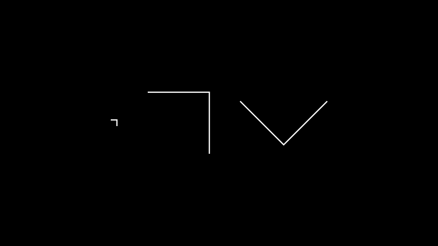

# 弯头

合格名称：`manim.mobject.geometry.line.Elbow`

```py
class Elbow(width=0.2, angle=0, **kwargs)
```

Bases: `VMobject`

两条线相互成直角：L 形。

参数

- **width** ( _float_ ) – 肘部两侧的长度。
- **angle** ( _float_ ) – 肘部的旋转。
- **kwargs** – 要传递给的附加参数[`VMobject`]()
- **另请参阅::** ( _.._ ) –[`RightAngle`]()

例子

示例：Elbow 示例




```py
from manim import *

class ElbowExample(Scene):
    def construct(self):
        elbow_1 = Elbow()
        elbow_2 = Elbow(width=2.0)
        elbow_3 = Elbow(width=2.0, angle=5*PI/4)

        elbow_group = Group(elbow_1, elbow_2, elbow_3).arrange(buff=1)
        self.add(elbow_group)
```


方法


属性

|||
|-|-|
`animate`|用于对 的任何方法的应用程序进行动画处理`self`。
`animation_overrides`|
`color`|
`depth`|对象的深度。
`fill_color`|如果有多种颜色（对于渐变），则返回第一个颜色
`height`|mobject 的高度。
`n_points_per_curve`|
`sheen_factor`|
`stroke_color`|
`width`|mobject 的宽度。
