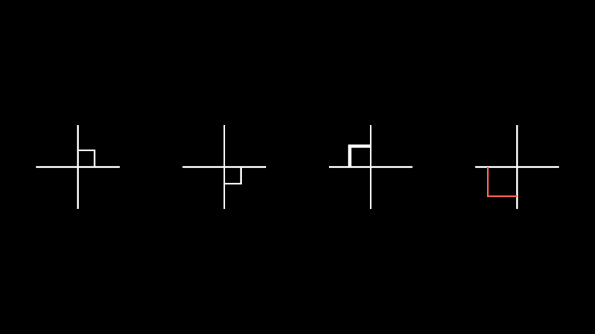

# 直角

合格名称：`manim.mobject.geometry.line.RightAngle`

```py
class RightAngle(line1, line2, length=None, **kwargs)
```

Bases: `Angle`

表示两条线之间的直角的肘型对象。

参数

- **line1** ( [_Line_]() ) – 第一行。
- **line2** ( [_Line_]() ) – 第二行。
- **length** ( _float_ _|_ _None_ ) – 手臂的长度。
- **\*\*kwargs** – 传递给 的构造函数的更多关键字参数[`Angle`]()。

例子

示例：RightAngle 示例




```py
from manim import *

class RightAngleExample(Scene):
    def construct(self):
        line1 = Line( LEFT, RIGHT )
        line2 = Line( DOWN, UP )
        rightangles = [
            RightAngle(line1, line2),
            RightAngle(line1, line2, length=0.4, quadrant=(1,-1)),
            RightAngle(line1, line2, length=0.5, quadrant=(-1,1), stroke_width=8),
            RightAngle(line1, line2, length=0.7, quadrant=(-1,-1), color=RED),
        ]
        plots = VGroup()
        for rightangle in rightangles:
            plot=VGroup(line1.copy(),line2.copy(), rightangle)
            plots.add(plot)
        plots.arrange(buff=1.5)
        self.add(plots)
```


方法


属性

|||
|-|-|
`animate`|用于对 的任何方法的应用程序进行动画处理`self`。
`animation_overrides`|
`color`|
`depth`|对象的深度。
`fill_color`|如果有多种颜色（对于渐变），则返回第一个颜色
`height`|mobject 的高度。
`n_points_per_curve`|
`sheen_factor`|
`stroke_color`|
`width`|mobject 的宽度。
