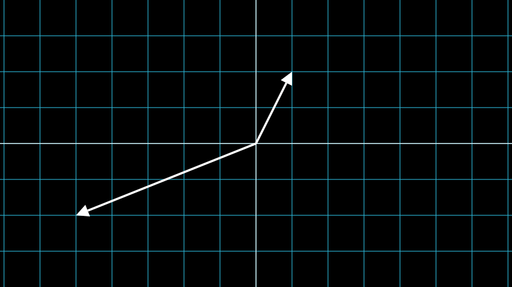

# 矢量

合格名称：`manim.mobject.geometry.line.Vector`

```py
class Vector(direction=array([1., 0., 0.]), buff=0, **kwargs)
```

Bases: `Arrow`

专门用于图形的向量。

参数

- **Direction** ( _list_ _|_ _np.ndarray_ ) – 箭头的方向。
- **buff** ( _float_ ) – 向量与其端点的距离。
- **kwargs** – 要传递给的附加参数[`Arrow`]()

例子

示例：矢量示例




```py
from manim import *

class VectorExample(Scene):
    def construct(self):
        plane = NumberPlane()
        vector_1 = Vector([1,2])
        vector_2 = Vector([-5,-2])
        self.add(plane, vector_1, vector_2)
```


方法

|||
|-|-|
[`coordinate_label`]()|根据向量的坐标创建标签。


属性

|||
|-|-|
`animate`|用于对 的任何方法的应用程序进行动画处理`self`。
`animation_overrides`|
`color`|
`depth`|对象的深度。
`fill_color`|如果有多种颜色（对于渐变），则返回第一个颜色
`height`|mobject 的高度。
`n_points_per_curve`|
`sheen_factor`|
`stroke_color`|
`width`|mobject 的宽度。


`coordinate_label(integer_labels=True, n_dim=2, color=None, **kwargs)`

根据向量的坐标创建标签。

参数

- **integer_labels** ( _bool_ ) – 是否将坐标舍入为整数。
- **n_dim** ( _int_ ) – 向量的维数。
- **color** ( _Color_ _|_ _None_ ) – 设置标签的颜色，可选。
- **kwargs** – 要传递给 的附加参数[`Matrix`]()。

返回

标签。

返回类型

[`Matrix`]()

例子

示例：矢量坐标标签


```py
from manim import *

class VectorCoordinateLabel(Scene):
    def construct(self):
        plane = NumberPlane()

        vec_1 = Vector([1, 2])
        vec_2 = Vector([-3, -2])
        label_1 = vec_1.coordinate_label()
        label_2 = vec_2.coordinate_label(color=YELLOW)

        self.add(plane, vec_1, vec_2, label_1, label_2)
```

