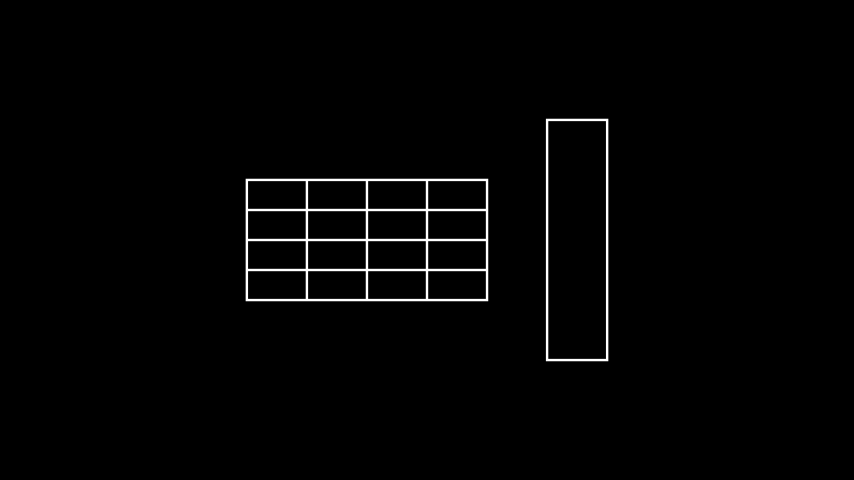

# 矩形

合格名称：`manim.mobject.geometry.polygram.Rectangle`

```py
class Rectangle(color='#FFFFFF', height=2.0, width=4.0, grid_xstep=None, grid_ystep=None, mark_paths_closed=True, close_new_points=True, **kwargs)
```

Bases: `Polygon`

具有两组平行边的四边形。

参数

- **color** ( _Color_ ) – 矩形的颜色。
- **height** ( _float_ ) – 矩形的垂直高度。
- **width** ( _float_ ) – 矩形的水平宽度。
- **grid_xstep** ( _float_ _|_ _None_ ) – 垂直网格线之间的空间。
- **grid_ystep** ( _float_ _|_ _None_ ) – 水平网格线之间的空间。
- **mark_paths_close** ( _bool_ ) – 没有目的。
- **close_new_points** ( _bool_ ) – 无目的。
- **kwargs** – 要传递给的附加参数[`Polygon`]()

例子

示例：矩形示例




```py
from manim import *

class RectangleExample(Scene):
    def construct(self):
        rect1 = Rectangle(width=4.0, height=2.0, grid_xstep=1.0, grid_ystep=0.5)
        rect2 = Rectangle(width=1.0, height=4.0)

        rects = Group(rect1,rect2).arrange(buff=1)
        self.add(rects)
```


方法


属性

|||
|-|-|
`animate`|用于对 的任何方法的应用程序进行动画处理`self`。
`animation_overrides`|
`color`|
`depth`|对象的深度。
`fill_color`|如果有多种颜色（对于渐变），则返回第一个颜色
`height`|mobject 的高度。
`n_points_per_curve`|
`sheen_factor`|
`stroke_color`|
`width`|mobject 的宽度。
