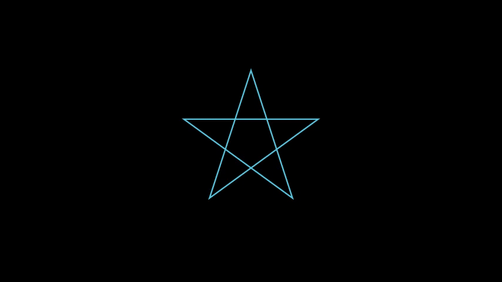
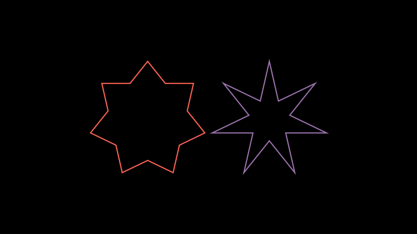

# 星

合格名称：`manim.mobject.geometry.polygram.Star`

```py
class Star(n=5, *, outer_radius=1, inner_radius=None, density=2, start_angle=1.5707963267948966, **kwargs)
```

Bases: `Polygon`

没有相交线的正多边形。

参数

- **n** ( _int_ ) – 上有多少个点[`Star`]()。
- **outer_radius** ( _float_ ) – 外部顶点所在圆的半径。
- **inner_radius**（_float**|**None_）–

  内部顶点所在圆的半径。

  如果未指定，则将计算内半径，使边缘[`Star`]() 完全遵循其[`RegularPolygram`]() 对应边缘。

- **density**( _int_ ) –

  的密度[`Star`]()。仅在未指定时使用 `inner_radius`。

  请参阅[`RegularPolygram`](")获取更多信息。

- **start_angle** ( _float_ _|_ _None_ ) – 顶点开始的角度；的旋转[`Star`]()。
- **kwargs** – 转发到父构造函数。

提高

**ValueError** – 如果`inner_radius`未指定`density` 且不在范围内。`[1, n/2)`

例子

示例：StarExample 



```py
from manim import *

class StarExample(Scene):
    def construct(self):
        pentagram = RegularPolygram(5, radius=2)
        star = Star(outer_radius=2, color=RED)

        self.add(pentagram)
        self.play(Create(star), run_time=3)
        self.play(FadeOut(star), run_time=2)
```


示例：不同密度示例



```py
from manim import *

class DifferentDensitiesExample(Scene):
    def construct(self):
        density_2 = Star(7, outer_radius=2, density=2, color=RED)
        density_3 = Star(7, outer_radius=2, density=3, color=PURPLE)

        self.add(VGroup(density_2, density_3).arrange(RIGHT))
```


方法


属性

|||
|-|-|
`animate`|用于对 的任何方法的应用程序进行动画处理`self`。
`animation_overrides`|
`color`|
`depth`|对象的深度。
`fill_color`|如果有多种颜色（对于渐变），则返回第一个颜色
`height`|mobject 的高度。
`n_points_per_curve`|
`sheen_factor`|
`stroke_color`|
`width`|mobject 的宽度。
