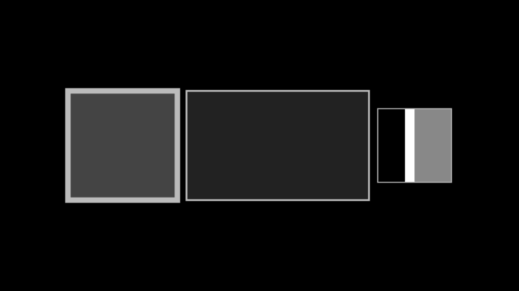

# 样本空间

合格名称：`manim.mobject.graphing.probability.SampleSpace`

```py
class SampleSpace(height=3, width=3, fill_color='#444444', fill_opacity=1, stroke_width=0.5, stroke_color='#BBBBBB', default_label_scale_val=1)
```

Bases: `Rectangle`

例子

示例：ExampleSampleSpace



```py
from manim import *

class ExampleSampleSpace(Scene):
    def construct(self):
        poly1 = SampleSpace(stroke_width=15, fill_opacity=1)
        poly2 = SampleSpace(width=5, height=3, stroke_width=5, fill_opacity=0.5)
        poly3 = SampleSpace(width=2, height=2, stroke_width=5, fill_opacity=0.1)
        poly3.divide_vertically(p_list=np.array([0.37, 0.13, 0.5]), colors=[BLACK, WHITE, GRAY], vect=RIGHT)
        poly_group = VGroup(poly1, poly2, poly3).arrange()
        self.add(poly_group)
```


方法

`add_braces_and_labels`
`add_label`
`add_title`
`complete_p_list`
`divide_horizontally`
`divide_vertically`
`get_bottom_braces_and_labels`
`get_division_along_dimension`
`get_horizontal_division`
`get_side_braces_and_labels`
`get_subdivision_braces_and_labels`
`get_top_braces_and_labels`
`get_vertical_division`


属性

|||
|-|-|
`animate`|用于对 的任何方法的应用程序进行动画处理`self`。
`animation_overrides`|
`color`|
`depth`|对象的深度。
`fill_color`|如果有多种颜色（对于渐变），则返回第一个颜色
`height`|mobject 的高度。
`n_points_per_curve`|
`sheen_factor`|
`stroke_color`|
`width`|mobject 的宽度。
