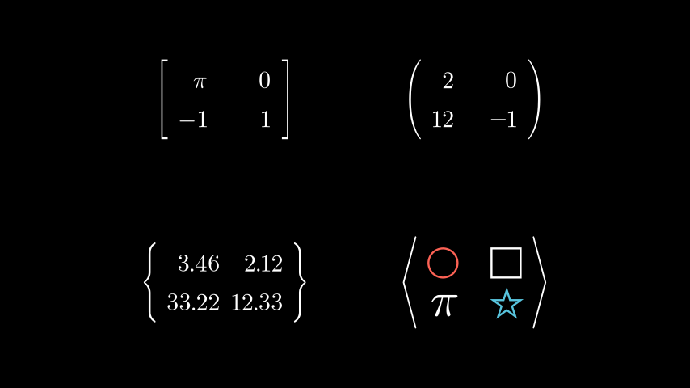
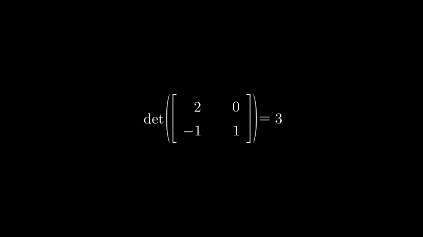

# 矩阵

表示矩阵的 Mobject。

例子

示例：矩阵示例



```py
from manim import *

class MatrixExamples(Scene):
    def construct(self):
        m0 = Matrix([["\\pi", 0], [-1, 1]])
        m1 = IntegerMatrix([[1.5, 0.], [12, -1.3]],
            left_bracket="(",
            right_bracket=")")
        m2 = DecimalMatrix(
            [[3.456, 2.122], [33.2244, 12.33]],
            element_to_mobject_config={"num_decimal_places": 2},
            left_bracket="\\{",
            right_bracket="\\}")
        m3 = MobjectMatrix(
            [[Circle().scale(0.3), Square().scale(0.3)],
            [MathTex("\\pi").scale(2), Star().scale(0.3)]],
            left_bracket="\\langle",
            right_bracket="\\rangle")
        g = Group(m0, m1, m2, m3).arrange_in_grid(buff=2)
        self.add(g)
```

Classes

[`DecimalMatrix`]()|一个在屏幕上显示带有十进制条目的矩阵的 mobject。
[`IntegerMatrix`]()|一个在屏幕上显示带有整数条目的矩阵的 mobject。
[`Matrix`]()|在屏幕上显示矩阵的 mobject。
[`MobjectMatrix`]()|在屏幕上显示 mobject 条目矩阵的 mobject。


Functions

`get_det_text(matrix, determinant=None, background_rect=False, initial_scale_factor=2)`

创建行列式的辅助函数。

参数

- **matrix**( [_Matrix_]() ) – 要创建其行列式的矩阵
- **determinant**( _int_ _|_ _str_ _|_ _None_ ) – 矩阵行列式的值
- **background_rect** ( _bool_ ) – 背景矩形
- **initial_scale_factor** ( _float_ ) – 矩阵中文本的比例

返回

包含行列式的 VGroup

返回类型

[`VGroup`]()

例子

示例：行列式矩阵



```py
from manim import *

class DeterminantOfAMatrix(Scene):
    def construct(self):
        matrix = Matrix([
            [2, 0],
            [-1, 1]
        ])

        # scaling down the `det` string
        det = get_det_text(matrix,
                    determinant=3,
                    initial_scale_factor=1)

        # must add the matrix
        self.add(matrix)
        self.add(det)
```

矩阵到对象（_矩阵_）

矩阵到文本字符串（_矩阵_）