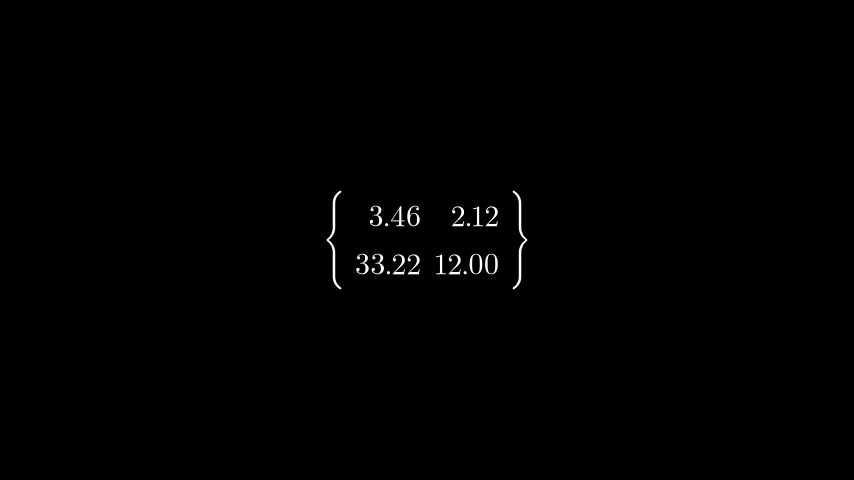

# 十进制矩阵

合格名称：`manim.mobject.matrix.DecimalMatrix`


```py
class DecimalMatrix(matrix, element_to_mobject=<class 'manim.mobject.text.numbers.DecimalNumber'>, element_to_mobject_config={'num_decimal_places': 1}, **kwargs)
```

Bases: `Matrix`

一个在屏幕上显示带有十进制条目的矩阵的 mobject。


例子

示例：DecimalMatrix 示例



```py
from manim import *

class DecimalMatrixExample(Scene):
    def construct(self):
        m0 = DecimalMatrix(
            [[3.456, 2.122], [33.2244, 12]],
            element_to_mobject_config={"num_decimal_places": 2},
            left_bracket="\{",
            right_bracket="\}")
        self.add(m0)
```


将根据提供的配置舍入/截断小数位。

参数

- **matrix**( _Iterable_ ) – numpy 二维数组或列表列表
- **element_to_mobject** ( [_Mobject_]() ) – 要使用的 Mobject，默认为 DecimalNumber
- **element_to_mobject_config** ( _dict_ _\[_ _str_ _,_ [_Mobject_]() _\]_ ) – 所需 mobject 的配置，默认为 {“num_decimal_places”: 1}


方法


属性

|||
|-|-|
`animate`|用于对 的任何方法的应用程序进行动画处理`self`。
`animation_overrides`|
`color`|
`depth`|对象的深度。
`fill_color`|如果有多种颜色（对于渐变），则返回第一个颜色
`height`|mobject 的高度。
`n_points_per_curve`|
`sheen_factor`|
`stroke_color`|
`width`|mobject 的宽度。
