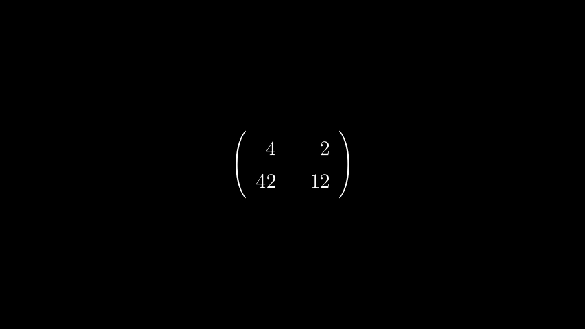

# 整数矩阵

合格名称：`manim.mobject.matrix.IntegerMatrix`


```py
class IntegerMatrix(matrix, element_to_mobject=<class 'manim.mobject.text.numbers.Integer'>, **kwargs)
```

Bases: `Matrix`

一个在屏幕上显示带有整数条目的矩阵的 mobject。

例子

示例：IntegerMatrix 示例



```py
from manim import *

class IntegerMatrixExample(Scene):
    def construct(self):
        m0 = IntegerMatrix(
            [[3.7, 2], [42.2, 12]],
            left_bracket="(",
            right_bracket=")")
        self.add(m0)
```


如果矩阵中有小数项，则进行四舍五入。

参数

- **matrix**( _Iterable_ ) – numpy 二维数组或列表列表
- **element_to_mobject** ( [_Mobject_]() ) – 要使用的 Mobject，默认为 Integer


方法


属性

|||
|-|-|
`animate`|用于对 的任何方法的应用程序进行动画处理`self`。
`animation_overrides`|
`color`|
`depth`|对象的深度。
`fill_color`|如果有多种颜色（对于渐变），则返回第一个颜色
`height`|mobject 的高度。
`n_points_per_curve`|
`sheen_factor`|
`stroke_color`|
`width`|mobject 的宽度。
