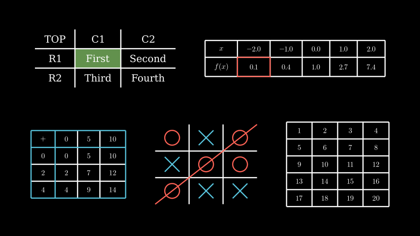

# 表

代表表的 Mobject。

例子

示例：表示例



```py
from manim import *

class TableExamples(Scene):
    def construct(self):
        t0 = Table(
            [["First", "Second"],
            ["Third","Fourth"]],
            row_labels=[Text("R1"), Text("R2")],
            col_labels=[Text("C1"), Text("C2")],
            top_left_entry=Text("TOP"))
        t0.add_highlighted_cell((2,2), color=GREEN)
        x_vals = np.linspace(-2,2,5)
        y_vals = np.exp(x_vals)
        t1 = DecimalTable(
            [x_vals, y_vals],
            row_labels=[MathTex("x"), MathTex("f(x)")],
            include_outer_lines=True)
        t1.add(t1.get_cell((2,2), color=RED))
        t2 = MathTable(
            [["+", 0, 5, 10],
            [0, 0, 5, 10],
            [2, 2, 7, 12],
            [4, 4, 9, 14]],
            include_outer_lines=True)
        t2.get_horizontal_lines()[:3].set_color(BLUE)
        t2.get_vertical_lines()[:3].set_color(BLUE)
        t2.get_horizontal_lines()[:3].set_z_index(1)
        cross = VGroup(
            Line(UP + LEFT, DOWN + RIGHT),
            Line(UP + RIGHT, DOWN + LEFT))
        a = Circle().set_color(RED).scale(0.5)
        b = cross.set_color(BLUE).scale(0.5)
        t3 = MobjectTable(
            [[a.copy(),b.copy(),a.copy()],
            [b.copy(),a.copy(),a.copy()],
            [a.copy(),b.copy(),b.copy()]])
        t3.add(Line(
            t3.get_corner(DL), t3.get_corner(UR)
        ).set_color(RED))
        vals = np.arange(1,21).reshape(5,4)
        t4 = IntegerTable(
            vals,
            include_outer_lines=True
        )
        g1 = Group(t0, t1).scale(0.5).arrange(buff=1).to_edge(UP, buff=1)
        g2 = Group(t2, t3, t4).scale(0.5).arrange(buff=1).to_edge(DOWN, buff=1)
        self.add(g1, g2)
```

Classes

|||
|-|-|
[`DecimalTable`]()|[`Table`]()用于[`DecimalNumber`]()显示十进制条目的专用 mobject。
[`IntegerTable`]()|[`Table`]()与 一起使用的专用对象[`Integer`]()。
[`MathTable`]()|[`Table`]()与 LaTeX 一起使用的专用对象。
[`MobjectTable`]()|[`Table`]()与 一起使用的专用对象[`Mobject`]()。
[`Table`]()|在屏幕上显示表格的 mobject。
