# 表

合格名称：`manim.mobject.table.Table`


```py
class Table(table, row_labels=None, col_labels=None, top_left_entry=None, v_buff=0.8, h_buff=1.3, include_outer_lines=False, add_background_rectangles_to_entries=False, entries_background_color='#000000', include_background_rectangle=False, background_rectangle_color='#000000', element_to_mobject=<class 'manim.mobject.text.text_mobject.Paragraph'>, element_to_mobject_config={}, arrange_in_grid_config={}, line_config={}, **kwargs)
```

Bases: `VGroup`

在屏幕上显示表格的 mobject。

例子

示例：表示例

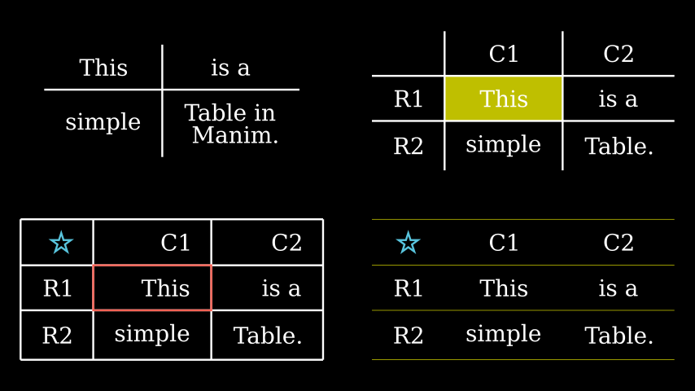

```py
from manim import *

class TableExamples(Scene):
    def construct(self):
        t0 = Table(
            [["This", "is a"],
            ["simple", "Table in \n Manim."]])
        t1 = Table(
            [["This", "is a"],
            ["simple", "Table."]],
            row_labels=[Text("R1"), Text("R2")],
            col_labels=[Text("C1"), Text("C2")])
        t1.add_highlighted_cell((2,2), color=YELLOW)
        t2 = Table(
            [["This", "is a"],
            ["simple", "Table."]],
            row_labels=[Text("R1"), Text("R2")],
            col_labels=[Text("C1"), Text("C2")],
            top_left_entry=Star().scale(0.3),
            include_outer_lines=True,
            arrange_in_grid_config={"cell_alignment": RIGHT})
        t2.add(t2.get_cell((2,2), color=RED))
        t3 = Table(
            [["This", "is a"],
            ["simple", "Table."]],
            row_labels=[Text("R1"), Text("R2")],
            col_labels=[Text("C1"), Text("C2")],
            top_left_entry=Star().scale(0.3),
            include_outer_lines=True,
            line_config={"stroke_width": 1, "color": YELLOW})
        t3.remove(*t3.get_vertical_lines())
        g = Group(
            t0,t1,t2,t3
        ).scale(0.7).arrange_in_grid(buff=1)
        self.add(g)
```


示例：背景矩形示例

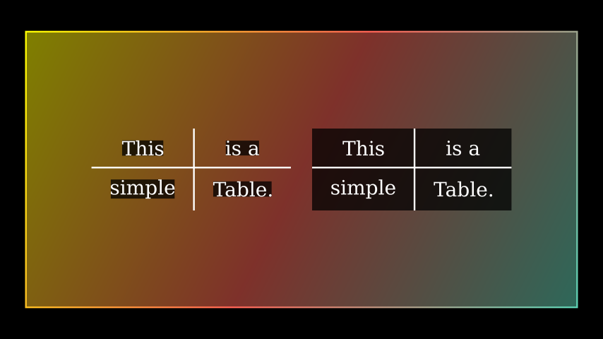

```py
from manim import *

class BackgroundRectanglesExample(Scene):
    def construct(self):
        background = Rectangle(height=6.5, width=13)
        background.set_fill(opacity=.5)
        background.set_color([TEAL, RED, YELLOW])
        self.add(background)
        t0 = Table(
            [["This", "is a"],
            ["simple", "Table."]],
            add_background_rectangles_to_entries=True)
        t1 = Table(
            [["This", "is a"],
            ["simple", "Table."]],
            include_background_rectangle=True)
        g = Group(t0, t1).scale(0.7).arrange(buff=0.5)
        self.add(g)
```


参数

- **table** ( _Iterable_ _\[_ _Iterable_ _\[_ _float_ _|_ _str_ _|_ [_VMobject_]() _\]_ _\]_ ) – 2D 数组或列表列表。表的内容必须是 中可调用集的有效输入`element_to_mobject`。
- **row_labels** ( _Iterable_ _\[_ [_VMobject_]() _\]_ _|_ _None_ ) –[`VMobject`]()表示每行标签的列表。
- **col_labels** ( _Iterable_ _\[_ [_VMobject_]() _\]_ _|_ _None_ ) –[`VMobject`]()表示每列标签的列表。
- **top_left_entry** ( [_VMobject_]() _|_ _None_ ) – 仅当给出行和列标签时才能指定表的左上角条目。
- **v_buff** ( _float_ ) – 传递给的垂直缓冲区[`arrange_in_grid()`]()，默认为 0.8。
- **h_buff** ( _float_ ) – 传递给的水平缓冲区[`arrange_in_grid()`]()，默认为 1.3。
- **include_outer_lines** ( _bool_ ) –`True`表格是否应包含外部行，默认为 False。
- **add_background_rectangles_to_entries** ( _bool_ ) –`True`默认情况下是否应将背景矩形添加到条目中`False`。
- **Entrys_background_color** ( _Color_ ) – 条目的背景颜色（如果`add_background_rectangles_to_entries`是）`True`。
- **include_background_rectangle** ( _bool_ ) –`True`默认情况下表格是否应该有一个背景矩形`False`。
- **background_rectangle_color** ( _Color_ ) – 表格的背景颜色（如果`include_background_rectangle`是）`True`。
- **element_to_mobject** ( _Callable_ _\[_ _\[_ _float_ _|_ _str_ _|_ [_VMobject_]() _\]_ _,_ [_VMobject_]() _\]_ ) –[`Mobject`]()应用于表条目的类。默认情况下[`Paragraph`]()。对于常见的选择，请参阅[`text_mobject`]()/ [`tex_mobject`]()。
- **element_to_mobject_config** ( _dict_ ) – 自定义配置传递到`element_to_mobject`，默认为 {}。
- **range_in_grid_config** ( _dict_ ) – 传递给 的 Dict [`arrange_in_grid()`]()，自定义表格的排列。
- **line_config** ( _dict_ ) – 传递给 的 Dit [`Line`]()，自定义表格的行。
- **kwargs** – 要传递给 的附加参数[`VGroup`]()。


方法

|||
|-|-|
[`add_background_to_entries`]()
[`BackgroundRectangle`]()向表的每个条目添加黑色。
[`add_highlighted_cell`]()
通过添加 . 突出显示表格中特定位置的一个单元格[`BackgroundRectangle`]()。
[`create`]()
定制的表创建类型函数。
[`get_cell`]()
[`Polygon`]()以不带条目的矩形形式返回一个特定单元格。
[`get_col_labels`]()
返回表的列标签。
[`get_columns`]()
将表的列返回为 a [`VGroup`]()of [`VGroup`]()。
[`get_entries`]()
返回表中的各个条目（包括标签）或一个特定条目（如果`pos`设置了参数 ）。
[`get_entries_without_labels`]()
返回表中的各个条目（不带标签）或一个特定条目（如果`pos`设置了参数 ）。
[`get_highlighted_cell`]()
返回[`BackgroundRectangle`]()给定位置的单元格的 a。
[`get_horizontal_lines`]()
返回表格的水平线。
[`get_labels`]()
返回表的标签。
[`get_row_labels`]()
返回表的行标签。
[`get_rows`]()
[`VGroup`]()以 a of 形式返回表的行[`VGroup`]()。
[`get_vertical_lines`]()
返回表格的垂直线。
[`scale`]()
按一个因子缩放大小。
[`set_column_colors`]()
为表的每一列设置单独的颜色。
[`set_row_colors`]()
为表格的每一行设置单独的颜色。


属性

|||
|-|-|
`animate`
用于对 的任何方法的应用程序进行动画处理`self`。
`animation_overrides`
`color`
`depth`
对象的深度。
`fill_color`
如果有多种颜色（对于渐变），则返回第一个颜色
`height`
mobject 的高度。
`n_points_per_curve`
`sheen_factor`
`stroke_color`
`width`
mobject 的宽度。


`add_background_to_entries(color='#000000')`

[`BackgroundRectangle`]()向表的每个条目添加黑色。

参数

**color**（_Color_）–

返回类型

[_Table_]()


`add_highlighted_cell(pos=(1, 1), color='#FFFF00', **kwargs)`

通过添加 . 突出显示表格中特定位置的一个单元格[`BackgroundRectangle`]()。

参数

- **pos** ( _Sequence_ _\[_ _int_ _\]_ ) – 表中特定条目的位置。`(1,1)`是表格的左上角条目。
- **color**( _Color_ ) – 用于突出显示单元格的颜色。
- **kwargs** – 要传递给 的附加参数[`BackgroundRectangle`]()。

返回类型

[_Table_]()


例子

示例：AddHighlightedCellExample 

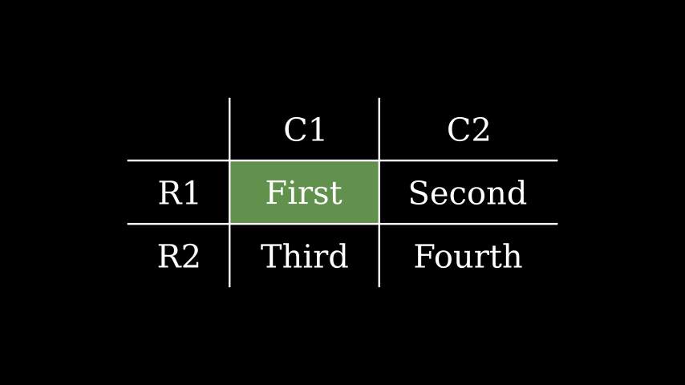

```py
from manim import *

class AddHighlightedCellExample(Scene):
    def construct(self):
        table = Table(
            [["First", "Second"],
            ["Third","Fourth"]],
            row_labels=[Text("R1"), Text("R2")],
            col_labels=[Text("C1"), Text("C2")])
        table.add_highlighted_cell((2,2), color=GREEN)
        self.add(table)
```


```py
create(lag_ratio=1, line_animation=<class 'manim.animation.creation.Create'>, label_animation=<class 'manim.animation.creation.Write'>, element_animation=<class 'manim.animation.creation.Create'>, entry_animation=<class 'manim.animation.fading.FadeIn'>, **kwargs)
```
定制的表创建类型函数。

参数

- **lag_ratio** ( _float_ ) – 动画的滞后比率。
- **line_animation** ( _Callable_ _\[_ _\[_ [_VMobject_]() _|_ [_VGroup_]() _\]_ _,_ [_Animation_]() _\]_ ) – 表格线的动画样式，请参阅[`creation`]()示例。
- **label_animation** ( _Callable_ _\[_ _\[_ [_VMobject_]() _|_ [_VGroup_]() _\]_ _,_ [_Animation_]() _\]_ ) – 表格标签的动画样式，请参阅[`creation`]()示例。
- **element_animation** ( _Callable_ _\[_ _\[_ [_VMobject_]() _|_ [_VGroup_]() _\]_ _,_ [_Animation_]() _\]_ ) – 表格元素的动画样式，请参阅[`creation`]()示例。
- **Entry_animation** ( _Callable_ _\[_ _\[_ [_VMobject_]() _|_ [_VGroup_]() _\]_ _,_ [_Animation_]() _\]_ ) – 表格背景的入口动画，请参见[`creation`]()示例。
- **kwargs** – 传递给创建动画的进一步参数。

返回

包含线条和元素创建的动画组。

返回类型

[`AnimationGroup`]()


例子

示例：创建表示例

```py
from manim import *

class CreateTableExample(Scene):
    def construct(self):
        table = Table(
            [["First", "Second"],
            ["Third","Fourth"]],
            row_labels=[Text("R1"), Text("R2")],
            col_labels=[Text("C1"), Text("C2")],
            include_outer_lines=True)
        self.play(table.create())
        self.wait()
```


`get_cell(pos=(1, 1), **kwargs)`

[`Polygon`]()以不带条目的矩形形式返回一个特定单元格。

参数

- **pos** ( _Sequence_ _\[_ _int_ _\]_ ) – 表中特定条目的位置。`(1,1)`是表格的左上角条目。
- **kwargs** – 要传递给 的附加参数[`Polygon`]()。

返回

模仿表格中一个特定单元格的多边形。

返回类型

[`Polygon`]()


例子

示例：获取单元格示例

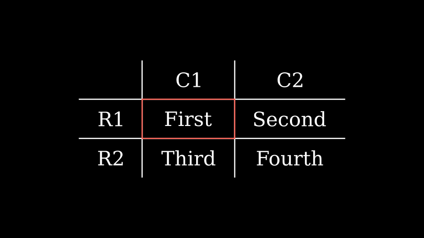

```py
from manim import *

class GetCellExample(Scene):
    def construct(self):
        table = Table(
            [["First", "Second"],
            ["Third","Fourth"]],
            row_labels=[Text("R1"), Text("R2")],
            col_labels=[Text("C1"), Text("C2")])
        cell = table.get_cell((2,2), color=RED)
        self.add(table, cell)
```


`get_col_labels()`

返回表的列标签。

返回

包含表的列标签的 VGroup。

返回类型

[`VGroup`]()


例子

示例：GetColLabelsExample 

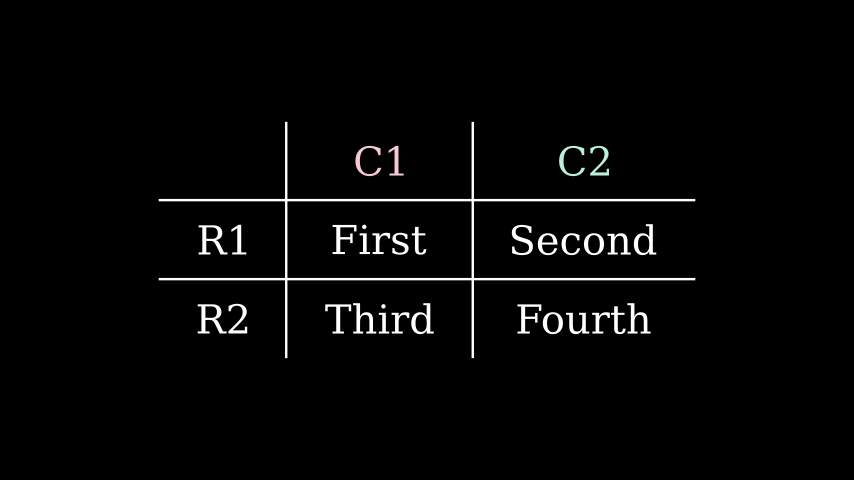

```py
from manim import *

class GetColLabelsExample(Scene):
    def construct(self):
        table = Table(
            [["First", "Second"],
            ["Third","Fourth"]],
            row_labels=[Text("R1"), Text("R2")],
            col_labels=[Text("C1"), Text("C2")])
        lab = table.get_col_labels()
        for item in lab:
            item.set_color(random_bright_color())
        self.add(table)
```


`get_columns()`

将表的列作为 [`VGroup`]() 的 [`VGroup`]() 返回

返回

[`VGroup`]()包含 a 中的每一列[`VGroup`]()。

返回类型

[`VGroup`]()


例子

示例：获取列示例

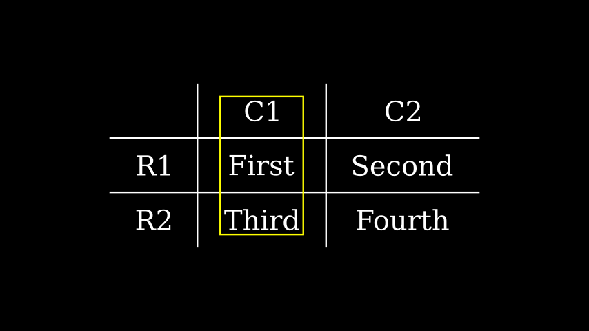

```py
from manim import *

class GetColumnsExample(Scene):
    def construct(self):
        table = Table(
            [["First", "Second"],
            ["Third","Fourth"]],
            row_labels=[Text("R1"), Text("R2")],
            col_labels=[Text("C1"), Text("C2")])
        table.add(SurroundingRectangle(table.get_columns()[1]))
        self.add(table)
```

`get_entries(pos=None)`

返回表中的各个条目（包括标签）或一个特定条目（如果`pos`设置了参数 ）。

参数

**pos** ( _Sequence_ _\[_ _int_ _\]_ _|_ _None_ ) – 表中特定条目的位置。`(1,1)`是表格的左上角条目。

返回

[`VGroup`]()包含表的所有条目（包括标签）或[`VMobject`]()给定位置的 if`pos`已设置。

返回类型

Union\[ [`VMobject`](), [`VGroup`]()\]


例子

示例：GetEntriesExample 

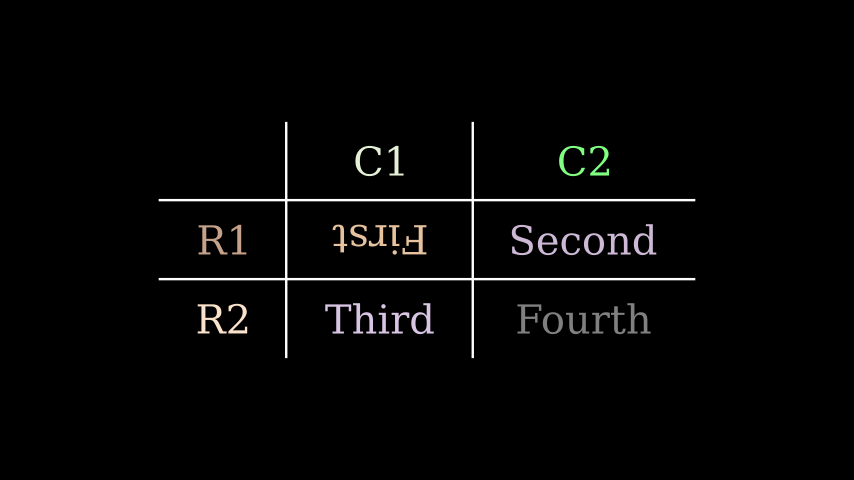

```py
from manim import *

class GetEntriesExample(Scene):
    def construct(self):
        table = Table(
            [["First", "Second"],
            ["Third","Fourth"]],
            row_labels=[Text("R1"), Text("R2")],
            col_labels=[Text("C1"), Text("C2")])
        ent = table.get_entries()
        for item in ent:
            item.set_color(random_bright_color())
        table.get_entries((2,2)).rotate(PI)
        self.add(table)
```


`get_entries_without_labels(pos=None)`

返回表中的各个条目（不带标签）或一个特定条目（如果`pos`设置了参数 ）。

参数

**pos** ( _Sequence_ _\[_ _int_ _\]_ _|_ _None_ ) – 表中特定条目的位置。`(1,1)`是表格的左上角条目（没有标签）。

返回

[`VGroup`]()包含表的所有条目（无标签）或[`VMobject`]()在给定位置 if`pos`已设置。

返回类型

Union\[ [`VMobject`](), [`VGroup`]()\]


例子

示例：GetEntriesWithoutLabelsExample 

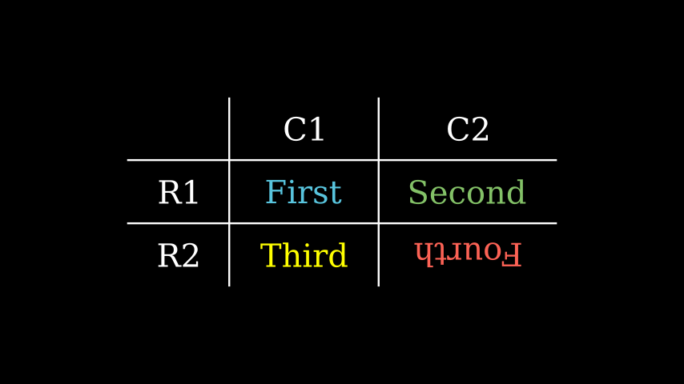

```py
from manim import *

class GetEntriesWithoutLabelsExample(Scene):
    def construct(self):
        table = Table(
            [["First", "Second"],
            ["Third","Fourth"]],
            row_labels=[Text("R1"), Text("R2")],
            col_labels=[Text("C1"), Text("C2")])
        ent = table.get_entries_without_labels()
        colors = [BLUE, GREEN, YELLOW, RED]
        for k in range(len(colors)):
            ent[k].set_color(colors[k])
        table.get_entries_without_labels((2,2)).rotate(PI)
        self.add(table)
```


`get_highlighted_cell(pos=(1, 1), color='#FFFF00', **kwargs)`

返回[`BackgroundRectangle`]()给定位置的单元格的 a。

参数

- **pos** ( _Sequence_ _\[_ _int_ _\]_ ) – 表中特定条目的位置。`(1,1)`是表格的左上角条目。
- **color**( _Color_ ) – 用于突出显示单元格的颜色。
- **kwargs** – 要传递给 的附加参数[`BackgroundRectangle`]()。

返回类型

[_BackgroundRectangle_]()


例子

示例：获取 HighlightedCellExample 


```py
from manim import *

class GetHighlightedCellExample(Scene):
    def construct(self):
        table = Table(
            [["First", "Second"],
            ["Third","Fourth"]],
            row_labels=[Text("R1"), Text("R2")],
            col_labels=[Text("C1"), Text("C2")])
        highlight = table.get_highlighted_cell((2,2), color=GREEN)
        table.add_to_back(highlight)
        self.add(table)
```


`get_horizontal_lines()`

返回表格的水平线。

返回

[`VGroup`]()包含表格的所有水平线。

返回类型

[`VGroup`]()


例子

示例：获取水平线示例

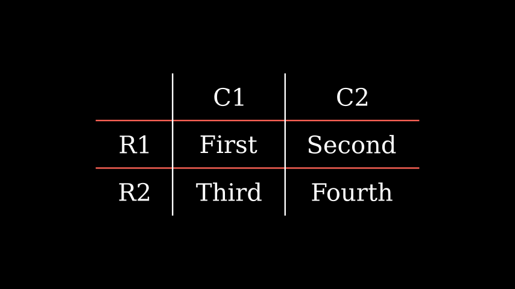

```py
from manim import *

class GetHorizontalLinesExample(Scene):
    def construct(self):
        table = Table(
            [["First", "Second"],
            ["Third","Fourth"]],
            row_labels=[Text("R1"), Text("R2")],
            col_labels=[Text("C1"), Text("C2")])
        table.get_horizontal_lines().set_color(RED)
        self.add(table)
```


`get_labels()`

返回表的标签。

返回

[`VGroup`]()包含表的所有标签。

返回类型

[`VGroup`]()


例子

示例：GetLabelsExample

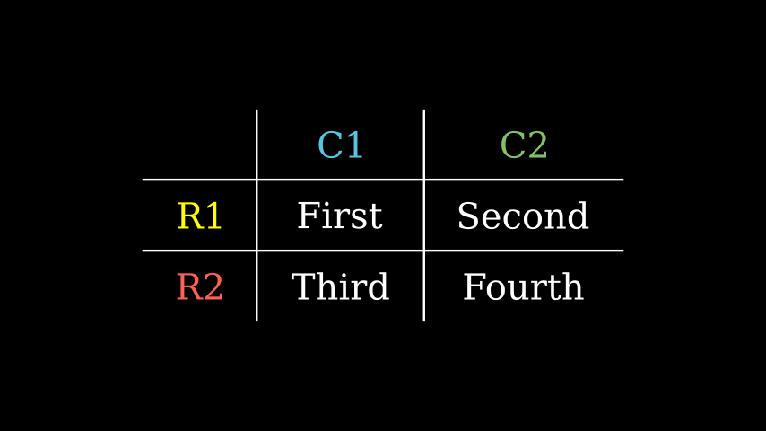

```py
from manim import *

class GetLabelsExample(Scene):
    def construct(self):
        table = Table(
            [["First", "Second"],
            ["Third","Fourth"]],
            row_labels=[Text("R1"), Text("R2")],
            col_labels=[Text("C1"), Text("C2")])
        lab = table.get_labels()
        colors = [BLUE, GREEN, YELLOW, RED]
        for k in range(len(colors)):
            lab[k].set_color(colors[k])
        self.add(table)
```

`get_row_labels()`

返回表的行标签。

返回

[`VGroup`]()包含表的行标签。

返回类型

[`VGroup`]()


例子

示例：GetRowLabelsExample 

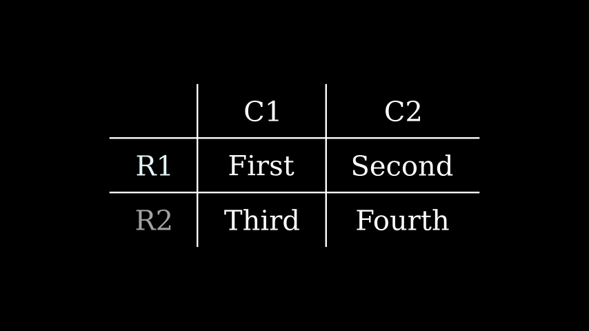

```py
from manim import *

class GetRowLabelsExample(Scene):
    def construct(self):
        table = Table(
            [["First", "Second"],
            ["Third","Fourth"]],
            row_labels=[Text("R1"), Text("R2")],
            col_labels=[Text("C1"), Text("C2")])
        lab = table.get_row_labels()
        for item in lab:
            item.set_color(random_bright_color())
        self.add(table)
```

`get_rows()`

[`VGroup`]()以 a of 形式返回表的行[`VGroup`]()。

返回

[`VGroup`]()包含 a 中的每一行[`VGroup`]()。

返回类型

[`VGroup`]()


例子

示例：GetRowsExample 

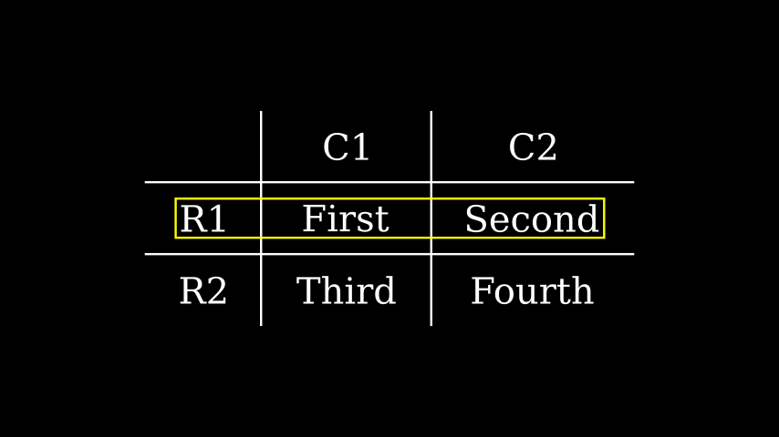

```py
from manim import *

class GetRowsExample(Scene):
    def construct(self):
        table = Table(
            [["First", "Second"],
            ["Third","Fourth"]],
            row_labels=[Text("R1"), Text("R2")],
            col_labels=[Text("C1"), Text("C2")])
        table.add(SurroundingRectangle(table.get_rows()[1]))
        self.add(table)
```

`get_vertical_lines()`

返回表格的垂直线。

返回

[`VGroup`]()包含表格的所有垂直线。

返回类型

[`VGroup`]()


例子

示例：获取垂直线示例

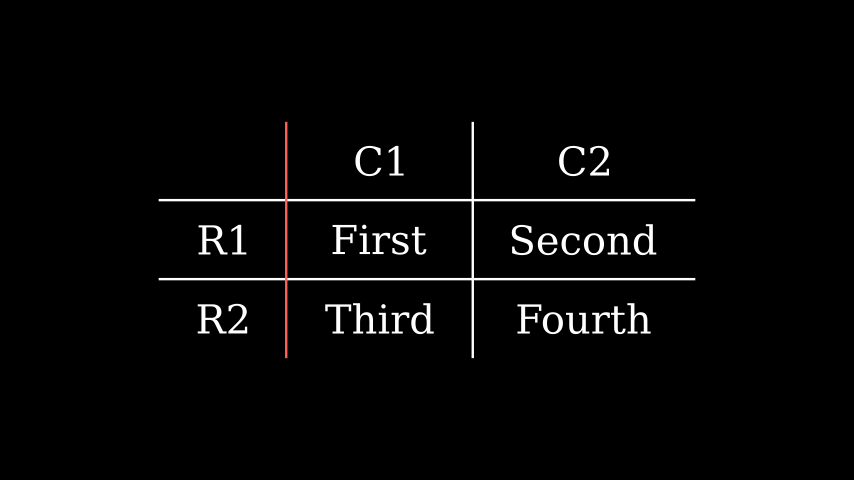

```py
from manim import *

class GetVerticalLinesExample(Scene):
    def construct(self):
        table = Table(
            [["First", "Second"],
            ["Third","Fourth"]],
            row_labels=[Text("R1"), Text("R2")],
            col_labels=[Text("C1"), Text("C2")])
        table.get_vertical_lines()[0].set_color(RED)
        self.add(table)
```


`scale(scale_factor, **kwargs)`

按一个因子缩放大小。

默认行为是围绕 mobject 的中心进行缩放。

参数

- **scale_factor** ( _float_ ) – 比例因子 α。如果 0<|α|<1，mobject 将缩小，并且对于|α|>1 它会成长。此外，如果 α<0，mobject 也被翻转。
- **kwargs** – 传递给 `apply_points_function_about_point()`.

返回

`self`

返回类型

`Mobject`

例子

示例：MobjectScaleExample 


```py
from manim import *

class MobjectScaleExample(Scene):
    def construct(self):
        f1 = Text("F")
        f2 = Text("F").scale(2)
        f3 = Text("F").scale(0.5)
        f4 = Text("F").scale(-1)

        vgroup = VGroup(f1, f2, f3, f4).arrange(6 * RIGHT)
        self.add(vgroup)
```


> 也可以看看

> `move_to()`


`set_column_colors(*colors)`

为表的每一列设置单独的颜色。

参数

**colors**(_Iterable[Color]_) – 颜色的可迭代；每种颜色对应一列。

返回类型

[_Table_]()


例子

示例：SetColumnColorsExample 

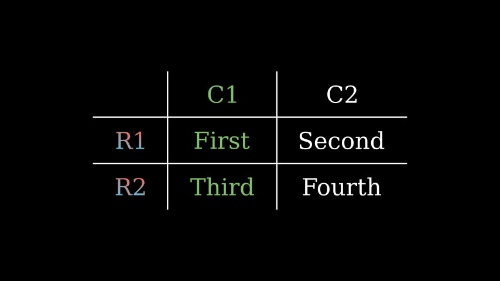

```py
from manim import *

class SetColumnColorsExample(Scene):
    def construct(self):
        table = Table(
            [["First", "Second"],
            ["Third","Fourth"]],
            row_labels=[Text("R1"), Text("R2")],
            col_labels=[Text("C1"), Text("C2")]
        ).set_column_colors([RED,BLUE], GREEN)
        self.add(table)
```


`set_row_colors(*colors)`

为表格的每一行设置单独的颜色。

参数

**colors**( _Iterable[Color]_ ) – 颜色的可迭代；每种颜色对应一行。

返回类型

[_Table_]()


例子

示例：SetRowColorsExample 

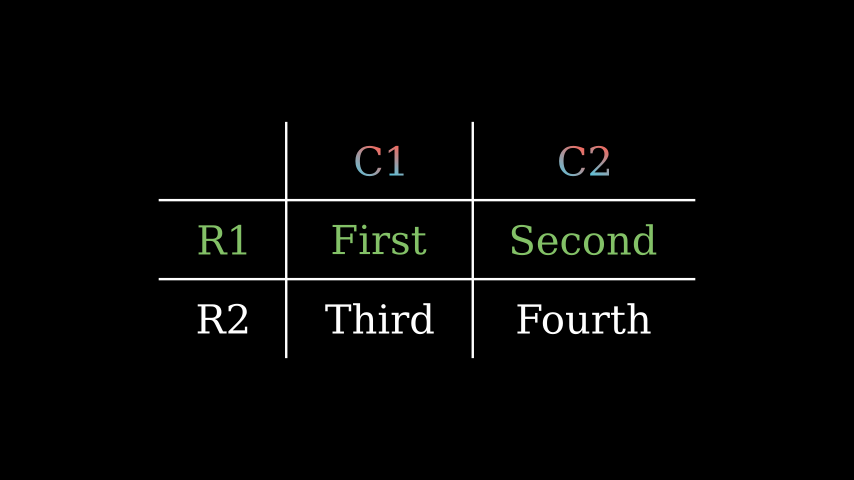

```py
from manim import *

class SetRowColorsExample(Scene):
    def construct(self):
        table = Table(
            [["First", "Second"],
            ["Third","Fourth"]],
            row_labels=[Text("R1"), Text("R2")],
            col_labels=[Text("C1"), Text("C2")]
        ).set_row_colors([RED,BLUE], GREEN)
        self.add(table)
```

