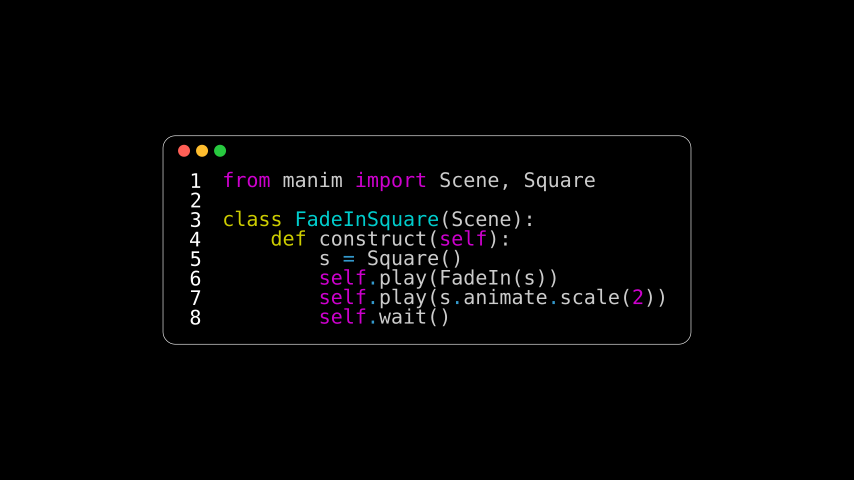

# 代码

合格名称：`manim.mobject.text.code\_mobject.Code`


```py
class Code(file_name=None, code=None, tab_width=3, line_spacing=0.3, font_size=24, font='Monospace', stroke_width=0, margin=0.3, indentation_chars='    ', background='rectangle', background_stroke_width=1, background_stroke_color='#FFFFFF', corner_radius=0.2, insert_line_no=True, line_no_from=1, line_no_buff=0.4, style='vim', language=None, generate_html_file=False, warn_missing_font=True, **kwargs)
```

Bases: `VGroup`

突出显示的源代码列表。

`listing`的对象由三个对象组成[`Code`]()：[`VGroup`]()

- 背景，`listing.background_mobject`. 它可以是 a [`Rectangle`]()（如果列表已使用 `background="rectangle"`默认选项 初始化）或[`VGroup`]() 类似窗口（如果`background="window"`已通过）。
- 行号`listing.line_numbers`（一个[`Paragraph`]() 对象）。
- 突出显示的代码本身`listing.code`（一个[`Paragraph`]() 对象）。

> 警告

> 使用[`Transform`]()带有前导空格的 on 文本（在本例中为：代码）可能看起来 [很奇怪](https://github.com/3b1b/manim/issues/1067)。考虑使用 `remove_invisible_chars()`来解决此问题。


例子

正常使用：

```py
listing = Code(
    "helloworldcpp.cpp",
    tab_width=4,
    background_stroke_width=1,
    background_stroke_color=WHITE,
    insert_line_no=True,
    style=Code.styles_list[15],
    background="window",
    language="cpp",
)
```


我们还可以渲染作为字符串传递的代码（但请注意，在这种情况下必须指定语言）：

示例：CodeFromString 



```py
from manim import *

class CodeFromString(Scene):
    def construct(self):
        code = '''from manim import Scene, Square

class FadeInSquare(Scene):
    def construct(self):
        s = Square()
        self.play(FadeIn(s))
        self.play(s.animate.scale(2))
        self.wait()
'''
        rendered_code = Code(code=code, tab_width=4, background="window",
                            language="Python", font="Monospace")
        self.add(rendered_code)
```


参数

- **file_name** ( _str_ _|_ _os.PathLike_ _|_ _None_ ) – 要显示的代码文件的名称。
- **code** ( _str_ _|_ _None_ ) – 如果`file_name`未指定，则可以直接传递代码字符串。
- **tab_width** ( _int_ ) – 与制表符对应的空格字符数。默认为 3。
- **line_spacing** ( _float_ ) – 与字体大小相关的行之间的间距量。默认为 0.3，表示字体大小的 30%。
- **font_size** ( _float_ ) – 缩放显示代码的数字。默认为 24。
- **font** ( _str_ ) – 要使用的文本字体的名称。默认为`"Monospace"`. 它可以是系统字体，也可以是使用 text.register_font()加载的字体。请注意，不同操作系统的字体系列名称可能有所不同。
- **stroke_width** ( _float_ ) – 文本的描边宽度。推荐设置为 0，默认设置。
- **margin** ( _float_ ) – 背景文本的内边距。默认为 0.3。
- **indentation_chars** ( _str_ ) – “缩进字符”是指给定代码行开头的空格/制表符。默认为`"    "`（空格）。
- **background**( _str_ ) – 定义背景的类型。目前仅支持`"rectangle"`（默认）和`"window"`.
- **background_lines_width** ( _float_ ) – 定义背景的描边宽度。默认为 1。
- **background_lines_color** ( _str_ ) – 定义背景的描边颜色。默认为`WHITE`.
- **corner_radius** ( _float_ ) – 定义背景的角半径。默认为 0.2。
- **insert_line_no** ( _bool_ ) – 定义是否应在显示的代码中插入行号。默认为`True`.
- **line_no_from** ( _int_ ) – 定义行计数中第一行的编号。默认为 1。
- **line_no_buff** ( _float_ ) – 定义行号和显示代码之间的间距。默认为 0.4。
- **style** ( _str_ ) – 定义显示代码的样式类型。您可以在 with 中看到可能的样式名称`styles_list`。默认为`"vim"`.
- **language** ( _str_ _|_ _None_ ) – 指定编写给定代码所用的编程语言。如果`None` （默认），将自动检测该语言。有关可能选项的列表，请访问[https://pygments.org/docs/lexers/](https://pygments.org/docs/lexers/)并查找“别名或短名称”。
- **generate_html_file** ( _bool_ ) – 定义是否将突出显示的 html 代码生成到文件夹 asset/codes/ generated_html_files。默认为 False。
- **warn_missing_font** ( \_bool ) – 如果为 True （默认），如果从\_manimpango.list_fonts()返回的字体（区分大小写）列表中不存在该字体，Manim 将发出警告。


`background_mobject`

代码清单的背景。

类型

[`VGroup`]()


`line_numbers`

代码列表的行号。如果 `insert_line_no=False`已指定，则为空。

类型

[`Paragraph`]()


`code`

突出显示的代码。

类型

[`Paragraph`]()


方法


属性

|||
|-|-|
`animate`|用于对 的任何方法的应用程序进行动画处理`self`。
`animation_overrides`|
`color`|
`depth`|对象的深度。
`fill_color`|如果有多种颜色（对于渐变），则返回第一个颜色
`height`|mobject 的高度。
`n_points_per_curve`|
`sheen_factor`|
`stroke_color`|
`styles_list`|
`width`|mobject 的宽度。
