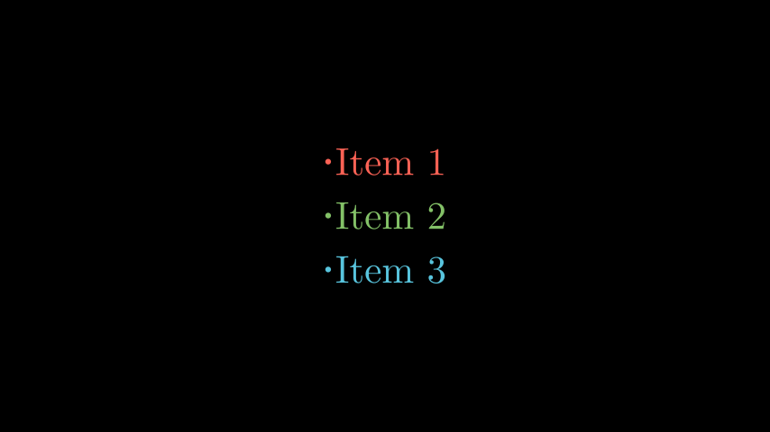

# 项目符号列表

合格名称：`manim.mobject.text.tex\_mobject.BulletedList`


```py
class BulletedList(*items, buff=0.5, dot_scale_factor=2, tex_environment=None, **kwargs)
```

Bases: `Tex`


例子

示例：项目符号列表示例



```py
from manim import *

class BulletedListExample(Scene):
    def construct(self):
        blist = BulletedList("Item 1", "Item 2", "Item 3", height=2, width=2)
        blist.set_color_by_tex("Item 1", RED)
        blist.set_color_by_tex("Item 2", GREEN)
        blist.set_color_by_tex("Item 3", BLUE)
        self.add(blist)
```


方法

`fade_all_but`


属性

|||
|-|-|
`animate`|用于对 的任何方法的应用程序进行动画处理`self`。
`animation_overrides`|
`color`|
`depth`|对象的深度。
`fill_color`|如果有多种颜色（对于渐变），则返回第一个颜色
`font_size`|tex mobject 的字体大小。
`hash_seed`|表示生成的对象点结果的唯一哈希值。
`height`|mobject 的高度。
`n_points_per_curve`|
`sheen_factor`|
`stroke_color`|
`width`|mobject 的宽度。
