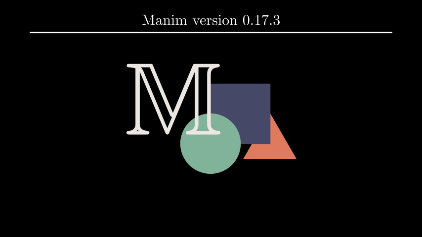

# 标题

合格名称：`manim.mobject.text.tex\_mobject.Title`


```py
class Title(*text_parts, include_underline=True, match_underline_width_to_text=False, underline_buff=0.25, **kwargs)
```

Bases: `Tex`


例子

示例：标题示例



```py
from manim import *

import manim

class TitleExample(Scene):
    def construct(self):
        banner = ManimBanner()
        title = Title(f"Manim version {manim.__version__}")
        self.add(banner, title)
```


方法


属性

|||
|-|-|
`animate`|用于对 的任何方法的应用程序进行动画处理`self`。
`animation_overrides`|
`color`|
`depth`|对象的深度。
`fill_color`|如果有多种颜色（对于渐变），则返回第一个颜色
`font_size`|tex mobject 的字体大小。
`hash_seed`|表示生成的对象点结果的唯一哈希值。
`height`|mobject 的高度。
`n_points_per_curve`|
`sheen_factor`|
`stroke_color`|
`width`|mobject 的宽度。
