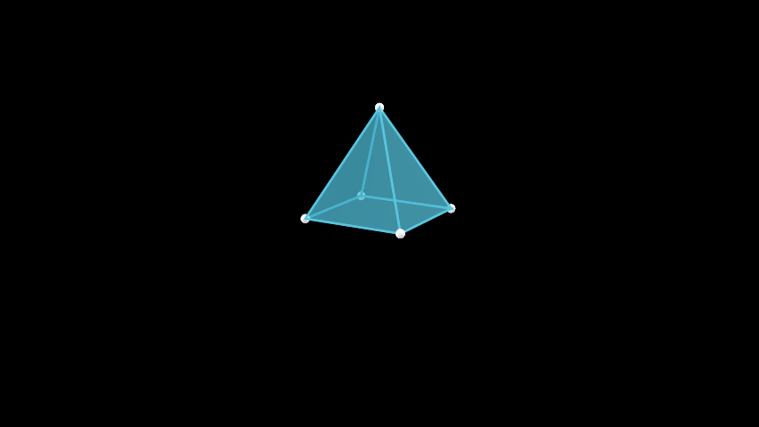
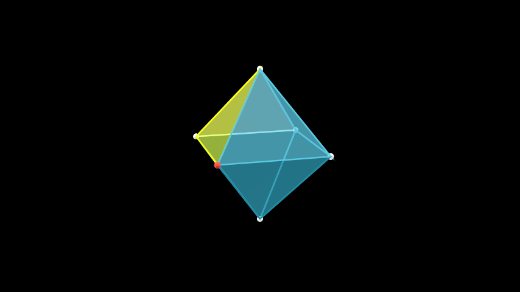

# 多面体

合格名称：`manim.mobject.three\_d.polyhedra.Polyhedron`


```py
class Polyhedron(vertex_coords, faces_list, faces_config={}, graph_config={})
```

Bases: `VGroup`

一个抽象的多面体类。

在此实现中，多面体是通过空间中的顶点坐标列表和面列表来定义的。此实现反映了标准多面体数据格式（OFF，目标文件格式）的实现。

参数

- **vertex_coords** ( _list_ _\[_ _list_ _\[_ _float_ _\]_ _|_ _np.ndarray_ _\]_ ) – 多面体中相应顶点的坐标列表。每个坐标将对应一个顶点。顶点使用 Python 的常用索引进行索引。
- **faces_list** ( _list_ _\[_ _list_ _\[_ _int_ _\]_ _\]_ ) – 面孔列表。每个面都是一个子列表，其中包含形成该面角的顶点的索引。
- **faces_config** ( _dict_ _\[_ _str_ _,_ _str_ _|_ _int_ _|_ _float_ _|_ _bool_ _\]_ ) – 表示多面体面的多边形的配置。
- **graph_config** ( _dict_ _\[_ _str_ _,_ _str_ _|_ _int_ _|_ _float_ _|_ _bool_ _\]_ ) – 包含多面体的顶点和边的图的配置。


例子

为了了解如何创建自定义多面体，让我们使用一个相当简单的例子 \- 方形金字塔。

示例：SquarePyramidScene 




```py
from manim import *

class SquarePyramidScene(ThreeDScene):
    def construct(self):
        self.set_camera_orientation(phi=75 * DEGREES, theta=30 * DEGREES)
        vertex_coords = [
            [1, 1, 0],
            [1, -1, 0],
            [-1, -1, 0],
            [-1, 1, 0],
            [0, 0, 2]
        ]
        faces_list = [
            [0, 1, 4],
            [1, 2, 4],
            [2, 3, 4],
            [3, 0, 4],
            [0, 1, 2, 3]
        ]
        pyramid = Polyhedron(vertex_coords, faces_list)
        self.add(pyramid)
```


在定义上面的多面体时，我们首先定义了顶点的坐标。这些是正方形底边的角，以顶点列表中的前四个坐标给出，而顶点是列表中的最后一个坐标。

接下来，我们定义多面体的面。金字塔的三角面是以底边两个相邻顶点和顶点处的顶点为角的多边形。因此，我们在面列表的前四个元素中定义这些面。最后一个元素定义了金字塔的底部。

实例化后，多面体的图形和面也可以直接访问和修改。它们分别存储在 graph 和 faces 属性中。

示例：PolyhedronSubMobjects 



```py
from manim import *

class PolyhedronSubMobjects(ThreeDScene):
    def construct(self):
        self.set_camera_orientation(phi=75 * DEGREES, theta=30 * DEGREES)
        octahedron = Octahedron(edge_length = 3)
        octahedron.graph[0].set_color(RED)
        octahedron.faces[2].set_color(YELLOW)
        self.add(octahedron)
```


方法

|||
|-|-|
[`create_faces`]()|从面坐标列表创建面 VGroup。
[`extract_face_coords`]()|提取图中顶点的坐标。
[`get_edges`]()|创建循环成对元组列表。
`update_faces`|


属性

|||
|-|-|
`animate`|用于对 的任何方法的应用程序进行动画处理`self`。
`animation_overrides`|
`color`|
`depth`|对象的深度。
`fill_color`|如果有多种颜色（对于渐变），则返回第一个颜色
`height`|mobject 的高度。
`n_points_per_curve`|
`sheen_factor`|
`stroke_color`|
`width`|mobject 的宽度。


`create_faces(face_coords)`

从面坐标列表创建面 VGroup。

参数

**face_coords** (_list\[list\[list | np.ndarray\]\]_) –

返回类型

[VGroup]()


`extract_face_coords()`

提取图中顶点的坐标。用于更新面孔。

返回类型

list\[list\[np.ndarray\]\]


`get_edges(faces_list)`

创建循环成对元组列表。

参数

**faces_list** (_list\[list\[int]\]\]_) –

返回类型

list\[tuple\[int, int\]\]
