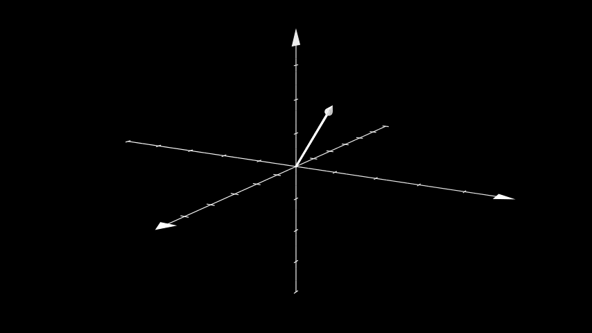

# 箭头 3D 

合格名称：`manim.mobject.three\_d.three\_dimensions.Arrow3D`


```py
class Arrow3D(start=array([- 1., 0., 0.]), end=array([1., 0., 0.]), thickness=0.02, height=0.3, base_radius=0.08, color='#FFFFFF', **kwargs)
```

Bases: `Line3D`

由圆柱线和圆锥形尖端制成的箭头。

参数

- **start** ( _np.ndarray_ ) – 箭头的起始位置。
- **end** ( _np.ndarray_ ) – 箭头的结束位置。
- **Thickness** ( _float_ ) – 箭头的粗细。
- **height** ( _float_ ) – 圆锥尖端的高度。
- **base_radius** ( _float_ ) – 圆锥形尖端的底半径。
- **color** ( _Color_ ) – 箭头的颜色。


例子

示例：ExampleArrow3D 



```py
from manim import *

class ExampleArrow3D(ThreeDScene):
    def construct(self):
        axes = ThreeDAxes()
        arrow = Arrow3D(
            start=np.array([0, 0, 0]),
            end=np.array([2, 2, 2]),
            resolution=8
        )
        self.set_camera_orientation(phi=75 * DEGREES, theta=30 * DEGREES)
        self.add(axes, arrow)
```

方法


属性

|||
|-|-|
`animate`|用于对 的任何方法的应用程序进行动画处理`self`。
`animation_overrides`|
`color`|
`depth`|对象的深度。
`fill_color`|如果有多种颜色（对于渐变），则返回第一个颜色
`height`|mobject 的高度。
`n_points_per_curve`|
`sheen_factor`|
`stroke_color`|
`width`|mobject 的宽度。
