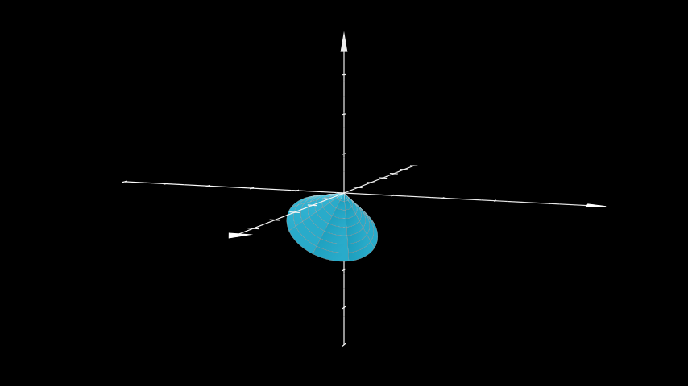

# 锥

合格名称：`manim.mobject.three\_d.three\_dimensions.Cone`


```py
class Cone(base_radius=1, height=1, direction=array([0., 0., 1.]), show_base=False, v_range=[0, 6.283185307179586], u_min=0, checkerboard_colors=False, **kwargs)
```

Bases: `Surface`

一个圆锥体。可以使用 2 个参数来定义：高度和底半径。极角 theta 可以使用 arctan(base_radius / height) 计算。球半径 r 使用毕达哥拉斯定理计算。

参数

- **base_radius** ( _float_ ) – 圆锥体逐渐变细的底半径。
- **height** ( _float_ ) – 从底半径形成的平面到圆锥体顶点测量的高度。
- **Direction** ( _np.ndarray_ ) – 顶点的方向。
- **show_base** ( _bool_ ) – 是否显示基准平面。
- **v_range** ( _Sequence_ _\[_ _float_ _\]_ ) – 开始和结束的方位角。
- **u_min** ( _float_ ) – 顶点处的半径。
- **checkerboard_colors** ( _bool_ ) – 在锥体上显示棋盘网格纹理。


例子

示例：ExampleCone




```py
from manim import *

class ExampleCone(ThreeDScene):
    def construct(self):
        axes = ThreeDAxes()
        cone = Cone(direction=X_AXIS+Y_AXIS+2*Z_AXIS, resolution=8)
        self.set_camera_orientation(phi=5*PI/11, theta=PI/9)
        self.add(axes, cone)
```


方法

|||
|-|-|
[`func`]()|从球坐标转换为笛卡尔坐标。
[`get_direction`]()|返回 顶点的当前方向[`Cone`]()。
[`set_direction`]()|更改 顶点的方向[`Cone`]()。


属性

|||
|-|-|
`animate`|用于对 的任何方法的应用程序进行动画处理`self`。
`animation_overrides`|
`color`|
`depth`|对象的深度。
`fill_color`|如果有多种颜色（对于渐变），则返回第一个颜色
`height`|mobject 的高度。
`n_points_per_curve`|
`sheen_factor`|
`stroke_color`|
`width`|mobject 的宽度。


`func(u, v)`

从球坐标转换为笛卡尔坐标。

参数

- **u** ( _float_ ) – 半径。
- **v** ( _float_ ) – 方位角。

返回

定义 的点[`Cone`]()。

返回类型

`numpy.array`


`get_direction()`

返回 顶点的当前方向[`Cone`]()。

返回

**direction** – 顶点的方向。

返回类型

`numpy.array`


`set_direction(direction)`

更改 顶点的方向[`Cone`]()。

参数

**Direction** (_ndarray_) – 顶点的方向。

返回类型

None
