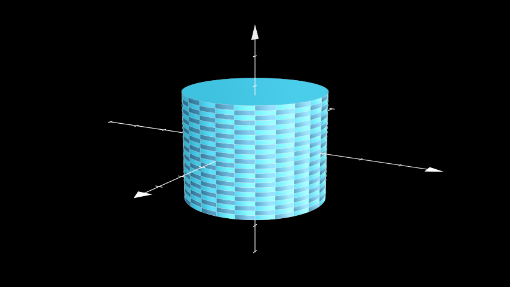

# 圆柱

合格名称：`manim.mobject.three\_d.three\_dimensions.Cylinder`


```py
class Cylinder(radius=1, height=2, direction=array([0., 0., 1.]), v_range=[0, 6.283185307179586], show_ends=True, resolution=(24, 24), **kwargs)
```

Bases: `Surface`

圆柱体，由其高度、半径和方向定义，

参数

- **radius** ( _float_ ) – 圆柱体的半径。
- **height** ( _float_ ) – 圆柱体的高度。
- **Direction** ( _np.ndarray_ ) – 圆柱体中心轴的方向。
- **v_range** ( _Sequence_ _\[_ _float_ _\]_ ) – 沿高度轴（由方向给出）开始和结束的高度。
- **show_ends** ( _bool_ ) – 是否显示端盖。
- **resolution**( _Sequence_ _\[_ _int_ _\]_ ) – 所采集的样本数[`Cylinder`]()。元组可用于分别定义`u`和的不同分辨率`v`。

例子

示例：示例圆柱体




```py
from manim import *

class ExampleCylinder(ThreeDScene):
    def construct(self):
        axes = ThreeDAxes()
        cylinder = Cylinder(radius=2, height=3)
        self.set_camera_orientation(phi=75 * DEGREES, theta=30 * DEGREES)
        self.add(axes, cylinder)
```


方法

|||
|-|-|
[`add_bases`]()|添加气缸的端盖。
[`func`]()|从圆柱坐标转换为笛卡尔坐标。
[`get_direction`]()|返回 的中心轴方向[`Cylinder`]()。
[`set_direction`]()|设置 的中心轴方向[`Cylinder`]()。


属性

|||
|-|-|
`animate`|用于对 的任何方法的应用程序进行动画处理`self`。
`animation_overrides`|
`color`|
`depth`|对象的深度。
`fill_color`|如果有多种颜色（对于渐变），则返回第一个颜色
`height`|mobject 的高度。
`n_points_per_curve`|
`sheen_factor`|
`stroke_color`|
`width`|mobject 的宽度。


`add_bases()`

添加气缸的端盖。

返回类型

None


`func(u, v)`

从圆柱坐标转换为笛卡尔坐标。

参数

- **u** ( _float_ ) – 高度。
- **v** ( _float_ ) – 方位角。

返回

定义 的点[`Cylinder`](")。

返回类型

`numpy.ndarray`


`get_direction()`

返回 的中心轴方向[`Cylinder`]()。

返回

**direction**– 中心轴的方向[`Cylinder`]()。

返回类型

`numpy.array`


`set_direction(direction)`

设置 的中心轴方向[`Cylinder`]()。

参数

**direction**( `numpy.array`) – 的中心轴方向[`Cylinder`]()。

返回类型

None
