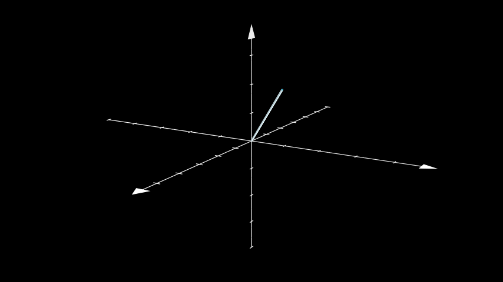
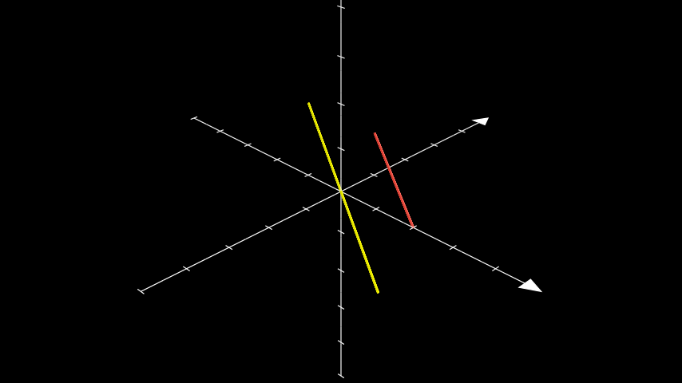
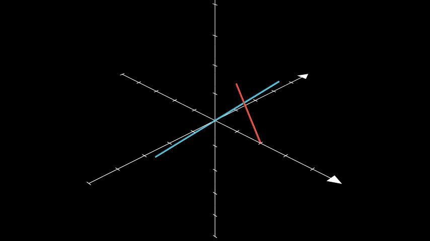

# 线 3D 

合格名称：`manim.mobject.three\_d.three\_dimensions.Line3D`


```py
class Line3D(start=array([- 1., 0., 0.]), end=array([1., 0., 0.]), thickness=0.02, color=None, **kwargs)
```

Bases: `Cylinder`

圆柱线，用于 ThreeDScene。

参数

- **start** ( _np.ndarray_ ) – 线的起点。
- **end** ( _np.ndarray_ ) – 线的终点。
- **thickness**( _float_ ) – 线条的粗细。
- **color**( _Color_ ) – 线条的颜色。

例子

示例：ExampleLine3D 



```py
from manim import *

class ExampleLine3D(ThreeDScene):
    def construct(self):
        axes = ThreeDAxes()
        line = Line3D(start=np.array([0, 0, 0]), end=np.array([2, 2, 2]))
        self.set_camera_orientation(phi=75 * DEGREES, theta=30 * DEGREES)
        self.add(axes, line)
```


方法

|||
|-|-|
[`get_end`]()|返回 的结束点[`Line3D`]()。
[`get_start`]()|返回 的起点[`Line3D`]()。
[`parallel_to`]()|返回与穿过给定点的另一条线平行的线。
[`perpendicular_to`]()|返回与穿过给定点的另一条线垂直的线。
[`pointify`]()|获取代表 的中心的点[`Mobjects`]()。
[`set_start_and_end_attrs`]()|设置线的起点和终点。


属性

|||
|-|-|
`animate`|用于对 的任何方法的应用程序进行动画处理`self`。
`animation_overrides`|
`color`|
`depth`|对象的深度。
`fill_color`|如果有多种颜色（对于渐变），则返回第一个颜色
`height`|mobject 的高度。
`n_points_per_curve`|
`sheen_factor`|
`stroke_color`|
`width`|mobject 的宽度。


`get_end()`

返回 的结束点[`Line3D`]()。

返回

**end** – 的结束点[`Line3D`]()。

返回类型

`numpy.array`


`get_start()`

返回 的起点[`Line3D`]()。

返回

**start** – 的起点[`Line3D`]()。

返回类型

`numpy.array`


```py
classmethod parallel_to(line, point=array([0., 0., 0.]), length=5, **kwargs)
```

返回与穿过给定点的另一条线平行的线。

参数

- **line** ( [_Line3D_]() ) – 要平行的线。
- **point** ( _Sequence_ _\[_ _float_ _\]_ ) – 要经过的点。
- **length** ( _float_ ) – 平行线的长度。
- **kwargs** – 要传递给类的附加参数。

返回

平行于 的线`line`。

返回类型

[`Line3D`]()


例子

示例：平行线示例




```py
from manim import *

class ParallelLineExample(ThreeDScene):
    def construct(self):
        self.set_camera_orientation(PI / 3, -PI / 4)
        ax = ThreeDAxes((-5, 5), (-5, 5), (-5, 5), 10, 10, 10)
        line1 = Line3D(RIGHT * 2, UP + OUT, color=RED)
        line2 = Line3D.parallel_to(line1, color=YELLOW)
        self.add(ax, line1, line2)
```


```py
classmethod perpendicular_to(line, point=array([0., 0., 0.]), length=5, **kwargs)
```

返回与穿过给定点的另一条线垂直的线。

参数

- **line** ( [_Line3D_]() ) – 要垂直的线。
- **point** ( _Sequence_ _\[_ _float_ _\]_ ) – 要经过的点。
- **length** ( _float_ ) – 垂直线的长度。
- **kwargs** – 要传递给类的附加参数。

返回

垂直于 的线`line`。

返回类型

[`Line3D`]()


例子

示例：PerpLineExample 



```py
from manim import *

class PerpLineExample(ThreeDScene):
    def construct(self):
        self.set_camera_orientation(PI / 3, -PI / 4)
        ax = ThreeDAxes((-5, 5), (-5, 5), (-5, 5), 10, 10, 10)
        line1 = Line3D(RIGHT * 2, UP + OUT, color=RED)
        line2 = Line3D.perpendicular_to(line1, color=BLUE)
        self.add(ax, line1, line2)
```


`pointify(mob_or_point, direction=None)`

获取代表 的中心的点[`Mobjects`]()。

参数

- **mob_or_point** ( [_Mobject_]() _|_ _float_ ) –[`Mobjects`]()或应返回其中心的点。
- **Direction** ( _np.ndarray_ ) – 如果应返回 a 的边[`Mobjects`]()，则为该边的方向。

返回

或点的中心[`Mobjects`]()，或边缘（如果给定方向）。

返回类型

`numpy.array`


`set_start_and_end_attrs(start, end, **kwargs)`

设置线的起点和终点。

如果 或`start`是`end`，[`Mobjects`]()这给出了它们的中心。

参数

- **start** ( _ndarray_ ) – 起始点或`Mobject`.
- **end** ( _ndarray_ ) – 结束点或`Mobject`.

返回类型

None
