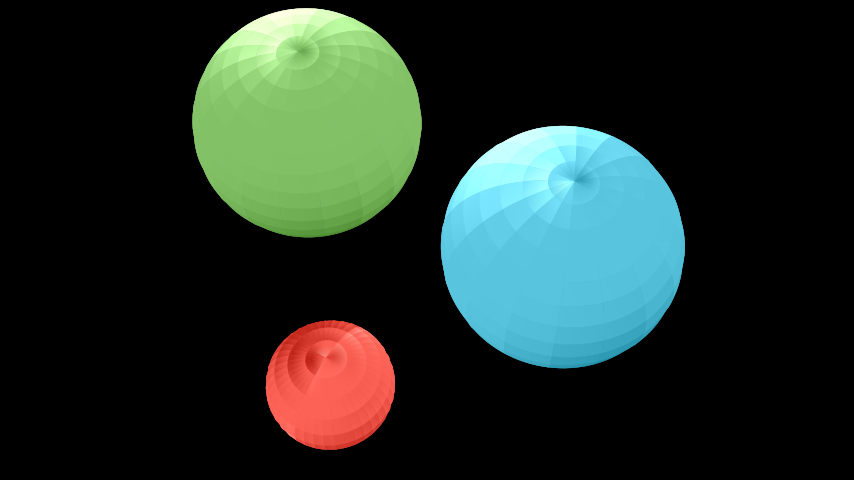

# 球体

合格名称：`manim.mobject.three\_d.three\_dimensions.Sphere`


```py
class Sphere(center=array([0., 0., 0.]), radius=1, resolution=None, u_range=(0, 6.283185307179586), v_range=(0, 3.141592653589793), **kwargs)
```

Bases: `Surface`

三维球体。

参数

- **center** ( _Sequence_ _\[_ _float_ _\]_ ) – 的中心[`Sphere`]()。
- **radius** ( _float_ ) – 的半径[`Sphere`]()。
- **resolution**( _Sequence_ _\[_ _int_ _\]_ ) – 所采集的样本数[`Sphere`]()。元组可用于分别定义`u`和的不同分辨率`v`。
- **u_range** ( _Sequence_ _\[_ _float_ _\]_ ) – 变量的范围`u`：。`(u_min, u_max)`
- **v_range** ( _Sequence_ _\[_ _float_ _\]_ ) – 变量的范围`v`：。`(v_min, v_max)`


例子

示例：ExampleSphere 



```py
from manim import *

class ExampleSphere(ThreeDScene):
    def construct(self):
        self.set_camera_orientation(phi=PI / 6, theta=PI / 6)
        sphere1 = Sphere(
            center=(3, 0, 0),
            radius=1,
            resolution=(20, 20),
            u_range=[0.001, PI - 0.001],
            v_range=[0, TAU]
        )
        sphere1.set_color(RED)
        self.add(sphere1)
        sphere2 = Sphere(center=(-1, -3, 0), radius=2, resolution=(18, 18))
        sphere2.set_color(GREEN)
        self.add(sphere2)
        sphere3 = Sphere(center=(-1, 2, 0), radius=2, resolution=(16, 16))
        sphere3.set_color(BLUE)
        self.add(sphere3)
```


方法

|||
|-|-|
[`func`]()|定义所绘制的 z 值[`Sphere`]()。


属性

|||
|-|-|
`animate`|用于对 的任何方法的应用程序进行动画处理`self`。
`animation_overrides`|
`color`|
`depth`|对象的深度。
`fill_color`|如果有多种颜色（对于渐变），则返回第一个颜色
`height`|mobject 的高度。
`n_points_per_curve`|
`sheen_factor`|
`stroke_color`|
`width`|mobject 的宽度。


`func(u, v)`

定义所绘制的 z 值[`Sphere`]()。

返回

定义 的 z 值[`Sphere`]()。

返回类型

`numpy.array`

参数

- **u**（_float_）–
- **v**（_float_）–
