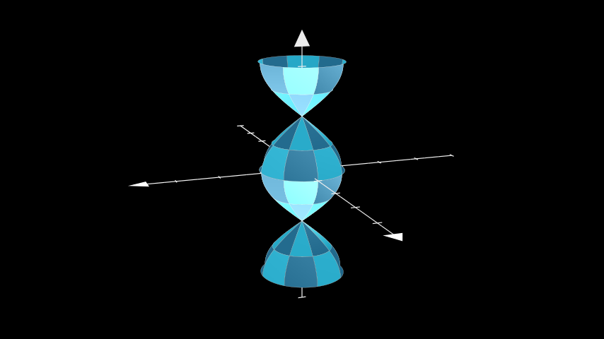
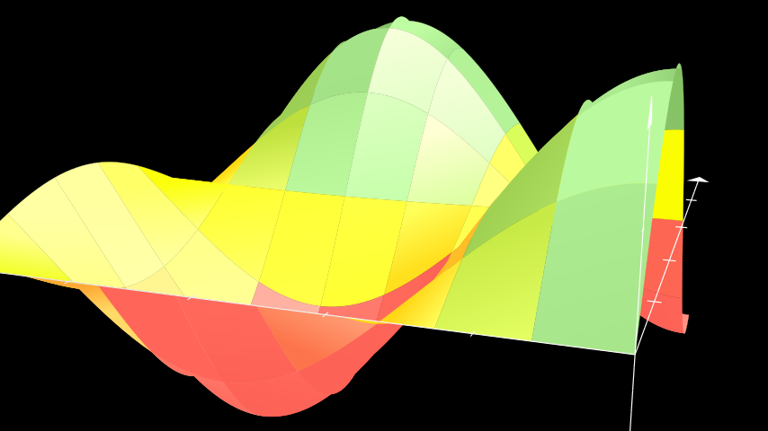

# 表面

合格名称：`manim.mobject.three\_d.three\_dimensions.Surface`


```py
class Surface(func, u_range=[0, 1], v_range=[0, 1], resolution=32, surface_piece_config={}, fill_color='#29ABCA', fill_opacity=1.0, checkerboard_colors=['#29ABCA', '#236B8E'], stroke_color='#BBBBBB', stroke_width=0.5, should_make_jagged=False, pre_function_handle_to_anchor_scale_factor=1e-05, **kwargs)
```

Bases: `VGroup`

使用棋盘图案创建参数化曲面。

参数

- **func** ( _Callable_ _\[_ _\[_ _float_ _,_ _float_ _\]_ _,_ _np.ndarray_ _\]_ ) – 定义 .ndarray 的函数[`Surface`]()。
- **u_range** ( _Sequence_ _\[_ _float_ _\]_ ) – 变量的范围`u`：。`(u_min, u_max)`
- **v_range** ( _Sequence_ _\[_ _float_ _\]_ ) – 变量的范围`v`：。`(v_min, v_max)`
- **resolution**( _Sequence_ _\[_ _int_ _\]_ ) – 所采集的样本数[`Surface`]()。元组可用于分别定义`u`和的不同分辨率`v`。
- **fill_color** ( _Color_ ) – 的颜色[`Surface`]()。如果已设置则忽略`checkerboard_colors` 。
- **fill_opacity** ( _float_ ) – 的不透明度[`Surface`]()，从 0 表示完全透明到 1 表示完全不透明。默认为 1。
- **checkerboard_colors** ( _Sequence_ _\[_ _Color_ _\]_ ) – 各个面交替颜色。覆盖`fill_color`.
- **stroke_color** ( _Color_ ) – 的每个面周围的描边颜色[`Surface`]()。
- **stroke_width** ( _float_ ) – 围绕 的每个面的描边宽度[`Surface`]()。默认为 0.5。
- **should_make_jagged** ( _bool_ ) – 将贝塞尔曲线的锚点模式从平滑更改为锯齿状。默认为`False`.
- **surface_piece_config** (_dict_) –
- **pre_function_handle_to_anchor_scale_factor** ( _float_ ) –


例子

示例：ParaSurface 




```py
from manim import *

class ParaSurface(ThreeDScene):
    def func(self, u, v):
        return np.array([np.cos(u) * np.cos(v), np.cos(u) * np.sin(v), u])

    def construct(self):
        axes = ThreeDAxes(x_range=[-4,4], x_length=8)
        surface = Surface(
            lambda u, v: axes.c2p(*self.func(u, v)),
            u_range=[-PI, PI],
            v_range=[0, TAU],
            resolution=8,
        )
        self.set_camera_orientation(theta=70 * DEGREES, phi=75 * DEGREES)
        self.add(axes, surface)
```

方法

|||
|-|-|
[`func`]()|定义所绘制的 z 值[`Surface`]()。
[`set_fill_by_checkerboard`]()|[`Surface`]()以交替模式设置每个面的 fill_color 。
[`set_fill_by_value`]()|将参数化曲面的每个 mobject 的颜色设置为相对于其轴值的颜色。


属性

|||
|-|-|
`animate`|用于对 的任何方法的应用程序进行动画处理`self`。
`animation_overrides`|
`color`|
`depth`|对象的深度。
`fill_color`|如果有多种颜色（对于渐变），则返回第一个颜色
`height`|mobject 的高度。
`n_points_per_curve`|
`sheen_factor`|
`stroke_color`|
`width`|mobject 的宽度。


`func(u, v)`

定义所绘制的 z 值[`Surface`]()。

返回

定义 的 z 值[`Surface`]()。

返回类型

`numpy.array`

参数

- **u**（_float_）–
- **v**（_float_）–


`set_fill_by_checkerboard(*colors, opacity=None)`

[`Surface`]()以交替模式设置每个面的 fill_color 。

参数

- **colors**( _Sequence_ _\[_ _Color_ _\]_ ) – 交替图案的颜色列表。
- **opacity** ( _float_ ) – 的 fill_opacity [`Surface`]()，从 0 表示完全透明到 1 表示完全不透明。

返回

具有交替图案的参数化曲面。

返回类型

[`Surface`]()


`set_fill_by_value(axes, colorscale=None, axis=2, **kwargs)`

将参数化曲面的每个 mobject 的颜色设置为相对于其轴值的颜色。

参数

- **axis** ( [_Mobject_]() ) – 参数化曲面的轴，用于将轴值映射到颜色。
- **colorscale** ( [_Union_]() _\[_ _Iterable_ _\[_ _Color_ _\]_ _,_ _Color_ _\]_ _|_ _None_ ) – 颜色列表，从较低的轴值到较高的轴值排序。如果传递包含与数字配对的颜色的元组列表，则这些数字将用作主元。
- **axis** ( _int_ ) – 选择用于颜色映射的轴。（0 = x、1 = y、2 = z）

返回

具有按值应用的渐变的参数化曲面。用于链接。

返回类型

[`Surface`]()


例子

示例：按值填充示例




```py
from manim import *

class FillByValueExample(ThreeDScene):
    def construct(self):
        resolution_fa = 8
        self.set_camera_orientation(phi=75 * DEGREES, theta=-160 * DEGREES)
        axes = ThreeDAxes(x_range=(0, 5, 1), y_range=(0, 5, 1), z_range=(-1, 1, 0.5))
        def param_surface(u, v):
            x = u
            y = v
            z = np.sin(x) * np.cos(y)
            return z
        surface_plane = Surface(
            lambda u, v: axes.c2p(u, v, param_surface(u, v)),
            resolution=(resolution_fa, resolution_fa),
            v_range=[0, 5],
            u_range=[0, 5],
            )
        surface_plane.set_style(fill_opacity=1)
        surface_plane.set_fill_by_value(axes=axes, colorscale=[(RED, -0.5), (YELLOW, 0), (GREEN, 0.5)], axis=2)
        self.add(axes, surface_plane)
```
