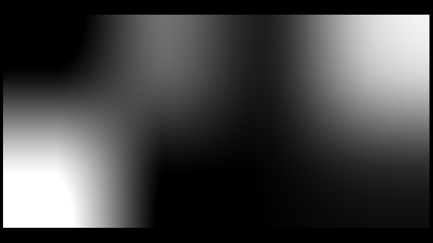
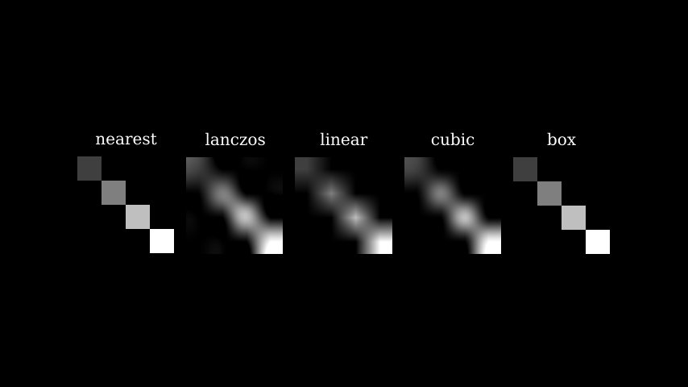

# 图像对象

合格名称：`manim.mobject.types.image\_mobject.ImageMobject`


```py
class ImageMobject(filename_or_array, scale_to_resolution=1080, invert=False, image_mode='RGBA', **kwargs)
```

Bases: `AbstractImageMobject`

显示 numpy 数组或文件中的图像。

参数

**scale_to_resolution** ( _int_ ) – 在此分辨率下，图像将逐像素放置在屏幕上，因此它看起来最清晰、最好。这是 ImageMobject 的自定义参数，因此使用例如或标志来渲染场景以加快渲染速度不会影响图像在屏幕上的位置。` --quality low``--quality medium `


例子

示例：ImageFromArray 




```py
from manim import *

class ImageFromArray(Scene):
    def construct(self):
        image = ImageMobject(np.uint8([[0, 100, 30, 200],
                                       [255, 0, 5, 33]]))
        image.height = 7
        self.add(image)
```

更改插值样式：

示例：ImageInterpolationEx 



```py
from manim import *

class ImageInterpolationEx(Scene):
    def construct(self):
        img = ImageMobject(np.uint8([[63, 0, 0, 0],
                                        [0, 127, 0, 0],
                                        [0, 0, 191, 0],
                                        [0, 0, 0, 255]
                                        ]))

        img.height = 2
        img1 = img.copy()
        img2 = img.copy()
        img3 = img.copy()
        img4 = img.copy()
        img5 = img.copy()

        img1.set_resampling_algorithm(RESAMPLING_ALGORITHMS["nearest"])
        img2.set_resampling_algorithm(RESAMPLING_ALGORITHMS["lanczos"])
        img3.set_resampling_algorithm(RESAMPLING_ALGORITHMS["linear"])
        img4.set_resampling_algorithm(RESAMPLING_ALGORITHMS["cubic"])
        img5.set_resampling_algorithm(RESAMPLING_ALGORITHMS["box"])
        img1.add(Text("nearest").scale(0.5).next_to(img1,UP))
        img2.add(Text("lanczos").scale(0.5).next_to(img2,UP))
        img3.add(Text("linear").scale(0.5).next_to(img3,UP))
        img4.add(Text("cubic").scale(0.5).next_to(img4,UP))
        img5.add(Text("box").scale(0.5).next_to(img5,UP))

        x= Group(img1,img2,img3,img4,img5)
        x.arrange()
        self.add(x)
```


方法

|||
|-|-|
[`fade`]()|使用 1 - Alpha 关系设置图像的不透明度。
[`get_pixel_array`]()|一个简单的 getter 方法。
`get_style`|
[`interpolate_color`]()|将一个 ImageMobject 中的像素颜色值数组插值到目标 ImageMobject 中的相同大小的数组中。
[`set_color`]()|条件是接受一个参数 (x, y, z) 的函数。
[`set_opacity`]()|设置图像的不透明度。


属性

|||
|-|-|
`animate`|用于对 的任何方法的应用程序进行动画处理`self`。
`animation_overrides`|
`depth`|对象的深度。
`height`|mobject 的高度。
`width`|mobject 的宽度。


`_original__init__(filename_or_array, scale_to_resolution=1080, invert=False, image_mode='RGBA', **kwargs)`

初始化自身。请参阅 help(type(self)) 以获取准确的签名。

参数：
**scale_to_resolution** (int) –


`fade(darkness=0.5, family=True)`

使用 1 - Alpha 关系设置图像的不透明度。

参数

- **dark** ( _float_ ) – 对象的 alpha 值，1 表示透明，0 表示不透明。
- **family** ( _bool_ ) – ImageMobject 的子对象是否应该受到影响。


`get_pixel_array()`

一个简单的 getter 方法。


`interpolate_color(mobject1, mobject2, alpha)`

将一个 ImageMobject 中的像素颜色值数组插值到目标 ImageMobject 中的相同大小的数组中。

参数

- **mobject1** ( [_ImageMobject_]() ) – 要转换的 ImageMobject。
- **mobject2** ( [_ImageMobject_]() ) – 要转换成的 ImageMobject。
- **alpha** ( _float_ ) – 用于跟踪 lerp 关系。与不透明度无关。


`set_color(color, alpha=None, family=True)`

条件是接受一个参数 (x, y, z) 的函数。这里它只是递归到子对象，但是在子类中，这应该基于颜色的内部工作原理进一步实现


`set_opacity(alpha)`

设置图像的不透明度。

参数

**alpha** ( _float_ ) – 对象的 alpha 值，1 表示不透明，0 表示透明。
