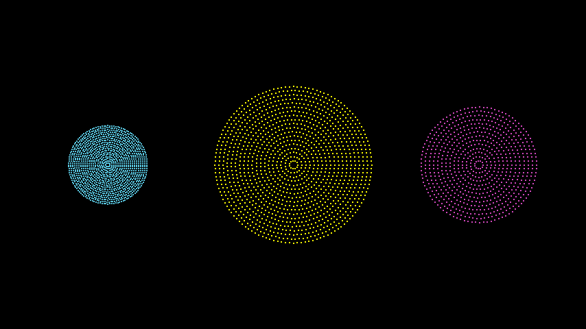

# P 组

合格名称：`manim.mobject.types.point\_cloud\_mobject.PGroup`


```py
class PGroup(*pmobs, **kwargs)
```

Bases: `PMobject`

例子

示例：Pgroup 示例



```py
from manim import *

class PgroupExample(Scene):
    def construct(self):

        p1 = PointCloudDot(radius=1, density=20, color=BLUE)
        p1.move_to(4.5 * LEFT)
        p2 = PointCloudDot()
        p3 = PointCloudDot(radius=1.5, stroke_width=2.5, color=PINK)
        p3.move_to(4.5 * RIGHT)
        pList = PGroup(p1, p2, p3)

        self.add(pList)
```


方法


`fade_to`


属性

|||
|-|-|
`animate`|用于对 的任何方法的应用程序进行动画处理`self`。
`animation_overrides`|
`depth`|对象的深度。
`height`|mobject 的高度。
`width`|mobject 的宽度。
