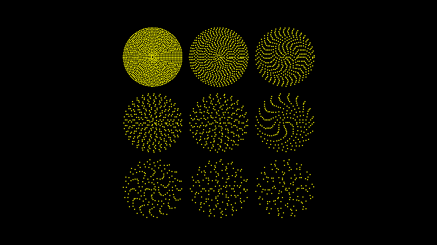

# PMobject

合格名称：`manim.mobject.types.point\_cloud\_mobject.PMobject`


```py
class PMobject(stroke_width=4, **kwargs)
```

Bases: `Mobject`

由点云组成的圆盘

例子

示例：PMobjectExample




```py
from manim import *

class PMobjectExample(Scene):
    def construct(self):

        pG = PGroup()  # This is just a collection of PMobject's

        # As the scale factor increases, the number of points
        # removed increases.
        for sf in range(1, 9 + 1):
            p = PointCloudDot(density=20, radius=1).thin_out(sf)
            # PointCloudDot is a type of PMobject
            # and can therefore be added to a PGroup
            pG.add(p)

        # This organizes all the shapes in a grid.
        pG.arrange_in_grid()

        self.add(pG)
```


方法

|||
|-|-|
[`add_points`]()|加分。
`align_points_with_larger`|
`fade_to`|
`filter_out`|
`get_all_rgbas`|
`get_array_attrs`|
[`get_color`]()|返回的颜色[`Mobject`]()
[`get_mobject_type_class`]()|返回此 mobject 类型的基类。
[`get_point_mobject`]()|最简单的[`Mobject`]()就是转化为自我或转化为自我。
`get_stroke_width`|
`ingest_submobjects`|
`interpolate_color`|
`match_colors`|
`point_from_proportion`|
`pointwise_become_partial`|
[`reset_points`]()|设置`points`为空数组。
[`set_color`]()|条件是接受一个参数 (x, y, z) 的函数。
`set_color_by_gradient`|
`set_colors_by_radial_gradient`|
`set_stroke_width`|
[`sort_points`]()|函数是从 R^3 到 R 的任何映射
[`thin_out`]()|删除除每个第 n 个点之外的所有点（n = 因子）


属性

|||
|-|-|
`animate`|用于对 的任何方法的应用程序进行动画处理`self`。
`animation_overrides`|
`depth`|对象的深度。
`height`|mobject 的高度。
`width`|mobject 的宽度。


`add_points(points, rgbas=None, color=None, alpha=1)`

加分。

点必须是 Nx3 numpy 数组。如果 Rgbas 不是 None，则它必须是 Nx4 numpy 数组。


`get_color()`

返回的颜色[`Mobject`]()


`static get_mobject_type_class()`

返回此 mobject 类型的基类。


`get_point_mobject(center=None)`

最简单的[`Mobject`]()就是转化为自我或转化为自我。应由适当类型的点


`reset_points()`

设置`points`为空数组。


`set_color(color='#FFFF00', family=True)`

条件是接受一个参数 (x, y, z) 的函数。这里它只是递归到子对象，但是在子类中，这应该基于颜色的内部工作原理进一步实现


`sort_points(function=<function PMobject.<lambda>>)`

函数是从 R^3 到 R 的任何映射


`thin_out(factor=5)`

删除除每个第 n 个点之外的所有点（n = 因子）
