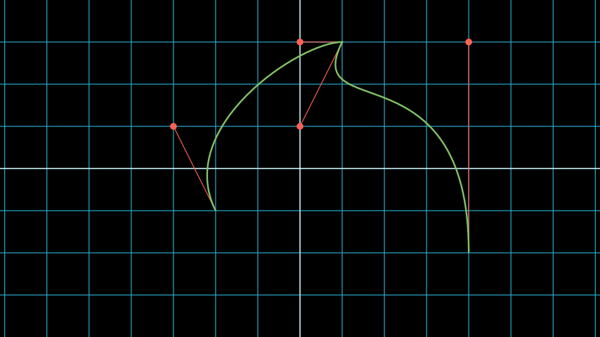

# 深入了解 Manim 的内部结构

**作者：** [本杰明·哈克尔](https://benjamin-hackl.at)

免责声明

本指南反映了库截至版本的状态`v0.16.0` ，并主要处理 Cairo 渲染器。最新版本的 Manim 中情况可能有所不同；如果存在重大偏差，我们将在下面添加注释。

## 简介

Manim 可以是一个很棒的库，如果它按照您想要的方式运行，和/或按照您期望的方式运行。不幸的是，情况并非总是如此（如果您自己已经玩过一些动画，您可能知道）。要了解哪里*出了*问题，挖掘库的源代码有时是唯一的选择 \- 但为了做到这一点，您需要知道从哪里开始挖掘。

本文旨在作为渲染过程中的某种生命线。我们的目标是提供适当的细节来描述当 Manim 读取场景代码并生成相应的动画时会发生什么。在本文中，我们将重点关注以下玩具示例：

```py
from manim import *

class ToyExample(Scene):
    def construct(self):
        orange_square = Square(color=ORANGE, fill_opacity=0.5)
        blue_circle = Circle(color=BLUE, fill_opacity=0.5)
        self.add(orange_square)
        self.play(ReplacementTransform(orange_square, blue_circle, run_time=3))
        small_dot = Dot()
        small_dot.add_updater(lambda mob: mob.next_to(blue_circle, DOWN))
        self.play(Create(small_dot))
        self.play(blue_circle.animate.shift(RIGHT))
        self.wait()
        self.play(FadeOut(blue_circle, small_dot))
```

在我们详细讨论甚至查看该场景的渲染输出之前，让我们首先口头描述该*动画*中发生的情况。在该方法的前三行中`construct`，初始化了 a[`Square`](../reference/manim.mobject.geometry.polygram.Square.html#manim.mobject.geometry.polygram.Square "manim.mobject.geometry.polygram.Square")和 a [`Circle`](../reference/manim.mobject.geometry.arc.Circle.html#manim.mobject.geometry.arc.Circle "manim.mobject.geometry.arc.Circle") ，然后将正方形添加到场景中。因此，渲染输出的第一帧应显示橙色方块。

然后实际的动画发生：正方形首先变成圆形，然后[`Dot`](../reference/manim.mobject.geometry.arc.Dot.html#manim.mobject.geometry.arc.Dot "manim.mobject.geometry.arc.Dot")创建一个（您猜这个点第一次添加到场景时位于哪里？回答这个问题已经需要有关渲染过程的详细知识。）。该点附有一个更新器，当圆圈向右移动时，该点也随之移动。最后，所有 mobject 都淡出。

实际渲染代码会产生以下视频：

[](https://docs.manim.community/en/stable/guides/ToyExample-1.mp4)

<iframe src="https://docs.manim.community/en/stable/guides/ToyExample-1.mp4"></iframe>

<video controls><source src="https://docs.manim.community/en/stable/guides/ToyExample-1.mp4" type="video/mp4"></video>

<iframe>
src="https://docs.manim.community/en/stable/guides/ToyExample-1.mp4" 
scrolling="no" 
border="0" 
frameborder="no" 
framespacing="0" 
allowfullscreen="true" 
height=600 
width=800> 
</iframe>

对于这个例子，输出（幸运的是）与我们的预期一致。

## 概述

由于本文包含大量信息，因此这里仅简要概述，以非常高的水平讨论以下章节的内容。

- [预备知识](#preliminaries)：在本章中，我们将阐明准备场景渲染所需的所有步骤；直到 `construct`运行用户重写的方法为止。这包括关于使用 Manim 的 CLI 与其他渲染方式（例如，通过 Jupyter 笔记本，或在 Python 脚本中通过[`Scene.render()`](../reference/manim.scene.scene.Scene.html#manim.scene.scene.Scene.render "manim.场景.场景.场景.渲染")自己调用该方法）的简要讨论。
- [Mobject 初始化](#mobject-initialization)：在第二章中，我们将深入研究 Mobject 的创建和处理，这是应该在场景中显示的基本元素。我们讨论[`Mobject`](../reference/manim.mobject.mobject.Mobject.html#manim.mobject.mobject.Mobject "manim.mobject.mobject.Mobject")基类，本质上是如何存在三种不同类型的 Mobject，然后讨论其中最重要的，矢量化 Mobject。特别是，我们描述了内部点数据结构，该结构控制负责将矢量化 Mobject 绘制到屏幕的机制如何设置相应的贝塞尔曲线。我们通过浏览来结束本章[`Scene.add()`](../reference/manim.scene.scene.Scene.html#manim.scene.scene.Scene.add "manim.场景.场景.场景.add")，它是控制哪些对象应该被渲染的簿记机制。
- [动画和渲染循环](#animations-and-the-render-loop)：最后，在最后一章中，我们介绍了[`Animation`](../reference/manim.animation.animation.Animation.html#manim.animation.animation.Animation "manim.animation.animation.Animation")对象的实例化（蓝图保存了渲染循环运行时应如何修改 Mobject 的信息），然后调查了臭名昭著的调用[`Scene.play()`](../reference/manim.scene.scene.Scene.html#manim.scene.scene.Scene.play "manim.场景.场景.场景.play")。我们会看到一个调用中有三个相关的部分[`Scene.play()`](../reference/manim.scene.scene.Scene.html#manim.scene.scene.Scene.play "manim.场景.场景.场景.play")；处理和准备传递的动画和关键字参数的部分，然后是实际的“渲染循环”，其中库逐步遍历时间线并逐帧渲染。最后一部分进行一些后处理以保存短视频片段（“部分电影文件”）并为下一次调用进行清理[`Scene.play()`](../reference/manim.scene.scene.Scene.html#manim.scene.scene.Scene.play "manim.场景.场景.场景.play")。最后，在所有 [`Scene.construct()`](../reference/manim.scene.scene.Scene.html#manim.scene.scene.Scene.construct "manim.scene.scene.Scene.construct")运行之后，库将部分电影文件合并为一个视频。

接下来，让我们进入*媒体资源*。

## 预赛

### 导入库

与您具体如何告诉系统渲染场景无关，即是否运行，或者是否通过类似代码片段直接从 Python 脚本渲染场景`manim -qm -p file_name.py ToyExample`

```py
with tempconfig({"quality": "medium_quality", "preview": True}):
    scene = ToyExample()
    scene.render()
```

或者无论您是在 Jupyter Notebook 中渲染代码，您仍然会告诉 Python 解释器导入该库。用于执行此操作的常用模式是

```py
from manim import *
```

它（虽然总体上是一个有争议的策略）导入了库附带的许多类和函数，并使它们在您的全局名称空间中可用。我明确避免声明它导入库的**所有**类和函数，因为它没有这样做：Manim 利用了[Python 教程第 6.4.1 节](https://docs.python.org/3/tutorial/modules.html#importing-from-a-package)中描述的实践，以及应向用户公开的所有模块成员运行时-import 会在模块的变量`*`中显式声明。`__all__`

Manim 也在内部使用此策略：看一下调用导入时运行的文件`__init__.py`（请参阅 [此处](https://github.com/ManimCommunity/manim/blob/main/manim/__init__.py)），您会注意到该模块中的大部分代码都与从各种不同子模块导入成员有关，再次使用`*`-进口。

> 暗示

> 如果您要向 Manim 贡献一个新的子模块，则 `__init__.py`必须在 main 中列出该子模块，以便在导入库后用户可以访问其成员。

然而，在该文件中，文件开头有一个特定的导入，即：

```py
from ._config import *
```

这会初始化 Manim 的全局配置系统，该系统在整个库的各个地方使用。库运行此行后，将设置当前配置选项。其中的代码负责读取`.cfg` 文件中的选项（所有用户至少拥有库附带的全局选项）以及正确处理命令行参数（如果您使用 CLI 进行渲染）。

[您可以在相应的主题指南](configuration.html)中阅读有关配置系统的更多信息 ，如果您有兴趣了解有关配置系统的内部结构及其初始化方式的更多信息，请按照从[配置模块的 init 文件](https://github.com/ManimCommunity/manim/blob/main/manim/_config/__init__.py)开始的代码流程进行操作。

现在库已导入，我们可以将注意力转向下一步：读取场景代码（这并不是特别令人兴奋，Python 只是根据`ToyExample`我们的代码创建一个新类；Manim 实际上不参与该步骤，因为`ToyExample`继承自)的异常`Scene`。

然而，随着`ToyExample`类的创建和准备就绪，有一个新的优秀问题需要回答：我们`construct`方法中的代码实际上是如何执行的？

### 场景实例化和渲染

这个问题的答案取决于您运行代码的准确程度。为了让事情更清楚一些，让我们首先考虑您创建的文件`toy_example.py`如下所示的情况：

```py
from manim import *

class ToyExample(Scene):
    def construct(self):
        orange_square = Square(color=ORANGE, fill_opacity=0.5)
        blue_circle = Circle(color=BLUE, fill_opacity=0.5)
        self.add(orange_square)
        self.play(ReplacementTransform(orange_square, blue_circle, run_time=3))
        small_dot = Dot()
        small_dot.add_updater(lambda mob: mob.next_to(blue_circle, DOWN))
        self.play(Create(small_dot))
        self.play(blue_circle.animate.shift(RIGHT))
        self.wait()
        self.play(FadeOut(blue_circle, small_dot))

with tempconfig({"quality": "medium_quality", "preview": True}):
    scene = ToyExample()
    scene.render()
```

有了这样的文件，只需通过 运行此 Python 脚本即可渲染所需的场景。然后，如上所述，导入库并且 Python 读取并定义了该类（但是，请仔细阅读：_尚未创建该类的实例_）。` python toy_example.py``ToyExample `

此时，解释器即将进入`tempconfig`上下文管理器。即使您以前没有见过 Manim `tempconfig`，它的名称也已经暗示了它的作用：它创建配置当前状态的副本，将更改应用于传递的字典中的键值对，并在将上下文保留为原始状态时配置的版本已恢复。TL;DR：它提供了一种临时设置配置选项的奇特方法。

在上下文管理器内部，发生了两件事：`ToyExample`实例化实际的场景对象，并`render`调用该方法。使用 Manim 的每种方式最终都会执行以下操作：库始终实例化场景对象，然后调用其`render`方法。为了说明情况确实如此，让我们简单看一下渲染场景的两种最常见的方式：

**命令行界面。**使用 CLI 并 在终端中运行命令时，实际入口点是 Manim 的文件（位于 [此处）](https://github.com/ManimCommunity/manim/blob/main/manim/__main__.py)。Manim 使用[Click](https://click.palletsprojects.com/en/8.0.x/)来实现命令行界面，相应的代码位于 Manim 的 模块中（[https://github.com /ManimCommunity/manim/tree/main/manim/cli](https://github.com/ManimCommunity/manim/tree/main/manim/cli) ). 创建场景类并调用其 render 方法的相应代码位于[此处](https://github.com/ManimCommunity/manim/blob/ac1ee9a683ce8b92233407351c681f7d71a4f2db/manim/cli/render/commands.py#L139-L141)。` manim -qm -p toy_example.py ToyExample``__main__.py `[](https://github.com/ManimCommunity/manim/blob/main/manim/__main__.py)[](https://click.palletsprojects.com/en/8.0.x/)`cli`[](https://github.com/ManimCommunity/manim/tree/main/manim/cli)[](https://github.com/ManimCommunity/manim/blob/ac1ee9a683ce8b92233407351c681f7d71a4f2db/manim/cli/render/commands.py#L139-L141)

**Jupyter 笔记本。**在 Jupyter Notebook 中，与库的通信由 magic 命令处理`%%manim`，该命令在模块中实现 `manim.utils.ipython_magic`。可以 使用 magic 命令，创建场景类并调用其渲染方法的代码位于 [此处](https://github.com/ManimCommunity/manim/blob/ac1ee9a683ce8b92233407351c681f7d71a4f2db/manim/utils/ipython_magic.py#L137-L138)。[`some documentation`](../reference/manim.utils.ipython_magic.ManimMagic.html#manim.utils.ipython_magic.ManimMagic.manim "manim.utils.ipython_magic.ManimMagic.manim")[](https://github.com/ManimCommunity/manim/blob/ac1ee9a683ce8b92233407351c681f7d71a4f2db/manim/utils/ipython_magic.py#L137-L138)

现在我们知道无论哪种方式[`Scene`](../reference/manim.scene.scene.Scene.html#manim.scene.scene.Scene "手动场景.场景.场景")都会创建一个对象，让我们研究一下 Manim 在发生这种情况时会做什么。当实例化我们的场景对象时

```py
scene = ToyExample()
```

`Scene.__init__`鉴于我们没有实现我们自己的初始化方法，该方法被调用。检查相应的代码（请参见 [此处](https://github.com/ManimCommunity/manim/blob/main/manim/scene/scene.py)）表明，`Scene.__init__`首先设置场景对象的几个属性，这些属性不依赖于 中设置的任何配置选项`config`。然后场景检查 的值 `config.renderer`，并根据其值实例化 a`CairoRenderer`或一个 `OpenGLRenderer`对象并将其分配给其`renderer`属性。

然后场景要求其渲染器通过调用来初始化场景

```py
self.renderer.init_scene(self)
```

检查默认的 Cairo 渲染器和 OpenGL 渲染器表明，该`init_scene` 方法有效地使渲染器实例化一个[`SceneFileWriter`](../reference/manim.scene.scene_file_writer.SceneFileWriter.html#manim.scene.scene_file_writer.SceneFileWriter "manim.scene.scene_file_writer.SceneFileWriter")对象，该对象基本上是 Manim 的接口`ffmpeg`并实际写入电影文件。[Cairo 渲染器（请参阅此处的](https://github.com/ManimCommunity/manim/blob/main/manim/renderer/cairo_renderer.py)实现）不需要任何进一步的初始化。OpenGL 渲染器做了一些额外的设置来启用实时渲染预览窗口，我们在此不再详细介绍。

> 警告

> 目前，场景与其渲染器之间有很多相互作用。这是 Manim 当前架构中的一个缺陷，我们正在努力减少这种相互依赖性，以实现更简单的代码流。

渲染器实例化并初始化其文件写入器后，场景会填充更多初始属性（值得注意的是：`mobjects`跟踪已添加到场景中的 mobject 的属性）。然后它就完成了实例化并准备好渲染。

本文的其余部分与我们的玩具示例脚本中的最后一行有关：

```py
scene.render()
```

这就是真正的魔法发生的地方。

检查[render 方法的实现](https://github.com/ManimCommunity/manim/blob/df1a60421ea1119cbbbd143ef288d294851baaac/manim/scene/scene.py#L211) 表明，有几个钩子可用于对场景进行预处理或后处理。毫不奇怪，描述了 场景的[`Scene.render()`](../reference/manim.scene.scene.Scene.html#manim.scene.scene.Scene.render "manim.场景.场景.场景.渲染")完整*渲染周期。*在此生命周期中，存在三个自定义方法，其基本实现为空，可以根据您的目的进行覆盖。按照调用顺序，这些可自定义方法是：

- [`Scene.setup()`](../reference/manim.scene.scene.Scene.html#manim.scene.scene.Scene.setup "manim.scene.scene.Scene.setup")，用于准备和*设置* 动画场景（例如，添加初始 mobject、为场景类分配自定义属性等），
- [`Scene.construct()`](../reference/manim.scene.scene.Scene.html#manim.scene.scene.Scene.construct "manim.scene.scene.Scene.construct")，这是屏幕播放的*脚本*，包含动画的编程描述，以及
- [`Scene.tear_down()`](../reference/manim.scene.scene.Scene.html#manim.scene.scene.Scene.tear_down "manim.scene.scene.Scene.tear_down")，它适用于您可能希望在渲染最后一帧后在场景上运行的任何操作（例如，这可以运行一些代码，根据场景中对象的状态生成视频的自定义缩略图– 这个钩子对于在其他 Python 脚本中使用 Manim 的情况更相关）。

这三个方法运行后，动画已经完全渲染完毕，Manim 调用`CairoRenderer.scene_finished()`优雅地完成渲染过程。这会检查是否已播放任何动画 \- 如果是，它会告诉[`SceneFileWriter`](../reference/manim.scene.scene_file_writer.SceneFileWriter.html#manim.scene.scene_file_writer.SceneFileWriter "manim.scene.scene_file_writer.SceneFileWriter")关闭管道`ffmpeg`。如果没有，Manim 假定应该输出静态图像，然后通过调用渲染循环（见下文）一次使用相同的策略进行渲染。

**回到我们的玩具示例，**[`Scene.render()`](../reference/manim.scene.scene.Scene.html#manim.scene.scene.Scene.render "manim.场景.场景.场景.渲染")对第一个触发器的调用[`Scene.setup()`](../reference/manim.scene.scene.Scene.html#manim.scene.scene.Scene.setup "manim.scene.scene.Scene.setup")（仅包含`pass`），然后调用[`Scene.construct()`](../reference/manim.scene.scene.Scene.html#manim.scene.scene.Scene.construct "manim.scene.scene.Scene.construct")。此时，我们的*动画脚本* 已运行，从 的初始化开始`orange_square`。

## 对象初始化

简而言之，Mobject 是代表 我们想要在场景中显示的所有*内容的 Python 对象。*在我们跟随调试器深入了解 Mobject 初始化代码之前，讨论 Manim 的不同类型的 Mobject 及其基本数据结构是有意义的。

### Mobject 到底是什么？

[`Mobject`](../reference/manim.mobject.mobject.Mobject.html#manim.mobject.mobject.Mobject "manim.mobject.mobject.Mobject")代表*数学对象*或*Manim 对象* （取决于你问的是谁 😄）。Python 类[`Mobject`](../reference/manim.mobject.mobject.Mobject.html#manim.mobject.mobject.Mobject "manim.mobject.mobject.Mobject")是应在屏幕上显示的所有对象的基类。查看 的[初始化方法](https://github.com/ManimCommunity/manim/blob/5d72d9cfa2e3dd21c844b1da807576f5a7194fda/manim/mobject/mobject.py#L94) ，[`Mobject`](../reference/manim.mobject.mobject.Mobject.html#manim.mobject.mobject.Mobject "manim.mobject.mobject.Mobject")你会发现里面并没有发生太多事情：

- 分配了一些初始属性值，例如`name`（这使得渲染日志提及 mobject 的名称而不是其类型）、 `submobjects`（最初是一个空列表）`color`、等等。
- 然后，调用两个与*点*`reset_points`相关的方法： 后面是`generate_points`,
- 最后，`init_colors`被调用。

深入挖掘，您会发现[`Mobject.reset_points()`](../reference/manim.mobject.mobject.Mobject.html#manim.mobject.mobject.Mobject.reset_points "manim.mobject.mobject.Mobject.reset_points")只需将 mobject 的属性设置`points`为空的 NumPy 向量，而其他两个方法[`Mobject.generate_points()`](../reference/manim.mobject.mobject.Mobject.html#manim.mobject.mobject.Mobject.generate_points "manim.mobject.mobject.Mobject.generate_points")和 [`Mobject.init_colors()`](../reference/manim.mobject.mobject.Mobject.html#manim.mobject.mobject.Mobject.init_colors "manim.mobject.mobject.Mobject.init_colors")只是实现为`pass`.

这是有道理的：[`Mobject`](../reference/manim.mobject.mobject.Mobject.html#manim.mobject.mobject.Mobject "manim.mobject.mobject.Mobject")不应该用作屏幕上显示的*实际对象；*事实上，相机（我们稍后将更详细地讨论；对于 Cairo 渲染器来说，该类负责当前场景的“拍照”）不会以任何方式处理“纯粹”，[`Mobjects`](../reference/manim.mobject.mobject.Mobject.html#manim.mobject.mobject.Mobject "manim.mobject.mobject.Mobject") 它们*不能*甚至出现在渲染的输出中。

这就是不同类型的 mobject 发挥作用的地方。粗略地说，Cairo 渲染器设置知道可以渲染的三种不同类型的 mobject：

- [`ImageMobject`](../reference/manim.mobject.types.image_mobject.ImageMobject.html#manim.mobject.types.image_mobject.ImageMobject "manim.mobject.types.image_mobject.ImageMobject")，代表您可以在场景中显示的图像，
- [`PMobject`](../reference/manim.mobject.types.point_cloud_mobject.PMobject.html#manim.mobject.types.point_cloud_mobject.PMobject "manim.mobject.types.point_cloud_mobject.PMobject")，它们是非常特殊的 mobject，用于表示点云；我们不会在本指南中进一步讨论它们，
- [`VMobject`](../reference/manim.mobject.types.vectorized_mobject.VMobject.html#manim.mobject.types.vectorized_mobject.VMobject "manim.mobject.types.vectorized_mobject.VMobject")，它们是*矢量化的 mobject*，即由通过曲线连接的点组成的 mobject 。这些几乎无处不在，我们将在下一节中详细讨论它们。

### …什么是 VMobject？

正如刚才提到的，[`VMobjects`](../reference/manim.mobject.types.vectorized_mobject.VMobject.html#manim.mobject.types.vectorized_mobject.VMobject "manim.mobject.types.vectorized_mobject.VMobject")表示矢量化的对象。为了渲染 a [`VMobject`](../reference/manim.mobject.types.vectorized_mobject.VMobject.html#manim.mobject.types.vectorized_mobject.VMobject "manim.mobject.types.vectorized_mobject.VMobject")，相机会查看 `points`a 的属性[`VMobject`](../reference/manim.mobject.types.vectorized_mobject.VMobject.html#manim.mobject.types.vectorized_mobject.VMobject "manim.mobject.types.vectorized_mobject.VMobject")并将其分为每组四个点。然后，使用这些集合中的每一个来构建三次贝塞尔曲线，其中第一个和最后一个条目描述曲线的端点（“锚点”），第二个和第三个条目描述曲线之间的控制点（“手柄”）。

> 暗示

> 要了解有关贝塞尔曲线的更多信息，请查看[Pomax](https://twitter.com/TheRealPomax) 编写的优秀在线教科书[《贝塞尔曲线入门》 ——](https://pomax.github.io/bezierinfo/)[第 1 节中](https://pomax.github.io/bezierinfo/#introduction)有一个表示三次贝塞尔曲线的游乐场，红色和黄色点是“锚点”，绿色和蓝色点是“锚点”点是“句柄”。[](https://twitter.com/TheRealPomax)[](https://pomax.github.io/bezierinfo/#introduction)

与 相比[`Mobject`](../reference/manim.mobject.mobject.Mobject.html#manim.mobject.mobject.Mobject "manim.mobject.mobject.Mobject")，[`VMobject`](../reference/manim.mobject.types.vectorized_mobject.VMobject.html#manim.mobject.types.vectorized_mobject.VMobject "manim.mobject.types.vectorized_mobject.VMobject")可以显示在屏幕上（尽管从技术上讲，它仍然被视为基类）。为了说明如何处理点，请考虑以下[`VMobject`](../reference/manim.mobject.types.vectorized_mobject.VMobject.html#manim.mobject.types.vectorized_mobject.VMobject "manim.mobject.types.vectorized_mobject.VMobject")带有 8 个点的简短示例（因此由 8/4 = 2 条三次贝塞尔曲线组成）。结果[`VMobject`](../reference/manim.mobject.types.vectorized_mobject.VMobject.html#manim.mobject.types.vectorized_mobject.VMobject "manim.mobject.types.vectorized_mobject.VMobject")以绿色绘制。手柄被绘制为红点，并有一条线连接到最近的锚点。

示例：VMobjectDemo 



```py
from manim import *

class VMobjectDemo(Scene):
    def construct(self):
        plane = NumberPlane()
        my_vmobject = VMobject(color=GREEN)
        my_vmobject.points = [
            np.array([-2, -1, 0]),  # start of first curve
            np.array([-3, 1, 0]),
            np.array([0, 3, 0]),
            np.array([1, 3, 0]),  # end of first curve
            np.array([1, 3, 0]),  # start of second curve
            np.array([0, 1, 0]),
            np.array([4, 3, 0]),
            np.array([4, -2, 0]),  # end of second curve
        ]
        handles = [
            Dot(point, color=RED) for point in
            [[-3, 1, 0], [0, 3, 0], [0, 1, 0], [4, 3, 0]]
        ]
        handle_lines = [
            Line(
                my_vmobject.points[ind],
                my_vmobject.points[ind+1],
                color=RED,
                stroke_width=2
            ) for ind in range(0, len(my_vmobject.points), 2)
        ]
        self.add(plane, *handles, *handle_lines, my_vmobject)
```

> 警告

> [`VMobject`](../reference/manim.mobject.types.vectorized_mobject.VMobject.html#manim.mobject.types.vectorized_mobject.VMobject "manim.mobject.types.vectorized_mobject.VMobject")通常不鼓励手动设置点；有一些专门的方法可以为您处理这个问题 \- 但在实现您自己的自定义[`VMobject`](../reference/manim.mobject.types.vectorized_mobject.VMobject.html#manim.mobject.types.vectorized_mobject.VMobject "manim.mobject.types.vectorized_mobject.VMobject").

### 正方形和圆形：回到我们的玩具示例

通过对不同类型的 mobject 的基本了解，以及如何构建矢量化 mobject，我们现在可以回到我们的玩具示例和方法的执行 [`Scene.construct()`](../reference/manim.scene.scene.Scene.html#manim.scene.scene.Scene.construct "manim.scene.scene.Scene.construct")。在动画脚本的前两行中， 和`orange_square`被 `blue_circle`初始化。

通过运行创建橙色方块时

```py
Square(color=ORANGE, fill_opacity=0.5)
```

[`Square`](../reference/manim.mobject.geometry.polygram.Square.html#manim.mobject.geometry.polygram.Square "manim.mobject.geometry.polygram.Square")、 、的初始化方法`Square.__init__`被调用。[看一下实现](https://github.com/ManimCommunity/manim/blob/5d72d9cfa2e3dd21c844b1da807576f5a7194fda/manim/mobject/geometry/polygram.py#L607)，我们可以看到，`side_length`设置了正方形的属性，然后

```py
super().__init__(height=side_length, width=side_length, **kwargs)
```

叫做。这个`super`调用是 Python 调用父类初始化函数的方式。由于[`Square`](../reference/manim.mobject.geometry.polygram.Square.html#manim.mobject.geometry.polygram.Square "manim.mobject.geometry.polygram.Square") 继承自[`Rectangle`](../reference/manim.mobject.geometry.polygram.Rectangle.html#manim.mobject.geometry.polygram.Rectangle "manim.mobject.geometry.polygram.矩形")，下一个调用的方法是`Rectangle.__init__`。在那里，只有前三行与我们真正相关：

```py
super().__init__(UR, UL, DL, DR, color=color, **kwargs)
self.stretch_to_fit_width(width)
self.stretch_to_fit_height(height)
```

首先调用--[`Rectangle`](../reference/manim.mobject.geometry.polygram.Rectangle.html#manim.mobject.geometry.polygram.Rectangle "manim.mobject.geometry.polygram.矩形")父类的初始化函数 。[`Polygon`](../reference/manim.mobject.geometry.polygram.Polygon.html#manim.mobject.geometry.polygram.Polygon "manim.mobject.geometry.polygram.Polygon")传递的四个位置参数是多边形的四个角：`UR`位于右上（且等于）、 位于左上（且等于），依此类推。在我们深入了解调试器之前，让我们观察一下构造的多边形会发生什么：剩下的两条线拉伸多边形以适合指定的宽度和高度，从而创建具有所需测量值的矩形。` UP + RIGHT``UL``UP + LEFT `

的初始化函数[`Polygon`](../reference/manim.mobject.geometry.polygram.Polygon.html#manim.mobject.geometry.polygram.Polygon "manim.mobject.geometry.polygram.Polygon")特别简单，只调用其父类的初始化函数[`Polygram`](../reference/manim.mobject.geometry.polygram.Polygram.html#manim.mobject.geometry.polygram.Polygram "manim.mobject.geometry.polygram.Polygram")。到这里，我们几乎已经到达了链的末端：[`Polygram`](../reference/manim.mobject.geometry.polygram.Polygram.html#manim.mobject.geometry.polygram.Polygram "manim.mobject.geometry.polygram.Polygram")继承自[`VMobject`](../reference/manim.mobject.types.vectorized_mobject.VMobject.html#manim.mobject.types.vectorized_mobject.VMobject "manim.mobject.types.vectorized_mobject.VMobject")，其初始化函数主要设置一些属性的值（与 非常相似`Mobject.__init__`，但更具体于构成 mobject 的贝塞尔曲线）。

在调用 的初始化函数之后[`VMobject`](../reference/manim.mobject.types.vectorized_mobject.VMobject.html#manim.mobject.types.vectorized_mobject.VMobject "manim.mobject.types.vectorized_mobject.VMobject")， 的构造函数[`Polygram`](../reference/manim.mobject.geometry.polygram.Polygram.html#manim.mobject.geometry.polygram.Polygram "manim.mobject.geometry.polygram.Polygram")还做了一些有点奇怪的事情：它设置了点（您可能还记得上面的内容，实际上应该在 的相应`generate_points`方法中设置[`Polygram`](../reference/manim.mobject.geometry.polygram.Polygram.html#manim.mobject.geometry.polygram.Polygram "manim.mobject.geometry.polygram.Polygram")）。

> 警告

> 在某些情况下，mobjects 的实现并没有真正遵循 Manim 接口的所有方面。这是不幸的，提高一致性是我们积极致力于的事情。欢迎帮助！

无需过多讨论细节，通过, 来[`Polygram`](../reference/manim.mobject.geometry.polygram.Polygram.html#manim.mobject.geometry.polygram.Polygram "manim.mobject.geometry.polygram.Polygram")设置其 `points`属性，它负责适当地设置锚点和句柄的四元组。设置好点后，Python 继续处理调用堆栈，直到到达第一次调用的方法；的初始化方法。此后，正方形被初始化并分配给 变量。` VMobject.start_new_path()``VMobject.add_points_as_corners() `[`Square`](../reference/manim.mobject.geometry.polygram.Square.html#manim.mobject.geometry.polygram.Square "manim.mobject.geometry.polygram.Square")`orange_square`

的初始化`blue_circle`与 的初始化类似 `orange_square`，主要区别是 的继承链[`Circle`](../reference/manim.mobject.geometry.arc.Circle.html#manim.mobject.geometry.arc.Circle "manim.mobject.geometry.arc.Circle")不同。让我们简单跟踪一下调试器的跟踪：

的实现`Circle.__init__()`立即调用 的初始化方法[`Arc`](../reference/manim.mobject.geometry.arc.Arc.html#manim.mobject.geometry.arc.Arc "manim.mobject.geometry.arc.Arc")，因为 Manim 中的圆只是一条角度为 的圆弧 τ=2π。初始化弧时，会设置一些基本属性（如 `Arc.radius`、`Arc.arc_center`、`Arc.start_angle`和 `Arc.angle`），然后调用其父类 的初始化方法[`TipableVMobject`](../reference/manim.mobject.geometry.arc.TipableVMobject.html#manim.mobject.geometry.arc.TipableVMobject "manim.mobject.geometry.arc.TipableVMobject")（这是一个相当抽象的 mobject 基类，可以附加箭头） 。请注意，与 相比[`Polygram`](../reference/manim.mobject.geometry.polygram.Polygram.html#manim.mobject.geometry.polygram.Polygram "manim.mobject.geometry.polygram.Polygram")，此类不会**预先**生成圆的点。

之后，事情就不那么令人兴奋了：[`TipableVMobject`](../reference/manim.mobject.geometry.arc.TipableVMobject.html#manim.mobject.geometry.arc.TipableVMobject "manim.mobject.geometry.arc.TipableVMobject")再次设置一些与添加箭头提示相关的属性，然后传递到 的初始化方法[`VMobject`](../reference/manim.mobject.types.vectorized_mobject.VMobject.html#manim.mobject.types.vectorized_mobject.VMobject "manim.mobject.types.vectorized_mobject.VMobject")。从那里开始， [`Mobject`](../reference/manim.mobject.mobject.Mobject.html#manim.mobject.mobject.Mobject "manim.mobject.mobject.Mobject")它被初始化并被[`Mobject.generate_points()`](../reference/manim.mobject.mobject.Mobject.html#manim.mobject.mobject.Mobject.generate_points "manim.mobject.mobject.Mobject.generate_points") 调用，它实际上运行在 中实现的方法 [`Arc.generate_points()`](../reference/manim.mobject.geometry.arc.Arc.html#manim.mobject.geometry.arc.Arc.generate_points "manim.mobject.geometry.arc.Arc.generate_points")。

在 our`orange_square`和 the`blue_circle`都初始化之后，正方形实际上被添加到场景中。该[`Scene.add()`](../reference/manim.scene.scene.Scene.html#manim.scene.scene.Scene.add "manim.场景.场景.场景.add")方法实际上做了一些有趣的事情，因此值得在下一节中深入挖掘。

### 将 Mobject 添加到场景中

`construct`接下来运行的方法中的代码是

```py
self.add(orange_square)
```

从高层的角度来看，[`Scene.add()`](../reference/manim.scene.scene.Scene.html#manim.scene.scene.Scene.add "manim.场景.场景.场景.add")将 加入 `orange_square`到应该渲染的 mobject 列表中，该列表存储在`mobjects`场景的属性中。然而，它以非常谨慎的方式这样做，以避免出现将对象多次添加到场景中的情况。乍一看，这听起来像是一个简单的任务 \- 问题是这`Scene.mobjects` 不是一个“平面”的 mobject 列表，而是一个可能包含 mobject 本身的 mobject 列表，等等。

单步查看 中的代码[`Scene.add()`](../reference/manim.scene.scene.Scene.html#manim.scene.scene.Scene.add "manim.场景.场景.场景.add")，我们看到首先检查我们当前是否正在使用 OpenGL 渲染器（我们没有）——对于 OpenGL 渲染器，将 mobject 添加到场景中的工作方式略有不同（实际上更容易！）。然后，输入 Cairo 渲染器的代码分支，并将所谓的前景 mobject（在所有其他 mobject 之上渲染）的列表添加到传递的 mobject 列表中。这是为了确保即使在添加新的对象之后，前景对象仍将保持在其他对象之上。在我们的例子中，前景对象列表实际上是空的，没有任何变化。

接下来，[`Scene.restructure_mobjects()`](../reference/manim.scene.scene.Scene.html#manim.scene.scene.Scene.restructure_mobjects "manim.scene.scene.Scene.restruction_mobjects")使用要添加的 mobject 列表作为`to_remove`参数进行调用，这乍一听可能很奇怪。实际上，这确保了 mobject 不会添加两次，如上所述：如果它们之前存在于场景列表中 `Scene.mobjects`（即使它们作为其他 mobject 的子级包含），它们首先会从列表中删除。其工作方式`Scene.restrucutre_mobjects()`相当激进：它总是对给定的 mobject 列表进行操作；在该`add`方法中出现两个不同的列表：默认的列表`Scene.mobjects`（不传递额外的关键字参数）和`Scene.moving_mobjects`（我们稍后将更详细地讨论）。它迭代列表的所有成员，并检查传入的任何 mobject 是否`to_remove` 包含为子对象（在任何嵌套级别中）。如果是这样，**他们的父对象被解构**，而他们的兄弟对象被直接插入到更高一层。考虑以下示例：

```sh
>>> from manim import Scene, Square, Circle, Group
>>> test_scene = Scene()
>>> mob1 = Square()
>>> mob2 = Circle()
>>> mob_group = Group(mob1, mob2)
>>> test_scene.add(mob_group)
<manim.scene.scene.Scene object at ...>
>>> test_scene.mobjects
[Group]
>>> test_scene.restructure_mobjects(to_remove=[mob1])
<manim.scene.scene.Scene object at ...>
>>> test_scene.mobjects
[Circle]
```

请注意，该组已解散，并且圆圈移至 中 mobjects 的根层`test_scene.mobjects`。

在 mobject 列表被“重构”之后，要添加的 mobject 被简单地追加到`Scene.mobjects`. 在我们的玩具示例中，`Scene.mobjects`列表实际上是空的，因此该 `restructure_mobjects`方法实际上不执行任何操作。被 `orange_square`简单地添加到`Scene.mobjects`，并且正如前面提到的`Scene.moving_mobjects`列表一样，此时也仍然是空的，什么也没有发生并[`Scene.add()`](../reference/manim.scene.scene.Scene.html#manim.scene.scene.Scene.add "manim.场景.场景.场景.add")返回。

`moving_mobject`当我们讨论渲染循环时，我们将听到更多有关该列表的信息。在此之前，让我们看一下玩具示例中的下一行代码，其中包括动画类的初始化，

```py
ReplacementTransform(orange_square, blue_circle, run_time=3)
```

因此是时候谈谈了[`Animation`](../reference/manim.animation.animation.Animation.html#manim.animation.animation.Animation "manim.animation.animation.Animation")。

## 动画和渲染循环

### 初始化动画

在追踪调试器的踪迹之前，让我们简单讨论一下（抽象）基类的一般结构[`Animation`](../reference/manim.animation.animation.Animation.html#manim.animation.animation.Animation "manim.animation.animation.Animation")。动画对象保存渲染器生成相应帧所需的所有信息。Manim 中的动画（就动画对象而言）*始终*与特定的 mobject 相关联；即使在这种情况下[`AnimationGroup`](../reference/manim.animation.composition.AnimationGroup.html#manim.animation.composition.AnimationGroup "manim.animation.composition.AnimationGroup")（您实际上应该将其视为一组 mobject 上的动画而不是一组动画）。而且，除了特定的特殊情况外，动画的运行时间也是固定的并且是预先已知的。

动画的初始化实际上并不是很令人兴奋， `Animation.__init__()`只是设置一些从传递的关键字参数派生的属性，并另外确保填充`Animation.starting_mobject`和`Animation.mobject` 属性。播放动画后，该 `starting_mobject`属性将保存动画所附加到的 mobject 的未修改副本；在初始化期间，它被设置为占位符 mobject。该`mobject`属性设置为动画附加到的 mobject。

动画有一些在渲染循环期间调用的特殊方法：

- [`Animation.begin()`](../reference/manim.animation.animation.Animation.html#manim.animation.animation.Animation.begin "manim.animation.animation.Animation.begin")，它在每个动画开始时（即渲染第一帧之前）被调用（如其名称所暗示）。动画所需的所有设置都在其中进行。
- [`Animation.finish()`](../reference/manim.animation.animation.Animation.html#manim.animation.animation.Animation.finish "manim.animation.animation.Animation.finish")`begin`是在动画生命周期结束时（渲染最后一帧后）调用的方法的对应方法。
- [`Animation.interpolate()`](../reference/manim.animation.animation.Animation.html#manim.animation.animation.Animation.interpolate "manim.animation.animation.Animation.interpolate")是将附加到动画的 mobject 更新为相应的动画完成百分比的方法。例如，如果在渲染循环中 `some_animation.interpolate(0.5)`调用，则附加的 mobject 将更新为动画完成 50% 的状态。

一旦我们完成实际的渲染循环，我们将讨论有关这些和一些进一步的动画方法的细节。现在，我们继续我们的玩具示例以及初始化动画时运行的代码 [`ReplacementTransform`](../reference/manim.animation.transform.ReplacementTransform.html#manim.animation.transform.ReplacementTransform "manim.animation.transform.ReplacementTransform")。

的初始化方法[`ReplacementTransform`](../reference/manim.animation.transform.ReplacementTransform.html#manim.animation.transform.ReplacementTransform "manim.animation.transform.ReplacementTransform")仅包含对其父类 的构造函数的调用， [`Transform`](../reference/manim.animation.transform.Transform.html#manim.animation.transform.Transform "manim.animation.transform.Transform")并将附加关键字参数 `replace_mobject_with_target_in_scene`设置为`True`。 [`Transform`](../reference/manim.animation.transform.Transform.html#manim.animation.transform.Transform "manim.animation.transform.Transform")然后设置控制起始 mobject 的点如何变形为目标 mobject 的点的属性，然后传递到 的初始化方法[`Animation`](../reference/manim.animation.animation.Animation.html#manim.animation.animation.Animation "manim.animation.animation.Animation")。动画的其他基本属性（如 it `run_time`、 the`rate_func`等）在那里进行处理，然后动画对象被完全初始化并准备好播放。

### 调用`play`：准备进入 Manim 的渲染循环

我们终于到了，渲染循环触手可及。[`Scene.play()`](../reference/manim.scene.scene.Scene.html#manim.scene.scene.Scene.play "manim.场景.场景.场景.play")让我们看一下调用时运行的代码。

> 暗示

> 回想一下，本文专门讨论 Cairo 渲染器。到目前为止，OpenGL 渲染器的情况也或多或少是相同的；虽然某些基本 mobject 可能有所不同，但 mobject 的控制流和生命周期仍然或多或少相同。在渲染循环方面存在更实质性的差异。

正如您在检查方法时所看到的，在我们的例子中，[`Scene.play()`](../reference/manim.scene.scene.Scene.html#manim.scene.scene.Scene.play "manim.场景.场景.场景.play")几乎立即传递到`play`渲染器的方法`CairoRenderer.play`。需要注意的一件事[`Scene.play()`](../reference/manim.scene.scene.Scene.html#manim.scene.scene.Scene.play "manim.场景.场景.场景.play") 是管理您可能传递给它的子标题（请参阅 的文档[`Scene.play()`](../reference/manim.scene.scene.Scene.html#manim.scene.scene.Scene.play "manim.场景.场景.场景.play")和 [`Scene.add_subcaption()`](../reference/manim.scene.scene.Scene.html#manim.scene.scene.Scene.add_subcaption "manim.scene.scene.Scene.add_subcaption")以获得更多信息）。

> 警告

> 正如之前所说，此时场景和渲染器之间的通信尚未处于非常干净的状态，因此如果您不运行调试器并亲自逐步执行代码，则以下段落可能会令人困惑。

在内部`CairoRenderer.play()`，渲染器首先检查是否可以跳过当前播放调用的渲染。例如，当`-s`传递到 CLI 时（即，仅应渲染最后一帧），或者当传递标志`-n`且当前播放调用超出指 ​​ 定的渲染范围时，可能会发生这种情况。“跳过状态”以调用的形式更新`CairoRenderer.update_skipping_status()`。

接下来，渲染器要求场景处理播放调用中的动画，以便渲染器获得它需要的所有信息。更具体地说，[`Scene.compile_animation_data()`](../reference/manim.scene.scene.Scene.html#manim.scene.scene.Scene.compile_animation_data "manim.scene.scene.Scene.compile_animation_data")被调用，然后它负责几件事：

- 该方法处理所有动画和传递给初始调用的关键字参数[`Scene.play()`](../reference/manim.scene.scene.Scene.html#manim.scene.scene.Scene.play "manim.场景.场景.场景.play")。特别是，这意味着它确保传递给 play 调用的所有参数实际上都是动画（或语法调用，此时`.animate`它们也被组装为实际对象）。它还将传递给每个单独动画的[`Animation`](../reference/manim.animation.animation.Animation.html#manim.animation.animation.Animation "manim.animation.animation.Animation")任何与动画相关的关键字参数（例如`run_time`、 或`rate_func`）传播。`Scene.play`然后，处理后的动画存储在`animations` 场景的属性中（渲染器稍后读取......）。
- 它将所播放的动画绑定到的所有 mobject 添加到场景中（前提是动画不是引入 mobject 的动画 - 对于这些动画，添加到场景会稍后发生）。
- 如果播放的动画是[`Wait`](../reference/manim.animation.animation.Wait.html#manim.animation.animation.Wait "manim.animation.animation.Wait")动画（调用中就是这种情况[`Scene.wait()`](../reference/manim.scene.scene.Scene.html#manim.scene.scene.Scene.wait "manim.scene.scene.Scene.wait")），该方法检查是否应该渲染静态图像，或者是否应该像往常一样处理渲染循环（请参阅[`Scene.should_update_mobjects()`](../reference/manim.scene.scene.Scene.html#manim.scene.scene.Scene.should_update_mobjects "manim.scene.scene.Scene.should_update_mobjects")具体条件，基本上它检查是否有任何依赖于时间的更新程序功能等等）。
- 最后，该方法确定播放调用的总运行时间（此时计算为所传递动画的运行时间的最大值）。这存储在`duration`场景的属性中。

场景编译动画数据后，渲染器继续准备进入渲染循环。现在它会检查之前确定的跳过状态。如果渲染器可以跳过此播放调用，它就会这样做：它将当前的播放调用哈希（我们稍后会返回）设置为 ，并将`None`渲染器的时间增加确定的动画运行时间。

否则，渲染器将检查是否应使用 Manim 的缓存系统。缓存系统的想法很简单：对于每个播放调用，都会计算一个哈希值，然后存储该哈希值，并在重新渲染场景时再次生成哈希值并对照存储的值进行检查。如果相同，则重新使用缓存的输出，否则将再次完全重新渲染。这里我们不会详细介绍缓存系统；如果您想了解更多信息，模块[`get_hash_from_play_call()`](../reference/manim.utils.hashing.html#manim.utils.hashing.get_hash_from_play_call "manim.utils.hashing.get_hash_from_play_call")中的函数 [`utils.hashing`](../reference/manim.utils.hashing.html#module-manim.utils.hashing "manim.utils.hashing")本质上是缓存机制的入口点。

如果必须渲染动画，渲染器会要求其[`SceneFileWriter`](../reference/manim.scene.scene_file_writer.SceneFileWriter.html#manim.scene.scene_file_writer.SceneFileWriter "manim.scene.scene_file_writer.SceneFileWriter")启动写入过程。该过程通过调用启动`ffmpeg`并打开一个管道，可以将渲染的原始帧写入其中。只要管道打开，就可以通过`writing_process`文件写入器的属性来访问进程。写入过程到位后，渲染器就会要求场景“开始”动画。

首先，它通过调用其设置方法（ 、 ）来真正*开始*所有动画。这样做时，动画新引入的移动对象（如 via 等）将被添加到场景中。此外，动画暂停在其 mobject 上调用更新程序函数，并将其 mobject 设置为与动画第一帧对应的状态。`Animation._setup_scene()`[`Animation.begin()`](../reference/manim.animation.animation.Animation.html#manim.animation.animation.Animation.begin "manim.animation.animation.Animation.begin")[`Create`](../reference/manim.animation.creation.Create.html#manim.animation.creation.Create "manim.animation.creation.Create")

当前调用中的所有动画都发生这种情况后`play`，Cairo 渲染器将确定哪些场景的 mobject 可以静态绘制到背景，以及哪些必须每帧重新绘制。它通过调用 来实现这一点 `Scene.get_moving_and_static_mobjects()`，并将生成的 mobjects 分区存储在相应的`moving_mobjects` 和`static_mobjects`属性中。

> 笔记

> 确定静态和移动对象的机制是特定于 Cairo 渲染器的，OpenGL 渲染器的工作方式不同。基本上，移动 mobject 是通过检查它们、它们的任何子级或它们“下面”的任何 mobject（就场景中处理 mobject 的顺序而言）是否附加了更新函数来确定的。它们出现在当前的动画之一中。[`Scene.get_moving_mobjects()`](../reference/manim.scene.scene.Scene.html#manim.scene.scene.Scene.get_moving_mobjects "manim.scene.scene.Scene.get_moving_mobjects")有关更多详细信息，请参阅 的实现 。

到目前为止，我们实际上还没有渲染场景中的任何（部分）图像或电影文件。然而，这种情况即将改变。在进入渲染循环之前，让我们简要回顾一下我们的玩具示例并讨论通用[`Scene.play()`](../reference/manim.scene.scene.Scene.html#manim.scene.scene.Scene.play "manim.场景.场景.场景.play")调用设置的样子。

对于播放 的呼叫[`ReplacementTransform`](../reference/manim.animation.transform.ReplacementTransform.html#manim.animation.transform.ReplacementTransform "manim.animation.transform.ReplacementTransform")，无需处理任何子标题。然后渲染器要求场景编译动画数据：传递的参数已经是一个动画（不需要额外的准备），不需要处理任何关键字参数（因为我们没有指定任何额外的参数）`play`。绑定到动画的 mobject`orange_square`已经是场景的一部分（因此，没有采取任何操作）。最后，提取运行时间（长 3 秒）并存储在 `Scene.duration`. 然后渲染器检查是否应该跳过（不应该），然后检查动画是否已经缓存（不是）。确定相应的动画哈希值并将其传递给文件编写器，然后文件编写器还调用 `ffmpeg`开始等待来自库的渲染帧的写入过程。

然后场景`begin`是动画：这 [`ReplacementTransform`](../reference/manim.animation.transform.ReplacementTransform.html#manim.animation.transform.ReplacementTransform "manim.animation.transform.ReplacementTransform")意味着动画填充其所有相关动画属性（即起始和目标 mobject 的兼容副本，以便它可以安全地在两者之间进行插值）。

确定静态和移动 mobject 的机制会考虑所有场景 mobject（此时仅 ） `orange_square`，并确定`orange_square`绑定到当前播放的动画。因此，该正方形被归类为“移动物体”。

是时候渲染一些帧了。

### 渲染循环（这次是真实的）

如上所述，由于确定场景中静态和移动 mobject 的机制，渲染器知道它可以将哪些 mobject 静态绘制到场景的背景上。实际上，这意味着它部分渲染场景（以生成背景图像），然后在迭代动画的时间进程时，仅将“移动的对象”重新绘制在静态背景之上。

渲染器调用`CairoRenderer.save_static_frame_data()`，它首先检查当前是否存在任何静态 mobject，如果有，它会更新帧（仅使用静态 mobject；稍后会详细介绍其具体工作原理），然后保存表示渲染的 NumPy 数组属性中的框架`static_image`。在我们的玩具示例中，没有静态 mobject，因此该`static_image`属性只是设置为`None`。

接下来，渲染器询问场景当前动画是否是“冻结帧”动画，这意味着渲染器实际上不必在时间进程的每一帧中重新绘制移动对象。然后它可以只获取最新的静态帧，并在整个动画中显示它。

> 笔记

> [`Wait`](../reference/manim.animation.animation.Wait.html#manim.animation.animation.Wait "manim.animation.animation.Wait")如果仅播放静态动画，则动画被视为“冻结帧”动画。更多细节请参见上面的描述[`Scene.compile_animation_data()`](../reference/manim.scene.scene.Scene.html#manim.scene.scene.Scene.compile_animation_data "manim.scene.scene.Scene.compile_animation_data")或实现。[`Scene.should_update_mobjects()`](../reference/manim.scene.scene.Scene.html#manim.scene.scene.Scene.should_update_mobjects "manim.scene.scene.Scene.should_update_mobjects")

如果情况并非如此（就像在我们的玩具示例中一样），则渲染器然后调用该[`Scene.play_internal()`](../reference/manim.scene.scene.Scene.html#manim.scene.scene.Scene.play_internal "manim.scene.scene.Scene.play_internal")方法，该方法是渲染循环的组成部分（其中库逐步执行动画的时间进程并渲染相应的帧） 。

在 中[`Scene.play_internal()`](../reference/manim.scene.scene.Scene.html#manim.scene.scene.Scene.play_internal "manim.scene.scene.Scene.play_internal")，执行以下步骤：

- 场景通过调用确定动画的运行时间 [`Scene.get_run_time()`](../reference/manim.scene.scene.Scene.html#manim.scene.scene.Scene.get_run_time "manim.scene.scene.Scene.get_run_time")。`run_time`此方法基本上采用传递给调用的所有动画的 最大 属性[`Scene.play()`](../reference/manim.scene.scene.Scene.html#manim.scene.scene.Scene.play "manim.场景.场景.场景.play")。
- 然后，*时间进程*是通过（内部） `Scene._get_animation_time_progression()`方法构造的，该方法包装了实际的[`Scene.get_time_progression()`](../reference/manim.scene.scene.Scene.html#manim.scene.scene.Scene.get_time_progression "manim.scene.scene.Scene.get_time_progression")方法。时间进度是 迭代器的`tqdm` [进度条对象](https://tqdm.github.io)。换句话说，时间进度保存了新动画帧所在时间轴的时间戳（相对于当前动画，因此从 0 开始到总动画运行时间结束，步长由渲染帧速率决定）应该被渲染。`np.arange(0, run_time, 1 / config.frame_rate)`
- 然后场景在时间进程上迭代：对于每个时间戳`t`， `Scene.update_to_time()`被调用，这......

  - …首先计算自上次更新以来经过的时间（可能为 0，特别是对于初始调用）并将其引用为`dt`，
  - 然后（按照动画传递到 的顺序[`Scene.play()`](../reference/manim.scene.scene.Scene.html#manim.scene.scene.Scene.play "manim.场景.场景.场景.play")）调用[`Animation.update_mobjects()`](../reference/manim.animation.animation.Animation.html#manim.animation.animation.Animation.update_mobjects "manim.animation.animation.Animation.update_mobjects")以触发附加到相应动画的所有更新程序函数，动画的“主对象”除外（即，例如，对于[`Transform`](../reference/manim.animation.transform.Transform.html#manim.animation.transform.Transform "manim.animation.transform.Transform")start 和 的未修改副本）目标对象 – 请参阅[`Animation.get_all_mobjects_to_update()`](../reference/manim.animation.animation.Animation.html#manim.animation.animation.Animation.get_all_mobjects_to_update "manim.animation.animation.Animation.get_all_mobjects_to_update") 获取更多详细信息），
  - 然后计算相对于当前动画的相对时间进度 ( )，然后通过调用 来更新动画的状态。`alpha = t / animation.run_time`[`Animation.interpolate()`](../reference/manim.animation.animation.Animation.html#manim.animation.animation.Animation.interpolate "manim.animation.animation.Animation.interpolate")
  - 处理完所有传递的动画后，将运行场景中所有 mobject、所有网格以及最后附加到场景本身的更新程序函数。

此时，所有 mobject 的内部 (Python) 状态已更新以匹配当前处理的时间戳。如果不应该跳过渲染，那么现在是时候*拍照了*！

> 笔记

> 一旦进入，内部状态的更新（时间进程的迭代） _总是发生。_[`Scene.play_internal()`](../reference/manim.scene.scene.Scene.html#manim.scene.scene.Scene.play_internal "manim.scene.scene.Scene.play_internal")这确保了即使不需要渲染帧（因为，例如，`-n`CLI 标志已被传递，某些内容已被缓存，或者因为我们可能位于 跳过渲染的*部分），更新程序函数仍然正确运行，并且渲染\_\_的*第一帧的状态保持一致。

为了渲染图像，场景调用其渲染器的相应方法， 并仅传递*移动 mobject*`CairoRenderer.render()`的列表（请记住，*静态 mobject*假定已静态绘制到场景的背景）。当渲染器通过调用更新其当前帧时，所有艰苦的工作就会发生：`CairoRenderer.update_frame()`

首先，渲染器[`Camera`](../reference/manim.camera.camera.Camera.html#manim.camera.camera.Camera "manim.camera.camera.Camera")通过检查渲染器是否与已存储的`static_image`不同来准备它。`None`如果是，则通过 将该图像设置为相机的*背景图像*`Camera.set_frame_to_background()`，否则仅通过 重置相机[`Camera.reset()`](../reference/manim.camera.camera.Camera.html#manim.camera.camera.Camera.reset "manim.camera.camera.Camera.reset")。然后，通过调用 来要求相机捕捉场景[`Camera.capture_mobjects()`](../reference/manim.camera.camera.Camera.html#manim.camera.camera.Camera.capture_mobjects "manim.camera.camera.Camera.capture_mobjects")。

这里的事情有点技术性，在某些时候，深入研究实现会更有效——但这里总结了一旦要求相机捕捉场景就会发生什么：

- 首先，创建一个简单的移动对象列表（以便从其父对象中提取子对象）。然后，该列表以相同类型的 mobject 的组进行处理（例如，一批矢量化 mobject，后面是一批图像 mobject，后面是更多矢量化 mobject，等等。在许多情况下，只会有一批矢量化 mobject）。对象）。
- 根据当前处理批次的类型，相机使用专用 *显示函数*将[`Mobject`](../reference/manim.mobject.mobject.Mobject.html#manim.mobject.mobject.Mobject "manim.mobject.mobject.Mobject")Python 对象转换为存储在相机`pixel_array`属性中的 NumPy 数组。在该上下文中最重要的示例是矢量化 mobjects 的显示函数，[`Camera.display_multiple_vectorized_mobjects()`](../reference/manim.camera.camera.Camera.html#manim.camera.camera.Camera.display_multiple_vectorized_mobjects "manim.camera.camera.Camera.display_multiple_vectorized_mobjects")或者更具体的（如果您没有向 中添加背景图像 [`VMobject`](../reference/manim.mobject.types.vectorized_mobject.VMobject.html#manim.mobject.types.vectorized_mobject.VMobject "manim.mobject.types.vectorized_mobject.VMobject")），[`Camera.display_multiple_non_background_colored_vmobjects()`](../reference/manim.camera.camera.Camera.html#manim.camera.camera.Camera.display_multiple_non_background_colored_vmobjects "manim.camera.camera.Camera.display_multiple_non_background_colored_vmobjects")。此方法首先获取当前的 Cairo 上下文，然后对于批处理中的每个（向量化）mobject，调用[`Camera.display_vectorized()`](../reference/manim.camera.camera.Camera.html#manim.camera.camera.Camera.display_vectorized "manim.camera.camera.Camera.display_vectorized"). 在那里，实际的背景描边、填充，然后将 mobject 的描边绘制到上下文上。参见[`Camera.apply_stroke()`](../reference/manim.camera.camera.Camera.html#manim.camera.camera.Camera.apply_stroke "manim.camera.camera.Camera.apply_中风")和 [`Camera.set_cairo_context_color()`](../reference/manim.camera.camera.Camera.html#manim.camera.camera.Camera.set_cairo_context_color "manim.camera.camera.Camera.set_cairo_context_color")了解更多细节 \- 但它并没有比这更深入，在后一种方法中，绘制了由对象的点确定的实际贝塞尔曲线；这是与开罗进行低级别互动的地方。

处理完所有批次后，相机会以 NumPy 数组的形式将当前时间戳的场景图像表示存储在其 `pixel_array`属性中。然后渲染器获取这个数组并将其传递给它的[`SceneFileWriter`](../reference/manim.scene.scene_file_writer.SceneFileWriter.html#manim.scene.scene_file_writer.SceneFileWriter "manim.scene.scene_file_writer.SceneFileWriter"). 这结束了渲染循环的一次迭代，并且一旦完全处理了时间进程，就会在调用[`Scene.play_internal()`](../reference/manim.scene.scene.Scene.html#manim.scene.scene.Scene.play_internal "manim.scene.scene.Scene.play_internal")完成之前执行最后的清理工作。

在我们的玩具示例的上下文中，渲染循环的 TL;DR 内容如下：

- 该场景发现应该播放 3 秒长的动画（将[`ReplacementTransform`](../reference/manim.animation.transform.ReplacementTransform.html#manim.animation.transform.ReplacementTransform "manim.animation.transform.ReplacementTransform") 橙色方块变为蓝色圆圈）。考虑到所请求的中等渲染质量，帧速率为每秒 30 帧，因此创建了带有步骤的时间进度。`[0, 1/30, 2/30, ..., 89/30]`
- 在内部渲染循环中，处理每个时间戳：没有更新器函数，因此场景有效地将变换动画的状态更新为所需的时间戳（例如，在时间戳 处，动画完成为的比率 ）。` t = 45/30``alpha = 0.5 `
- 然后场景要求渲染器完成其工作。渲染器要求其相机捕获场景，此时唯一需要处理的 mobject 是附加到变换的主 mobject；相机将 mobject 的当前状态转换为 NumPy 数组中的条目。渲染器将 ​​ 此数组传递给文件写入器。
- 在循环结束时，90 帧已传递给文件写入器。

### 完成渲染循环

调用的最后几个步骤[`Scene.play_internal()`](../reference/manim.scene.scene.Scene.html#manim.scene.scene.Scene.play_internal "manim.scene.scene.Scene.play_internal")并不太令人兴奋：对于每个动画，都会调用相应的[`Animation.finish()`](../reference/manim.animation.animation.Animation.html#manim.animation.animation.Animation.finish "manim.animation.animation.Animation.finish") 和方法。[`Animation.clean_up_from_scene()`](../reference/manim.animation.animation.Animation.html#manim.animation.animation.Animation.clean_up_from_scene "manim.animation.animation.Animation.clean_up_from_scene")

> 笔记

> 请注意，作为 的一部分[`Animation.finish()`](../reference/manim.animation.animation.Animation.html#manim.animation.animation.Animation.finish "manim.animation.animation.Animation.finish")，该[`Animation.interpolate()`](../reference/manim.animation.animation.Animation.html#manim.animation.animation.Animation.interpolate "manim.animation.animation.Animation.interpolate") 方法是用参数 1.0 调用的 - 您可能已经注意到动画的最后一帧有时可能有点偏离或不完整。这是目前的设计！渲染循环中渲染的最后一帧（并在渲染视频中显示几秒）对应于动画结束前几秒的状态。为了在视频中显示最后一帧，我们需要 在视频中再添加几秒——这意味着 1 秒渲染的 Manim 视频将比 1 秒稍长。我们在某个时候决定反对这一点。` 1 / frame_rate``1 / frame_rate``1 / frame_rate `

最后，时间进度在终端中关闭（完成显示的进度条）。随着时间进程的结束， [`Scene.play_internal()`](../reference/manim.scene.scene.Scene.html#manim.scene.scene.Scene.play_internal "manim.scene.scene.Scene.play_internal")调用完成，我们返回到渲染器，渲染器现在命令[`SceneFileWriter`](../reference/manim.scene.scene_file_writer.SceneFileWriter.html#manim.scene.scene_file_writer.SceneFileWriter "manim.scene.scene_file_writer.SceneFileWriter")关闭为此动画打开的电影管道：写入部分电影文件。

这几乎结束了一次调用的演练`Scene.play`，实际上对于我们的玩具示例也没有太多可说的：此时，代表播放的部分电影文件已经 [`ReplacementTransform`](../reference/manim.animation.transform.ReplacementTransform.html#manim.animation.transform.ReplacementTransform "manim.animation.transform.ReplacementTransform")编写完成。的初始化与上面讨论的[`Dot`](../reference/manim.mobject.geometry.arc.Dot.html#manim.mobject.geometry.arc.Dot "manim.mobject.geometry.arc.Dot")的初始化类似。`blue_circle`从字面上看，该[`Mobject.add_updater()`](../reference/manim.mobject.mobject.Mobject.html#manim.mobject.mobject.Mobject.add_updater "manim.mobject.mobject.Mobject.add_updater")调用只是将一个函数附加`updaters`到`small_dot`. 其余的[`Scene.play()`](../reference/manim.scene.scene.Scene.html#manim.scene.scene.Scene.play "manim.场景.场景.场景.play")和[`Scene.wait()`](../reference/manim.scene.scene.Scene.html#manim.scene.scene.Scene.wait "manim.scene.scene.Scene.wait")调用遵循与上面渲染循环部分中讨论的完全相同的过程；每个这样的调用都会产生一个相应的部分电影文件。

一旦该[`Scene.construct()`](../reference/manim.scene.scene.Scene.html#manim.scene.scene.Scene.construct "manim.scene.scene.Scene.construct")方法被完全处理（因此所有相应的部分电影文件都已被写入），场景调用其清理方法[`Scene.tear_down()`](../reference/manim.scene.scene.Scene.html#manim.scene.scene.Scene.tear_down "manim.scene.scene.Scene.tear_down")，然后要求其渲染器完成场景。渲染器反过来要求其场景文件编写器通 ​​ 过调用将事情打包[`SceneFileWriter.finish()`](../reference/manim.scene.scene_file_writer.SceneFileWriter.html#manim.scene.scene_file_writer.SceneFileWriter.finish "manim.scene.scene_file_writer.SceneFileWriter.finish")，这会触发将部分电影文件组合到最终产品中。

就这样吧！这是对 Manim 幕后工作原理的或多或少的详细描述。虽然我们没有在本演练中详细讨论每一行代码，但它仍然应该让您很好地了解库的总体结构设计，尤其是开罗渲染流程的外观。
